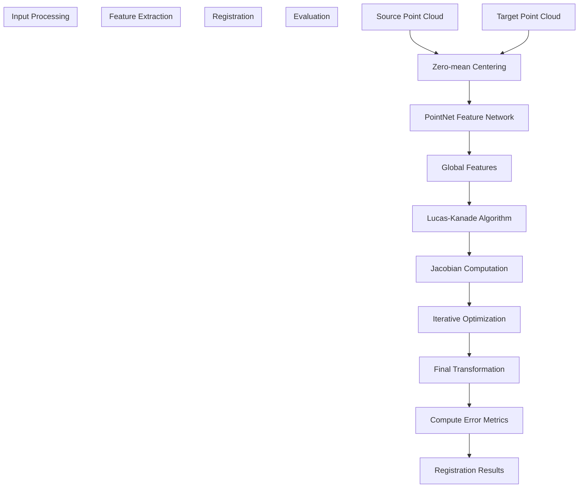

# Architecture

> **Relevant source files**
> * [README.md](https://github.com/Lilac-Lee/PointNetLK_Revisited/blob/4c5fbb1a/README.md)
> * [model.py](https://github.com/Lilac-Lee/PointNetLK_Revisited/blob/4c5fbb1a/model.py)
> * [trainer.py](https://github.com/Lilac-Lee/PointNetLK_Revisited/blob/4c5fbb1a/trainer.py)

This document provides a comprehensive overview of the system architecture of the PointNetLK_Revisited repository. It describes the high-level system design, component interactions, and data flow during both training and testing phases. For detailed information about the algorithm itself, see [PointNetLK Algorithm](/Lilac-Lee/PointNetLK_Revisited/3.1-pointnetlk-algorithm).

## System Components and Interactions

The PointNetLK_Revisited system is designed with a clean separation of concerns, with specialized components for model definition, training logic, and data processing.

```

```

Sources: [trainer.py L19-L43](https://github.com/Lilac-Lee/PointNetLK_Revisited/blob/4c5fbb1a/trainer.py#L19-L43)

 [model.py L50-L101](https://github.com/Lilac-Lee/PointNetLK_Revisited/blob/4c5fbb1a/model.py#L50-L101)

 [model.py L103-L351](https://github.com/Lilac-Lee/PointNetLK_Revisited/blob/4c5fbb1a/model.py#L103-L351)

### Key Classes and Their Responsibilities

The core architecture consists of several key classes that work together to implement the PointNetLK algorithm:

| Class | File | Primary Responsibility |
| --- | --- | --- |
| `TrainerAnalyticalPointNetLK` | trainer.py | Orchestrates the training process, creates models, and evaluates performance |
| `Pointnet_Features` | model.py | Implements the PointNet feature extraction network |
| `AnalyticalPointNetLK` | model.py | Implements the Lucas-Kanade algorithm for point cloud registration |
| `MLPNet` | model.py | Multi-layer perceptron used in the feature extraction network |

Sources: [trainer.py L19-L43](https://github.com/Lilac-Lee/PointNetLK_Revisited/blob/4c5fbb1a/trainer.py#L19-L43)

 [model.py L29-L41](https://github.com/Lilac-Lee/PointNetLK_Revisited/blob/4c5fbb1a/model.py#L29-L41)

 [model.py L50-L101](https://github.com/Lilac-Lee/PointNetLK_Revisited/blob/4c5fbb1a/model.py#L50-L101)

 [model.py L103-L351](https://github.com/Lilac-Lee/PointNetLK_Revisited/blob/4c5fbb1a/model.py#L103-L351)

## Model Architecture

The core algorithm combines PointNet for feature extraction with Lucas-Kanade for iterative pose refinement.


Sources: [model.py L50-L101](https://github.com/Lilac-Lee/PointNetLK_Revisited/blob/4c5fbb1a/model.py#L50-L101)

 [model.py L103-L351](https://github.com/Lilac-Lee/PointNetLK_Revisited/blob/4c5fbb1a/model.py#L103-L351)

 [trainer.py L19-L43](https://github.com/Lilac-Lee/PointNetLK_Revisited/blob/4c5fbb1a/trainer.py#L19-L43)

### Feature Extraction Architecture

The feature extraction component is built on the PointNet architecture with a series of MLP layers:


Sources: [model.py L50-L101](https://github.com/Lilac-Lee/PointNetLK_Revisited/blob/4c5fbb1a/model.py#L50-L101)

### Lucas-Kanade Algorithm Implementation

The AnalyticalPointNetLK class implements the iterative closest point registration with Lucas-Kanade optimization:


Sources: [model.py L264-L350](https://github.com/Lilac-Lee/PointNetLK_Revisited/blob/4c5fbb1a/model.py#L264-L350)

## Data Flow

The system processes point cloud data through several stages during both training and testing.



Sources: [model.py L143-L202](https://github.com/Lilac-Lee/PointNetLK_Revisited/blob/4c5fbb1a/model.py#L143-L202)

 [model.py L264-L350](https://github.com/Lilac-Lee/PointNetLK_Revisited/blob/4c5fbb1a/model.py#L264-L350)

 [trainer.py L210-L241](https://github.com/Lilac-Lee/PointNetLK_Revisited/blob/4c5fbb1a/trainer.py#L210-L241)

### Data Flow During Training

During training, the system:

1. Loads batches of point cloud pairs and ground truth transformations
2. Processes the point clouds (zero-mean centering)
3. Extracts features using the PointNet feature extractor
4. Computes the analytical Jacobian
5. Iteratively refines the transformation using the Lucas-Kanade algorithm
6. Computes the loss between estimated and ground truth transformations
7. Updates the model parameters through backpropagation

Sources: [trainer.py L45-L67](https://github.com/Lilac-Lee/PointNetLK_Revisited/blob/4c5fbb1a/trainer.py#L45-L67)

 [trainer.py L210-L241](https://github.com/Lilac-Lee/PointNetLK_Revisited/blob/4c5fbb1a/trainer.py#L210-L241)

### Data Flow During Testing

During testing, the system:

1. Loads test point cloud pairs
2. Optionally applies voxelization for real-world datasets
3. Processes the point clouds (zero-mean centering)
4. Extracts features and computes the analytical Jacobian
5. Iteratively refines the transformation until convergence
6. Computes evaluation metrics (rotation and translation errors)

Sources: [trainer.py L87-L207](https://github.com/Lilac-Lee/PointNetLK_Revisited/blob/4c5fbb1a/trainer.py#L87-L207)

## Integration with Datasets

The system is designed to work with multiple datasets through a unified interface:


Sources: [trainer.py L94-L107](https://github.com/Lilac-Lee/PointNetLK_Revisited/blob/4c5fbb1a/trainer.py#L94-L107)

 [trainer.py L210-L226](https://github.com/Lilac-Lee/PointNetLK_Revisited/blob/4c5fbb1a/trainer.py#L210-L226)

## Conclusion

The PointNetLK_Revisited architecture combines the feature extraction capabilities of PointNet with the iterative refinement approach of the Lucas-Kanade algorithm. The system is designed with clear separation of concerns, allowing for flexibility in data handling and model configuration. The analytical computation of the Jacobian is a key innovation that enables more efficient and accurate point cloud registration compared to previous approaches.

For more details on the specific components, refer to [Core Components](/Lilac-Lee/PointNetLK_Revisited/3-core-components) and [Data Processing](/Lilac-Lee/PointNetLK_Revisited/4-data-processing).