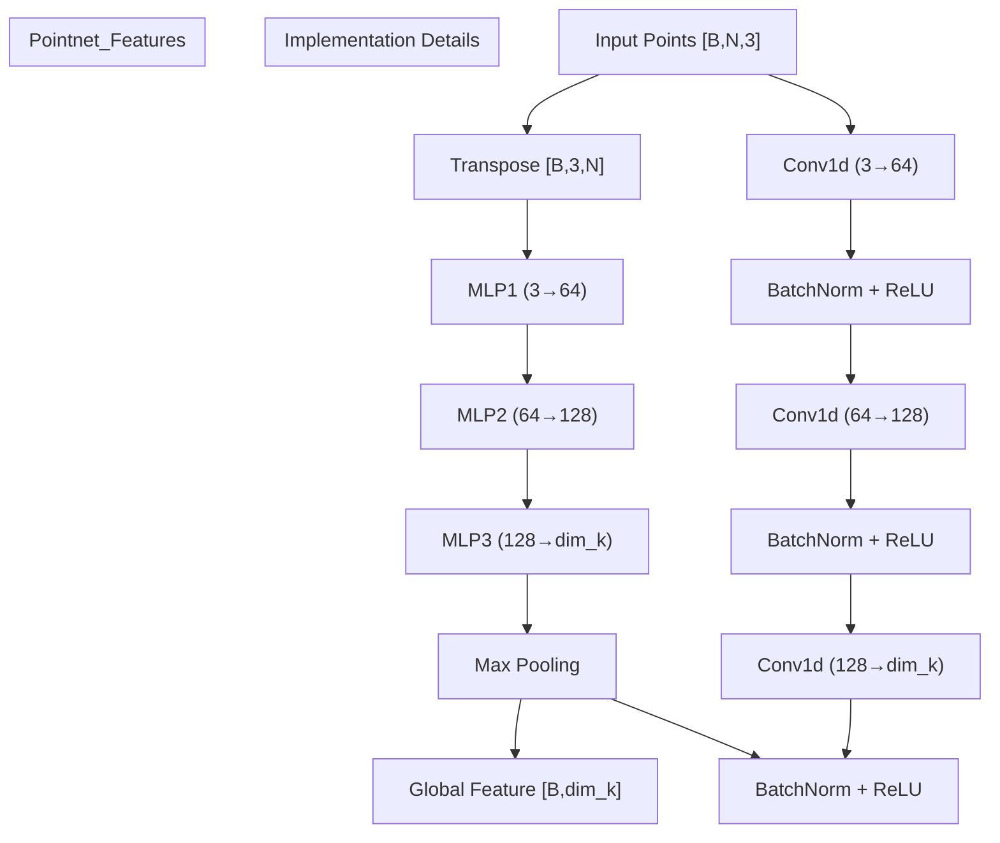
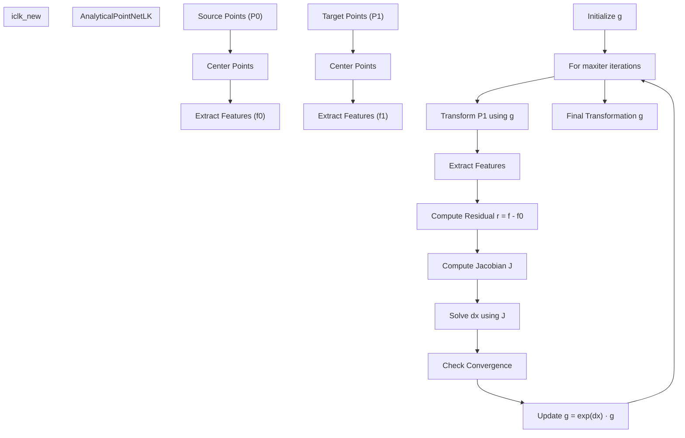
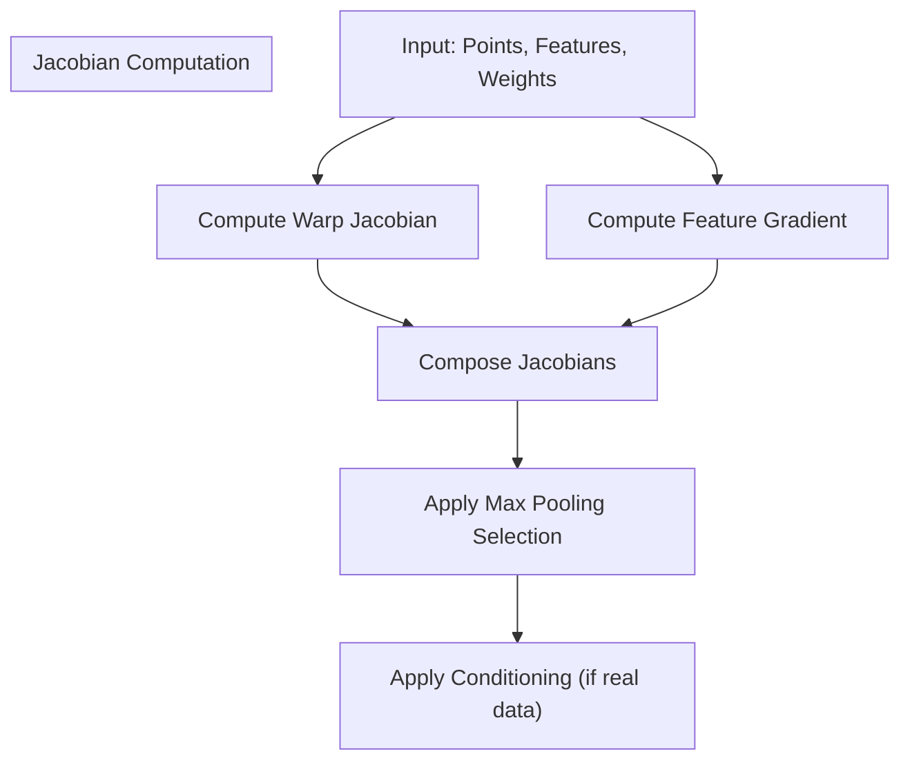
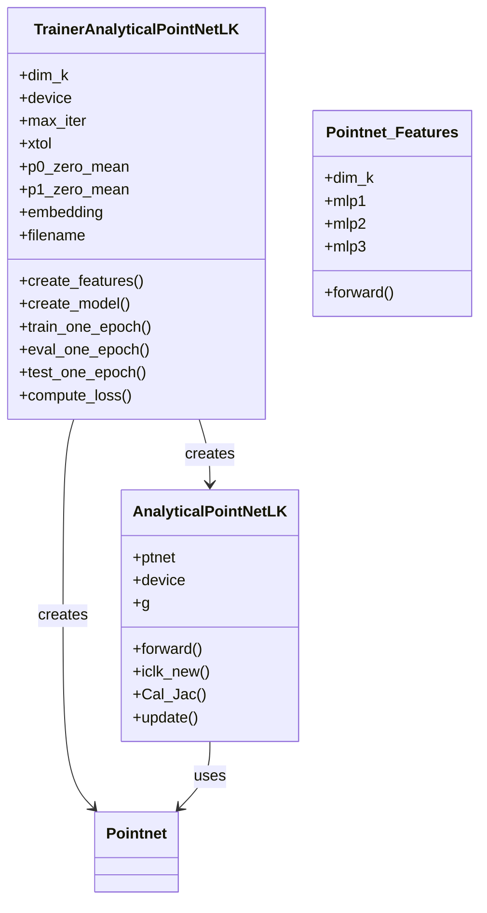
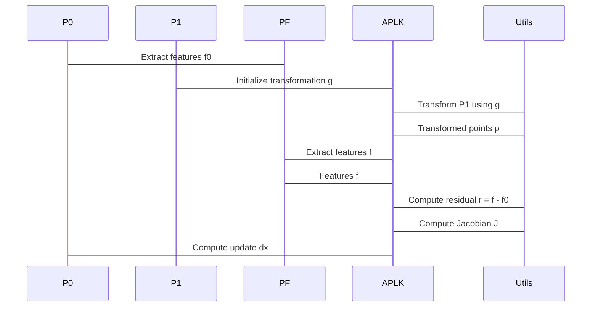

# Core Components

> **Relevant source files**
> * [model.py](https://github.com/Lilac-Lee/PointNetLK_Revisited/blob/4c5fbb1a/model.py)
> * [trainer.py](https://github.com/Lilac-Lee/PointNetLK_Revisited/blob/4c5fbb1a/trainer.py)
> * [utils.py](https://github.com/Lilac-Lee/PointNetLK_Revisited/blob/4c5fbb1a/utils.py)

This page provides a detailed overview of the key algorithmic components that form the backbone of the PointNetLK_Revisited system. The system implements a point cloud registration algorithm that combines PointNet for feature extraction with the Lucas-Kanade algorithm for transformation estimation.

For information about the overall system architecture, see [Architecture](/Lilac-Lee/PointNetLK_Revisited/2-architecture), and for details on using these components, see [Usage Guide](/Lilac-Lee/PointNetLK_Revisited/5-usage-guide).

## Feature Extraction Component

The feature extraction component transforms raw point clouds into feature vectors that are invariant to point permutations and robust to geometric transformations.

Sources: [model.py L44-L101](https://github.com/Lilac-Lee/PointNetLK_Revisited/blob/4c5fbb1a/model.py#L44-L101)

The `Pointnet_Features` class implements the feature extraction process:

1. **Network Architecture**:

* A series of 1D convolutions with batch normalization and ReLU activations
* Three MLPs with output dimensions [64, 128, dim_k]
* A max pooling operation to achieve permutation invariance
2. **Forward Pass**:

* Regular mode: Processes point clouds directly to features
* Analytical mode (iter=-1): Additionally returns intermediate values and weights needed for Jacobian calculations

The feature extraction component is designed to:

* Handle arbitrary numbers of points
* Produce global features that capture the geometric structure
* Return intermediate computations necessary for analytical derivatives

## PointNetLK Algorithm

The PointNetLK algorithm is an iterative method that estimates the rigid transformation between two point clouds by minimizing the distance between their feature representations.

Sources: [model.py L103-L351](https://github.com/Lilac-Lee/PointNetLK_Revisited/blob/4c5fbb1a/model.py#L103-L351)

The core of the system is implemented in the `AnalyticalPointNetLK` class:

1. **Initialization**:

* Takes a `Pointnet_Features` network as input
* Prepares SE(3) transformation utilities
2. **Point Cloud Registration** (iclk_new method):

* Initializes transformation matrix g
* Computes features for source point cloud
* Iteratively:
* Transforms target points using current estimate
* Computes features for transformed points
* Calculates residual between features
* Computes Jacobian matrix
* Solves for transformation update
* Updates transformation estimate
* Checks convergence
3. **Key Methods**:

* `do_forward`: Main entry point handling zero-centering of point clouds
* `Cal_Jac`: Computes the Jacobian matrix for optimization
* `update`: Updates the transformation matrix with incremental updates

The Jacobian computation is particularly important and involves:

Sources: [model.py L222-L262](https://github.com/Lilac-Lee/PointNetLK_Revisited/blob/4c5fbb1a/model.py#L222-L262)

 [utils.py L286-L386](https://github.com/Lilac-Lee/PointNetLK_Revisited/blob/4c5fbb1a/utils.py#L286-L386)

## Training System

The training system manages the training, evaluation, and testing processes for the PointNetLK algorithm.

Sources: [trainer.py L19-L242](https://github.com/Lilac-Lee/PointNetLK_Revisited/blob/4c5fbb1a/trainer.py#L19-L242)

The `TrainerAnalyticalPointNetLK` class orchestrates:

1. **Model Creation**:

* Creates the feature extraction network
* Builds the PointNetLK registration model
2. **Training Process**:

* `train_one_epoch`: Trains the model for one epoch
* `eval_one_epoch`: Evaluates model performance
* `test_one_epoch`: Tests the model and computes metrics
3. **Loss Computation**:

* Main loss: Feature residual norm + transformation error
* Transformation error: Difference between estimated and ground truth transforms
4. **Data Handling**:

* Supports both synthetic and real data
* Handles voxelized and non-voxelized point clouds

## Mathematical Utilities

The system relies on various mathematical operations for SE(3) transformations and matrix manipulations.

```mermaid
flowchart TD

subgraph Evaluation ["Evaluation"]
end

subgraph Jacobian_Utilities ["Jacobian Utilities"]
end

subgraph Matrix_Operations ["Matrix Operations"]
end

subgraph SE3_Operations ["SE3 Operations"]
end

metrics["test_metrics: Compute error metrics"]
feature_jac["feature_jac: Compute feature gradients"]
warp_jac["compute_warp_jac: Compute warp Jacobian"]
condition["cal_conditioned_warp_jacobian: Apply conditioning"]
inverse["batch_inverse: Matrix inversion"]
solve["Solve linear systems"]
so3["mat_so3: Create skew-symmetric matrices"]
se3["mat_se3: Create SE(3) matrices"]
exp["exp: se(3)→SE(3)"]
transform["transform: Apply transformation"]
log["log: SE(3)→se(3)"]
error["Compute transformation error"]

    inverse --> solve
    so3 --> se3
    exp --> transform
    log --> error
```

Sources: [utils.py L1-L462](https://github.com/Lilac-Lee/PointNetLK_Revisited/blob/4c5fbb1a/utils.py#L1-L462)

Key utility functions include:

1. **SE(3) Operations**:

* `exp`: Maps a 6D vector in se(3) to a 4x4 transformation matrix in SE(3)
* `log`: Maps a 4x4 transformation matrix to a 6D twist coordinates
* `transform`: Applies a transformation matrix to 3D points
2. **Matrix Operations**:

* `batch_inverse`: Computes matrix inverses for batches
* `mat_so3`: Creates skew-symmetric matrices from 3D vectors
* `mat_se3`: Creates SE(3) matrices from 6D vectors
3. **Jacobian Computation**:

* `feature_jac`: Computes the feature Jacobian
* `compute_warp_jac`: Computes the warp Jacobian
* `cal_conditioned_warp_jacobian`: Applies conditioning for real data
4. **Evaluation Metrics**:

* `test_metrics`: Computes rotation and translation errors

## Data Flow in Core Components

The following diagram illustrates how data flows through the core components during a registration operation:

Sources: [model.py L264-L350](https://github.com/Lilac-Lee/PointNetLK_Revisited/blob/4c5fbb1a/model.py#L264-L350)

 [trainer.py L210-L241](https://github.com/Lilac-Lee/PointNetLK_Revisited/blob/4c5fbb1a/trainer.py#L210-L241)

## Component Interaction

The core components interact closely to implement the PointNetLK algorithm:

| Component | Main Responsibility | Interfaces With |
| --- | --- | --- |
| `Pointnet_Features` | Extract global features from point clouds | `AnalyticalPointNetLK` |
| `AnalyticalPointNetLK` | Iteratively estimate transformation | `Pointnet_Features`, `TrainerAnalyticalPointNetLK` |
| `TrainerAnalyticalPointNetLK` | Manage training and evaluation | `AnalyticalPointNetLK`, data loaders |
| Utility Functions | Provide mathematical operations | All components |

The system follows a modular design where:

1. Feature extraction is handled by `Pointnet_Features`
2. Registration algorithm is implemented in `AnalyticalPointNetLK`
3. Training orchestration is managed by `TrainerAnalyticalPointNetLK`
4. Mathematical operations are provided by utility functions

This modular approach allows for easy modification and extension of individual components while maintaining the overall system architecture.