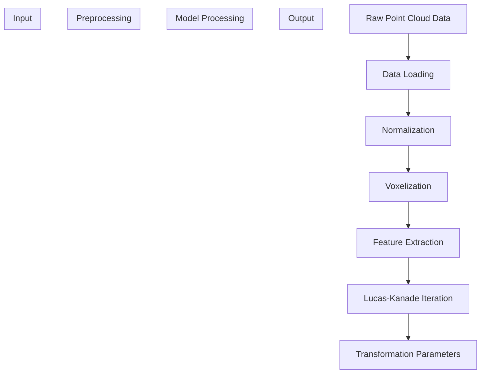
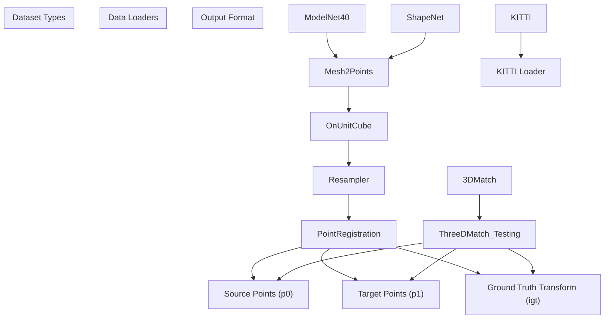
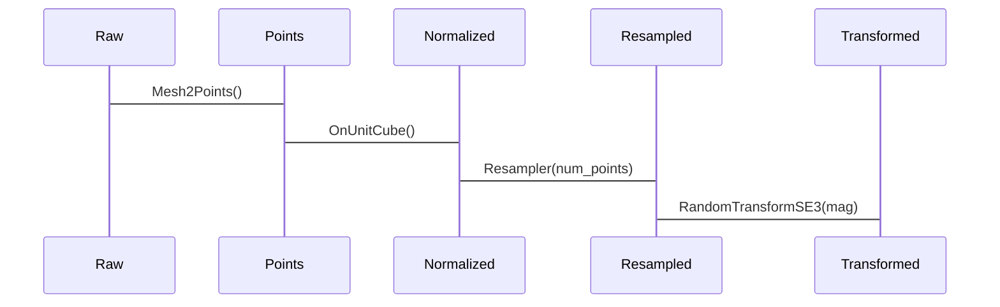
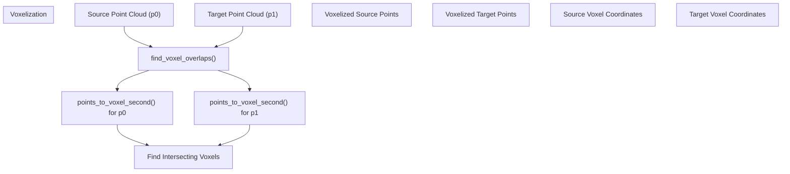
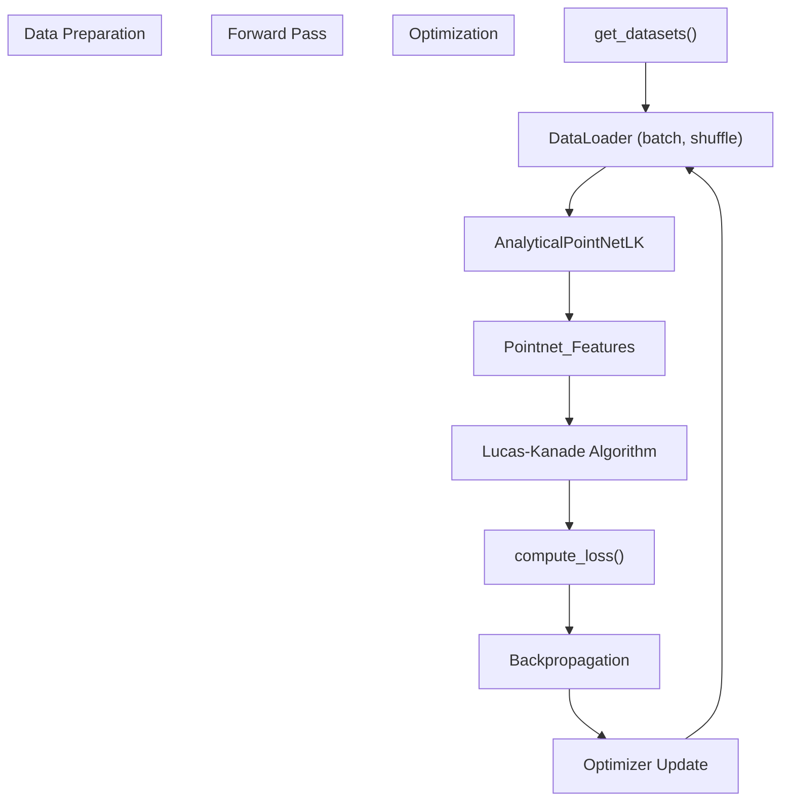
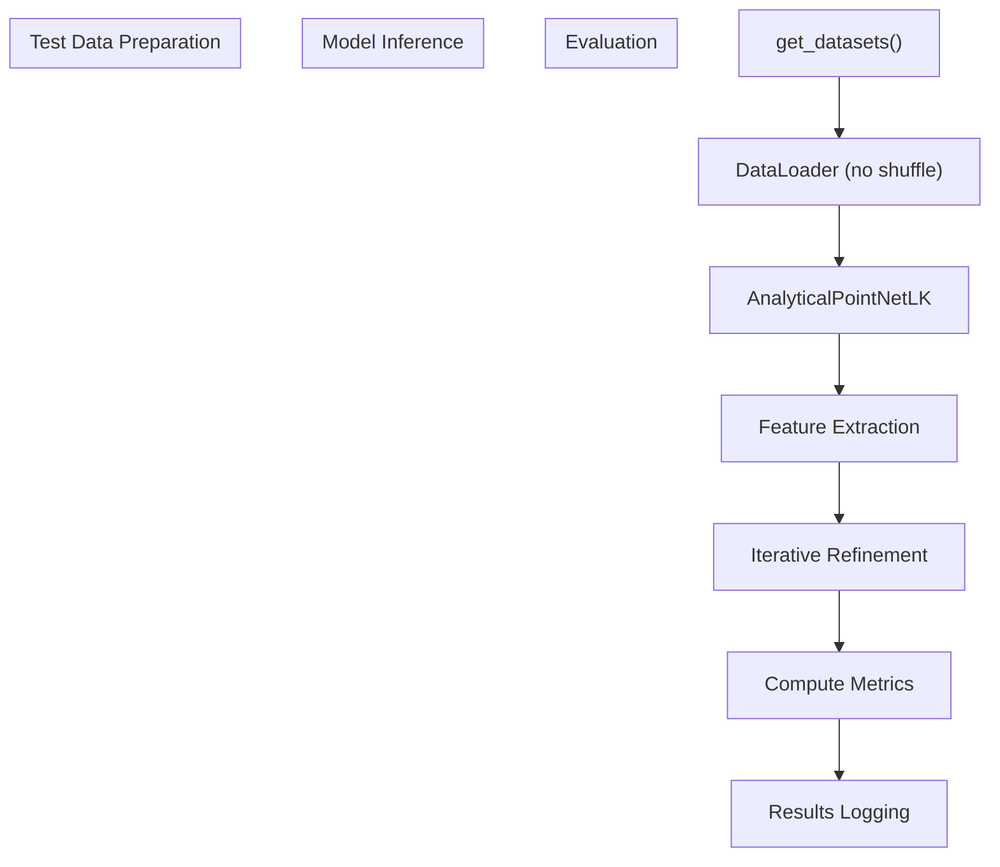
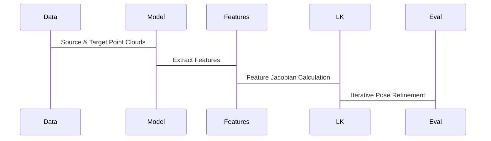
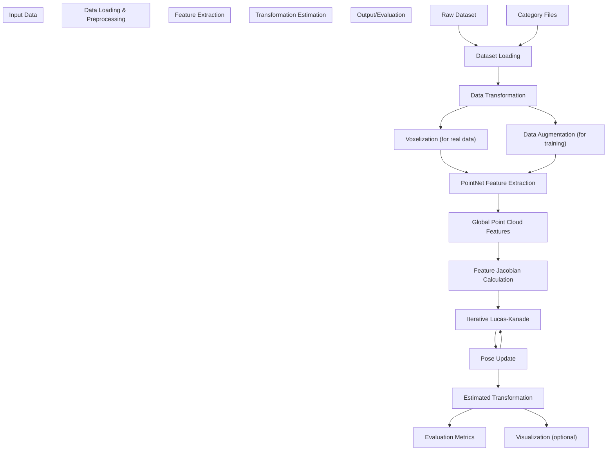
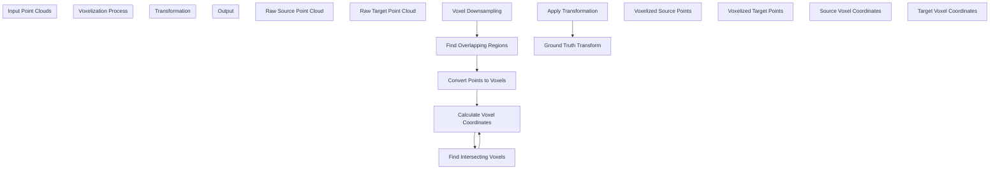

# Data Flow

> **Relevant source files**
> * [README.md](https://github.com/Lilac-Lee/PointNetLK_Revisited/blob/4c5fbb1a/README.md)
> * [data_utils.py](https://github.com/Lilac-Lee/PointNetLK_Revisited/blob/4c5fbb1a/data_utils.py)
> * [test.py](https://github.com/Lilac-Lee/PointNetLK_Revisited/blob/4c5fbb1a/test.py)
> * [train.py](https://github.com/Lilac-Lee/PointNetLK_Revisited/blob/4c5fbb1a/train.py)

This document details how data flows through the PointNetLK_Revisited system during both training and testing/inference processes. It covers data loading, preprocessing, model input/output flow, and transformation estimation. For information about the system's architectural components, see [System Design](/Lilac-Lee/PointNetLK_Revisited/2.1-system-design).

## 1. Overview of Data Flow

The PointNetLK_Revisited system handles point cloud registration through a pipeline that transforms raw point cloud data into estimated rigid transformations. The pipeline includes data loading, preprocessing, feature extraction, and iterative transformation estimation.

Sources: [data_utils.py L55-L179](https://github.com/Lilac-Lee/PointNetLK_Revisited/blob/4c5fbb1a/data_utils.py#L55-L179)

 [train.py L154-L176](https://github.com/Lilac-Lee/PointNetLK_Revisited/blob/4c5fbb1a/train.py#L154-L176)

 [test.py L115-L144](https://github.com/Lilac-Lee/PointNetLK_Revisited/blob/4c5fbb1a/test.py#L115-L144)

## 2. Data Loading Process

The system handles different types of datasets with specialized data loading pipelines.

### 2.1 Dataset Loading

Sources: [train.py L154-L176](https://github.com/Lilac-Lee/PointNetLK_Revisited/blob/4c5fbb1a/train.py#L154-L176)

 [test.py L115-L144](https://github.com/Lilac-Lee/PointNetLK_Revisited/blob/4c5fbb1a/test.py#L115-L144)

 [data_utils.py L294-L344](https://github.com/Lilac-Lee/PointNetLK_Revisited/blob/4c5fbb1a/data_utils.py#L294-L344)

### 2.2 Data Transformation Pipeline

During training and testing, point clouds undergo different transformations depending on the dataset type:

| Dataset Type | Preprocessing Steps | Output Format |
| --- | --- | --- |
| ModelNet40/ShapeNet | 1. Mesh to Points2. Normalize to unit cube3. Resample to fixed point count4. Apply random transformation | Source points, target points, ground truth transform |
| 3DMatch | 1. Load point pairs2. Find overlapping regions3. Voxelize point clouds4. Apply specified transformation | Voxelized source points, voxelized target points, ground truth transform |

For synthetic datasets (ModelNet/ShapeNet), the transformation sequence is:

Sources: [data_utils.py L777-L846](https://github.com/Lilac-Lee/PointNetLK_Revisited/blob/4c5fbb1a/data_utils.py#L777-L846)

 [data_utils.py L249-L283](https://github.com/Lilac-Lee/PointNetLK_Revisited/blob/4c5fbb1a/data_utils.py#L249-L283)

### 2.3 Voxelization Process

For real-world datasets (3DMatch/KITTI), the voxelization process is critical:

Sources: [data_utils.py L36-L52](https://github.com/Lilac-Lee/PointNetLK_Revisited/blob/4c5fbb1a/data_utils.py#L36-L52)

 [data_utils.py L398-L449](https://github.com/Lilac-Lee/PointNetLK_Revisited/blob/4c5fbb1a/data_utils.py#L398-L449)

## 3. Training Data Flow

During training, data flows through multiple stages from loading to loss computation:

Sources: [train.py L84-L146](https://github.com/Lilac-Lee/PointNetLK_Revisited/blob/4c5fbb1a/train.py#L84-L146)

 [train.py L128-L131](https://github.com/Lilac-Lee/PointNetLK_Revisited/blob/4c5fbb1a/train.py#L128-L131)

The data batches are processed as follows:

1. Source and target point clouds are loaded in batches
2. Both point clouds are passed through PointNet feature extraction
3. Features are used in the Lucas-Kanade algorithm to estimate transformation
4. Loss is computed between estimated and ground truth transformation
5. Gradients are backpropagated to update the model

## 4. Testing/Inference Data Flow

During testing, the data flow is similar but focused on evaluation:

Sources: [test.py L87-L106](https://github.com/Lilac-Lee/PointNetLK_Revisited/blob/4c5fbb1a/test.py#L87-L106)

 [test.py

106](https://github.com/Lilac-Lee/PointNetLK_Revisited/blob/4c5fbb1a/test.py#L106-L106)

### 4.1 Detailed Testing Pipeline

In the testing phase, the system processes each point cloud pair through the following steps:

1. Load point clouds (either directly or through voxelization)
2. Extract features using the PointNet backbone
3. Iteratively estimate transformation using the Lucas-Kanade algorithm
4. Evaluate transformation accuracy using metrics such as rotation error and translation error

Sources: [test.py

106](https://github.com/Lilac-Lee/PointNetLK_Revisited/blob/4c5fbb1a/test.py#L106-L106)

## 5. Complete Data Flow Pipeline

The following diagram illustrates the end-to-end data flow from input data to final transformation estimation:

Sources: [data_utils.py](https://github.com/Lilac-Lee/PointNetLK_Revisited/blob/4c5fbb1a/data_utils.py)

 [train.py](https://github.com/Lilac-Lee/PointNetLK_Revisited/blob/4c5fbb1a/train.py)

 [test.py](https://github.com/Lilac-Lee/PointNetLK_Revisited/blob/4c5fbb1a/test.py)

## 6. Data Flow During Voxel-based Registration

For 3DMatch dataset and real-world point clouds, voxel-based registration involves additional processing:

Sources: [data_utils.py L55-L179](https://github.com/Lilac-Lee/PointNetLK_Revisited/blob/4c5fbb1a/data_utils.py#L55-L179)

 [data_utils.py L36-L52](https://github.com/Lilac-Lee/PointNetLK_Revisited/blob/4c5fbb1a/data_utils.py#L36-L52)

This voxelization-based data flow is particularly important for handling real-world data with partial overlaps and sensor noise, ensuring that the Lucas-Kanade algorithm operates on well-structured and matched regions of the point clouds.