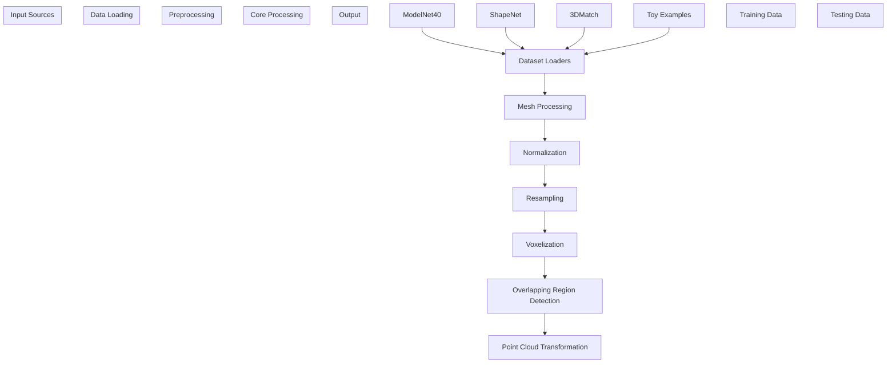
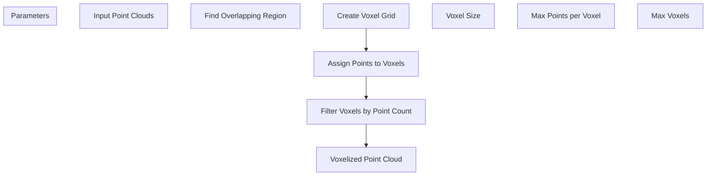
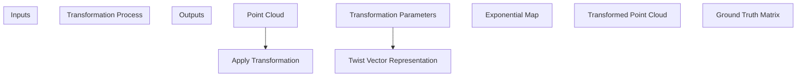

# Data Processing

> **Relevant source files**
> * [README.md](https://github.com/Lilac-Lee/PointNetLK_Revisited/blob/4c5fbb1a/README.md)
> * [data_utils.py](https://github.com/Lilac-Lee/PointNetLK_Revisited/blob/4c5fbb1a/data_utils.py)

This document provides a comprehensive overview of the data processing components in the PointNetLK_Revisited codebase. It covers how point cloud data is loaded, preprocessed, voxelized, and transformed for training and testing in the point cloud registration system.

## Overview of Data Processing Pipeline

The data processing pipeline in PointNetLK_Revisited involves several key steps: data loading from various datasets, voxelization, transformation, and preparation for the model. The system supports multiple datasets (ModelNet40, ShapeNet, KITTI, 3DMatch) and provides efficient processing for point cloud registration tasks.



Sources: [data_utils.py L18-L33](https://github.com/Lilac-Lee/PointNetLK_Revisited/blob/4c5fbb1a/data_utils.py#L18-L33)

 [data_utils.py L36-L52](https://github.com/Lilac-Lee/PointNetLK_Revisited/blob/4c5fbb1a/data_utils.py#L36-L52)

 [data_utils.py L55-L179](https://github.com/Lilac-Lee/PointNetLK_Revisited/blob/4c5fbb1a/data_utils.py#L55-L179)

 [data_utils.py L398-L449](https://github.com/Lilac-Lee/PointNetLK_Revisited/blob/4c5fbb1a/data_utils.py#L398-L449)

## Dataset Loaders

The codebase implements several dataset loaders for different point cloud datasets. These loaders handle the specifics of each dataset format and prepare the data for the registration task.

### Dataset Class Hierarchy

```

```

Sources: [data_utils.py L55-L179](https://github.com/Lilac-Lee/PointNetLK_Revisited/blob/4c5fbb1a/data_utils.py#L55-L179)

 [data_utils.py L182-L246](https://github.com/Lilac-Lee/PointNetLK_Revisited/blob/4c5fbb1a/data_utils.py#L182-L246)

 [data_utils.py L293-L345](https://github.com/Lilac-Lee/PointNetLK_Revisited/blob/4c5fbb1a/data_utils.py#L293-L345)

 [data_utils.py L497-L591](https://github.com/Lilac-Lee/PointNetLK_Revisited/blob/4c5fbb1a/data_utils.py#L497-L591)

 [data_utils.py L809-L819](https://github.com/Lilac-Lee/PointNetLK_Revisited/blob/4c5fbb1a/data_utils.py#L809-L819)

 [data_utils.py L822-L827](https://github.com/Lilac-Lee/PointNetLK_Revisited/blob/4c5fbb1a/data_utils.py#L822-L827)

### Key Dataset Classes

1. **ModelNet** - Loads the Princeton ModelNet40 dataset, which contains 3D CAD models across 40 object categories.

```
ModelNet(dataset_path, train=1, transform=None, classinfo=None)
```
2. **ShapeNet2** - Loads ShapeNet v2 dataset, a large collection of 3D models.

```
ShapeNet2(dataset_path, transform=None, classinfo=None)
```
3. **ThreeDMatch_Testing** - Loads and processes 3DMatch dataset, which consists of real-world 3D RGB-D scans.

```
ThreeDMatch_Testing(dataset_path, category, overlap_ratio, voxel_ratio, voxel, 
                    max_voxel_points, num_voxels, rigid_transform, vis, 
                    voxel_after_transf)
```
4. **ToyExampleData** - A simplified dataset class for demonstrating the system with small examples.

```
ToyExampleData(p0, p1, voxel_ratio, voxel, max_voxel_points, num_voxels, 
              rigid_transform, vis)
```
5. **PointRegistration** - A wrapper dataset that applies transformations to point clouds for registration tasks.

```
PointRegistration(dataset, rigid_transform, sigma=0.00, clip=0.00)
```

Sources: [data_utils.py L55-L179](https://github.com/Lilac-Lee/PointNetLK_Revisited/blob/4c5fbb1a/data_utils.py#L55-L179)

 [data_utils.py L182-L246](https://github.com/Lilac-Lee/PointNetLK_Revisited/blob/4c5fbb1a/data_utils.py#L182-L246)

 [data_utils.py L293-L345](https://github.com/Lilac-Lee/PointNetLK_Revisited/blob/4c5fbb1a/data_utils.py#L293-L345)

 [data_utils.py L809-L819](https://github.com/Lilac-Lee/PointNetLK_Revisited/blob/4c5fbb1a/data_utils.py#L809-L819)

 [data_utils.py L822-L827](https://github.com/Lilac-Lee/PointNetLK_Revisited/blob/4c5fbb1a/data_utils.py#L822-L827)

## Voxelization Process

Voxelization is a critical step in the data processing pipeline that converts continuous point clouds into discrete voxel representations. This process involves dividing the 3D space into voxels (3D pixels) and assigning points to these voxels.

### Voxelization Workflow



Sources: [data_utils.py L36-L52](https://github.com/Lilac-Lee/PointNetLK_Revisited/blob/4c5fbb1a/data_utils.py#L36-L52)

 [data_utils.py L348-L394](https://github.com/Lilac-Lee/PointNetLK_Revisited/blob/4c5fbb1a/data_utils.py#L348-L394)

 [data_utils.py L398-L449](https://github.com/Lilac-Lee/PointNetLK_Revisited/blob/4c5fbb1a/data_utils.py#L398-L449)

### Key Voxelization Functions

1. **points_to_voxel_second** - The main voxelization function that converts point clouds to voxel representation.

```
points_to_voxel_second(points, coords_range, voxel_size, max_points=100,
                      reverse_index=False, max_voxels=20000)
```

* `points`: Input point cloud
* `coords_range`: Coordinate range for voxelization (min/max x, y, z)
* `voxel_size`: Size of each voxel
* `max_points`: Maximum number of points per voxel
* `max_voxels`: Maximum number of voxels to create

Returns:

* `voxels`: Array of voxelized points
* `coordinates`: 3D indices of voxels
* `num_points_per_voxel`: Count of points in each voxel
2. **find_voxel_overlaps** - Finds the overlapping region between two point clouds for focused voxelization.

```
find_voxel_overlaps(p0, p1, voxel)
```

* `p0`, `p1`: Source and target point clouds
* `voxel`: Voxelization resolution

Sources: [data_utils.py L36-L52](https://github.com/Lilac-Lee/PointNetLK_Revisited/blob/4c5fbb1a/data_utils.py#L36-L52)

 [data_utils.py L398-L449](https://github.com/Lilac-Lee/PointNetLK_Revisited/blob/4c5fbb1a/data_utils.py#L398-L449)

### Voxelization in Dataset Processing

The voxelization process is integral to the `__getitem__` method of dataset classes, especially `ThreeDMatch_Testing` and `ToyExampleData`. The process typically follows these steps:

1. Load point clouds from dataset
2. Find the overlapping region between source and target point clouds
3. Apply voxelization to convert points to voxels
4. Filter voxels based on point density
5. Apply transformations if needed

In the implementation, there are two voxelization modes controlled by the `voxel_after_transf` parameter:

* `True`: Apply transformation first, then voxelize
* `False`: Voxelize first, then apply transformation

Sources: [data_utils.py L90-L175](https://github.com/Lilac-Lee/PointNetLK_Revisited/blob/4c5fbb1a/data_utils.py#L90-L175)

 [data_utils.py L204-L245](https://github.com/Lilac-Lee/PointNetLK_Revisited/blob/4c5fbb1a/data_utils.py#L204-L245)

## Point Cloud Transformations

Transformations are essential for generating training and testing data for point cloud registration. The system implements various transformation methods to create pairs of point clouds with known relative poses.

### Transformation Process



Sources: [data_utils.py L249-L283](https://github.com/Lilac-Lee/PointNetLK_Revisited/blob/4c5fbb1a/data_utils.py#L249-L283)

 [data_utils.py L86-L88](https://github.com/Lilac-Lee/PointNetLK_Revisited/blob/4c5fbb1a/data_utils.py#L86-L88)

 [data_utils.py L196-L202](https://github.com/Lilac-Lee/PointNetLK_Revisited/blob/4c5fbb1a/data_utils.py#L196-L202)

### Key Transformation Classes

1. **RandomTransformSE3** - Generates random rigid transformations (rotation and translation).

```
RandomTransformSE3(mag=1, mag_randomly=True)
```

* `mag`: Magnitude of transformation
* `mag_randomly`: Whether to randomize the magnitude

Key methods:

* `generate_transform()`: Creates a random transformation
* `apply_transform(p0, x)`: Applies transformation to point cloud
2. **PointRegistration** - Wraps a dataset to create registration pairs with random transformations.

```
PointRegistration(dataset, rigid_transform, sigma=0.00, clip=0.00)
```
3. **PointRegistration_fixed_perturbation** - Similar to PointRegistration but uses predefined transformations.

```
PointRegistration_fixed_perturbation(dataset, rigid_transform, sigma=0.00, clip=0.00)
```

Sources: [data_utils.py L249-L283](https://github.com/Lilac-Lee/PointNetLK_Revisited/blob/4c5fbb1a/data_utils.py#L249-L283)

 [data_utils.py L293-L345](https://github.com/Lilac-Lee/PointNetLK_Revisited/blob/4c5fbb1a/data_utils.py#L293-L345)

### Transformation in Dataset Processing

The transformation process is used in the `__getitem__` methods of dataset classes to generate pairs of point clouds with known transformations:

1. For `ThreeDMatch_Testing`, transformations can be applied either before or after voxelization based on the `voxel_after_transf` parameter.
2. For `ToyExampleData`, transformations are applied to create source and target point clouds for toy examples.
3. In both `PointRegistration` and `PointRegistration_fixed_perturbation`, transformations create paired data for training and testing.

The transformation itself is represented as a 6-dimensional "twist" vector and converted to a 4×4 transformation matrix using the exponential map from Lie algebra.

Sources: [data_utils.py L82-L88](https://github.com/Lilac-Lee/PointNetLK_Revisited/blob/4c5fbb1a/data_utils.py#L82-L88)

 [data_utils.py L169-L174](https://github.com/Lilac-Lee/PointNetLK_Revisited/blob/4c5fbb1a/data_utils.py#L169-L174)

 [data_utils.py L196-L202](https://github.com/Lilac-Lee/PointNetLK_Revisited/blob/4c5fbb1a/data_utils.py#L196-L202)

 [data_utils.py L237-L241](https://github.com/Lilac-Lee/PointNetLK_Revisited/blob/4c5fbb1a/data_utils.py#L237-L241)

## Data Augmentation

Data augmentation techniques enhance the robustness of the model by introducing controlled variations to the training data.

### Key Augmentation Techniques

1. **Adding Noise** - Function `add_noise` adds Gaussian noise to point clouds.

```
add_noise(pointcloud, sigma=0.01, clip=0.05)
```

* `sigma`: Standard deviation of the Gaussian noise
* `clip`: Maximum absolute value of noise
2. **Normalization** - Classes like `OnUnitCube` normalize point clouds to fit within standard bounds.

```
OnUnitCube()
```

Methods:

* `method1`: Centers and scales by maximum absolute value
* `method2`: Scales by maximum dimension range and centers

Sources: [data_utils.py L286-L290](https://github.com/Lilac-Lee/PointNetLK_Revisited/blob/4c5fbb1a/data_utils.py#L286-L290)

 [data_utils.py L787-L802](https://github.com/Lilac-Lee/PointNetLK_Revisited/blob/4c5fbb1a/data_utils.py#L787-L802)

## Implementation Details by Dataset Type

Each dataset type has specific implementation details for data processing:

### ModelNet40 Processing

ModelNet40 consists of 3D CAD models across 40 object categories. The processing workflow is:

1. Load OFF files using `offread` function
2. Convert mesh to point cloud using `Mesh2Points`
3. Apply any transformations via dataset wrappers
4. Normalize and prepare for training/testing

Source: [data_utils.py L809-L819](https://github.com/Lilac-Lee/PointNetLK_Revisited/blob/4c5fbb1a/data_utils.py#L809-L819)

 [data_utils.py L673-L722](https://github.com/Lilac-Lee/PointNetLK_Revisited/blob/4c5fbb1a/data_utils.py#L673-L722)

### 3DMatch Processing

3DMatch dataset contains real-world 3D scans. Its processing includes:

1. Load point cloud pairs from NPZ files
2. Down-sample using Open3D's voxel_down_sample
3. Find overlapping regions
4. Apply voxelization and transformation
5. Filter voxels by point density

A key characteristic is the handling of partial overlaps between point cloud pairs, managed through the `find_voxel_overlaps` function.

Source: [data_utils.py L55-L179](https://github.com/Lilac-Lee/PointNetLK_Revisited/blob/4c5fbb1a/data_utils.py#L55-L179)

 [data_utils.py L18-L33](https://github.com/Lilac-Lee/PointNetLK_Revisited/blob/4c5fbb1a/data_utils.py#L18-L33)

### Toy Examples

For demonstration purposes, the codebase includes a `ToyExampleData` class that applies the same processing pipeline to simple point cloud examples:

1. Locate overlapping regions
2. Voxelize point clouds
3. Apply transformations
4. Filter and process voxels

This provides a simplified environment for testing the methodology.

Source: [data_utils.py L182-L246](https://github.com/Lilac-Lee/PointNetLK_Revisited/blob/4c5fbb1a/data_utils.py#L182-L246)

## Data Processing Configuration

The data processing components can be configured through several parameters:

| Parameter | Description | Typical Values |
| --- | --- | --- |
| `voxel_ratio` | Down-sampling ratio for initial voxelization | 0.01-0.1 |
| `voxel` | Voxelization resolution | 24-32 |
| `max_voxel_points` | Maximum points per voxel | 100-500 |
| `num_voxels` | Maximum number of voxels | 10000-20000 |
| `rigid_transform` | Path to predefined transformations | "transforms.csv" |
| `voxel_after_transf` | Whether to voxelize after transformation | True/False |
| `sigma` | Noise standard deviation | 0.0-0.01 |
| `clip` | Maximum noise value | 0.0-0.05 |

The README notes an important consideration about voxelization:

> In the current setting, the voxelization for overlapped source and target point clouds still relies on "registered point clouds" (such as results from a global registration). The code for voxelization after "transformation" is updated by setting argument `--voxel_after_transf` to **True**. In the real-world application, our algorithm would be better suited for local registration problem.

Source: [README.md L46-L49](https://github.com/Lilac-Lee/PointNetLK_Revisited/blob/4c5fbb1a/README.md#L46-L49)

## Summary

The data processing system in PointNetLK_Revisited provides a comprehensive pipeline for handling point cloud data from various sources. It implements efficient voxelization, transformation, and augmentation techniques that prepare data for the point cloud registration task. The system is designed to be flexible, supporting multiple datasets and configurations while providing consistent processing across different experimental setups.

For information about how the processed data is used in the training system, see [Training System](/Lilac-Lee/PointNetLK_Revisited/3.2-training-system).