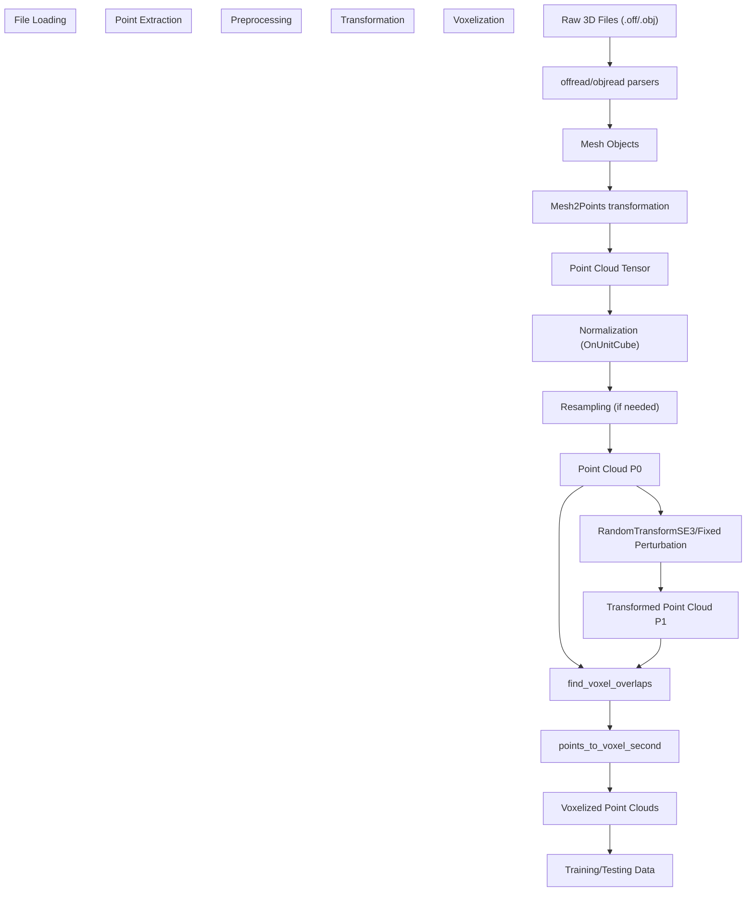
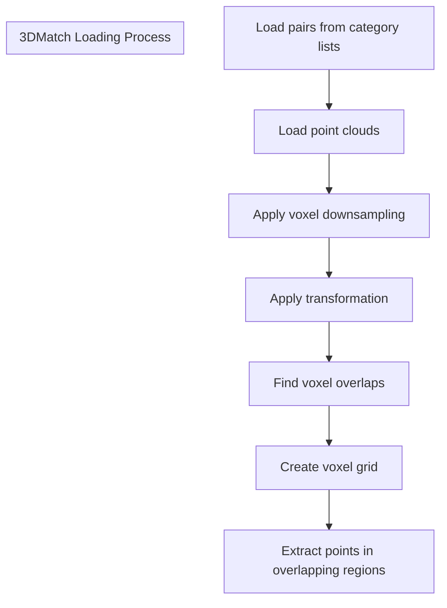

# Dataset Loaders

> **Relevant source files**
> * [data_utils.py](https://github.com/Lilac-Lee/PointNetLK_Revisited/blob/4c5fbb1a/data_utils.py)
> * [dataset/modelnet40_half1.txt](https://github.com/Lilac-Lee/PointNetLK_Revisited/blob/4c5fbb1a/dataset/modelnet40_half1.txt)
> * [dataset/modelnet40_half2.txt](https://github.com/Lilac-Lee/PointNetLK_Revisited/blob/4c5fbb1a/dataset/modelnet40_half2.txt)
> * [dataset/test_3dmatch.txt](https://github.com/Lilac-Lee/PointNetLK_Revisited/blob/4c5fbb1a/dataset/test_3dmatch.txt)

## Purpose and Scope

This document describes the dataset loading mechanism implemented in the PointNetLK_Revisited codebase. It covers how different 3D datasets (ModelNet40, ShapeNet, 3DMatch, and custom data) are loaded, preprocessed, and transformed to prepare point cloud pairs for registration. For information about the voxelization process specifically, see [Voxelization](/Lilac-Lee/PointNetLK_Revisited/4.2-voxelization).

## Dataset Architecture Overview

The dataset system in PointNetLK_Revisited follows a hierarchical pattern where specialized dataset classes handle different data sources while sharing common preprocessing functionality.

```

```

Sources: [data_utils.py L497-L591](https://github.com/Lilac-Lee/PointNetLK_Revisited/blob/4c5fbb1a/data_utils.py#L497-L591)

 [data_utils.py L809-L827](https://github.com/Lilac-Lee/PointNetLK_Revisited/blob/4c5fbb1a/data_utils.py#L809-L827)

 [data_utils.py L55-L179](https://github.com/Lilac-Lee/PointNetLK_Revisited/blob/4c5fbb1a/data_utils.py#L55-L179)

 [data_utils.py L182-L246](https://github.com/Lilac-Lee/PointNetLK_Revisited/blob/4c5fbb1a/data_utils.py#L182-L246)

 [data_utils.py L293-L345](https://github.com/Lilac-Lee/PointNetLK_Revisited/blob/4c5fbb1a/data_utils.py#L293-L345)

## Dataset Loading Pipeline

The dataset loading pipeline consists of several key stages that transform raw 3D model files into processed point cloud pairs ready for the registration model.



Sources: [data_utils.py L673-L784](https://github.com/Lilac-Lee/PointNetLK_Revisited/blob/4c5fbb1a/data_utils.py#L673-L784)

 [data_utils.py L249-L283](https://github.com/Lilac-Lee/PointNetLK_Revisited/blob/4c5fbb1a/data_utils.py#L249-L283)

 [data_utils.py L36-L52](https://github.com/Lilac-Lee/PointNetLK_Revisited/blob/4c5fbb1a/data_utils.py#L36-L52)

 [data_utils.py L398-L449](https://github.com/Lilac-Lee/PointNetLK_Revisited/blob/4c5fbb1a/data_utils.py#L398-L449)

## Supported Datasets

### ModelNet40

ModelNet40 is a benchmark dataset containing 12,311 CAD models from 40 object categories. The dataset is primarily used for tasks such as classification and registration.

```
class ModelNet(Globset):
    """ [Princeton ModelNet](http://modelnet.cs.princeton.edu/) """
    def __init__(self, dataset_path, train=1, transform=None, classinfo=None):
        loader = offread
        if train > 0:
            pattern = 'train/*.off'
        elif train == 0:
            pattern = 'test/*.off'
        else:
            pattern = ['train/*.off', 'test/*.off']
        super().__init__(dataset_path, pattern, loader, transform, classinfo)
```

The codebase supports using half of the ModelNet40 categories at a time through two configuration files:

* `modelnet40_half1.txt`: First 20 categories (airplane to lamp)
* `modelnet40_half2.txt`: Second 20 categories (laptop to xbox)

Sources: [data_utils.py L809-L819](https://github.com/Lilac-Lee/PointNetLK_Revisited/blob/4c5fbb1a/data_utils.py#L809-L819)

 [dataset/modelnet40_half1.txt](https://github.com/Lilac-Lee/PointNetLK_Revisited/blob/4c5fbb1a/dataset/modelnet40_half1.txt)

 [dataset/modelnet40_half2.txt](https://github.com/Lilac-Lee/PointNetLK_Revisited/blob/4c5fbb1a/dataset/modelnet40_half2.txt)

### ShapeNet

ShapeNet is a large-scale repository of 3D CAD models. The codebase specifically implements `ShapeNet2` which works with ShapeNet v2 data.

```
class ShapeNet2(Globset):
    """ [ShapeNet](https://www.shapenet.org/) v2 """
    def __init__(self, dataset_path, transform=None, classinfo=None):
        loader = objread
        pattern = '*/models/model_normalized.obj'
        super().__init__(dataset_path, pattern, loader, transform, classinfo)
```

Sources: [data_utils.py L822-L827](https://github.com/Lilac-Lee/PointNetLK_Revisited/blob/4c5fbb1a/data_utils.py#L822-L827)

### 3DMatch

3DMatch is a real-world RGB-D scan dataset designed for geometric registration. The `ThreeDMatch_Testing` class specifically implements functionality for testing on this dataset.



The `ThreeDMatch_Testing` class loads point cloud pairs based on a configurable overlap ratio and applies voxelization and transformations. The dataset configuration is controlled by the `test_3dmatch.txt` file which specifies scene names.

Sources: [data_utils.py L55-L179](https://github.com/Lilac-Lee/PointNetLK_Revisited/blob/4c5fbb1a/data_utils.py#L55-L179)

 [dataset/test_3dmatch.txt](https://github.com/Lilac-Lee/PointNetLK_Revisited/blob/4c5fbb1a/dataset/test_3dmatch.txt)

### Toy Example Dataset

For demonstration purposes, the codebase includes a `ToyExampleData` class that works with custom point cloud data. This is particularly useful for the demo notebook to showcase functionality without requiring a full dataset.

Sources: [data_utils.py L182-L246](https://github.com/Lilac-Lee/PointNetLK_Revisited/blob/4c5fbb1a/data_utils.py#L182-L246)

## Core Dataset Base Classes

### Globset

`Globset` is the base class that implements common functionality for dataset loading. It provides mechanisms for:

1. Finding all relevant files based on glob patterns
2. Loading files using the specified file loader (offread/objread)
3. Applying transformations
4. Splitting datasets for train/test
5. Selecting specific classes

```
def __getitem__(self, index):
    path, target = self.samples[index]
    sample = self.fileloader(path)
    if self.transform is not None:
        sample = self.transform(sample)
    
    return sample, target
```

Sources: [data_utils.py L497-L591](https://github.com/Lilac-Lee/PointNetLK_Revisited/blob/4c5fbb1a/data_utils.py#L497-L591)

## Point Cloud Transformation Utilities

### RandomTransformSE3

This class generates random rigid body transformations (rotation and translation) for creating source-target point cloud pairs during training.

```
def generate_transform(self):
    amp = self.mag
    if self.randomly:
        amp = torch.rand(1, 1) * self.mag
    x = torch.randn(1, 6)
    x = x / x.norm(p=2, dim=1, keepdim=True) * amp
    
    return x
```

The transformation is represented as a 6-dimensional twist vector (3 for rotation, 3 for translation) and converted to a 4×4 transformation matrix using the exponential map.

Sources: [data_utils.py L249-L283](https://github.com/Lilac-Lee/PointNetLK_Revisited/blob/4c5fbb1a/data_utils.py#L249-L283)

### PointRegistration Classes

The codebase includes two point registration classes:

1. `PointRegistration`: Applies random transformations to point clouds.
2. `PointRegistration_fixed_perturbation`: Applies predefined transformations loaded from a file.

These classes wrap around other dataset classes and augment them with transformation capabilities, creating the source-target pairs needed for point cloud registration training and testing.

```
def __getitem__(self, index):
    pm, _ = self.dataset[index]   # one point cloud
    p_ = add_noise(pm, sigma=self.sigma, clip=self.clip)
    p1 = self.transf(p_)
    igt = self.transf.igt.squeeze(0)
    p0 = pm
    
    # p0: template, p1: source, igt:transform matrix from p0 to p1
    return p0, p1, igt
```

Sources: [data_utils.py L293-L345](https://github.com/Lilac-Lee/PointNetLK_Revisited/blob/4c5fbb1a/data_utils.py#L293-L345)

## File Loaders

The codebase implements parsers for two common 3D model file formats:

1. `offread`: Loads Geomview OFF (Object File Format) files, typically used by ModelNet
2. `objread`: Loads Wavefront OBJ files, typically used by ShapeNet

These loaders convert the raw file data into `Mesh` objects, which are then processed by the dataset pipeline.

Sources: [data_utils.py L673-L774](https://github.com/Lilac-Lee/PointNetLK_Revisited/blob/4c5fbb1a/data_utils.py#L673-L774)

## Mesh Processing Utilities

Several utility classes are provided for processing mesh data:

1. `Mesh`: Base class representing a 3D mesh with vertices and faces
2. `Mesh2Points`: Converts a mesh to a point cloud tensor
3. `OnUnitCube`: Normalizes point clouds to fit within a unit cube

```
class OnUnitCube:
    def method2(self, tensor):
        c = torch.max(tensor, dim=0)[0] - torch.min(tensor, dim=0)[0]
        s = torch.max(c)
        v = tensor / s
        return v - v.mean(dim=0, keepdim=True)
```

Sources: [data_utils.py L594-L806](https://github.com/Lilac-Lee/PointNetLK_Revisited/blob/4c5fbb1a/data_utils.py#L594-L806)

## Example Usage Flow

The following table outlines the typical flow of dataset usage in the PointNetLK_Revisited system:

| Step | Action | Responsible Component |
| --- | --- | --- |
| 1 | Load 3D model files | `offread`/`objread` |
| 2 | Convert to point clouds | `Mesh2Points` |
| 3 | Normalize coordinates | `OnUnitCube` |
| 4 | Create source point cloud (p0) | Dataset class |
| 5 | Generate transformation | `RandomTransformSE3` |
| 6 | Create target point cloud (p1) | `PointRegistration` |
| 7 | Voxelize point clouds | `points_to_voxel_second` |
| 8 | Return processed pairs | Dataset `__getitem__` |

## Typical Dataset Configuration

Below is a summary of typical dataset parameters used in the system:

| Dataset | File Format | Transformation | Voxelization |
| --- | --- | --- | --- |
| ModelNet40 | OFF | RandomTransformSE3 | Yes |
| ShapeNet | OBJ | RandomTransformSE3 | Yes |
| 3DMatch | NPZ | Fixed perturbation | Yes, with downsampling |
| Toy Example | Custom | Fixed perturbation | Yes |

In conclusion, the dataset loading system in PointNetLK_Revisited provides a flexible framework for handling various 3D datasets, applying transformations, and preparing point cloud pairs for the registration model.