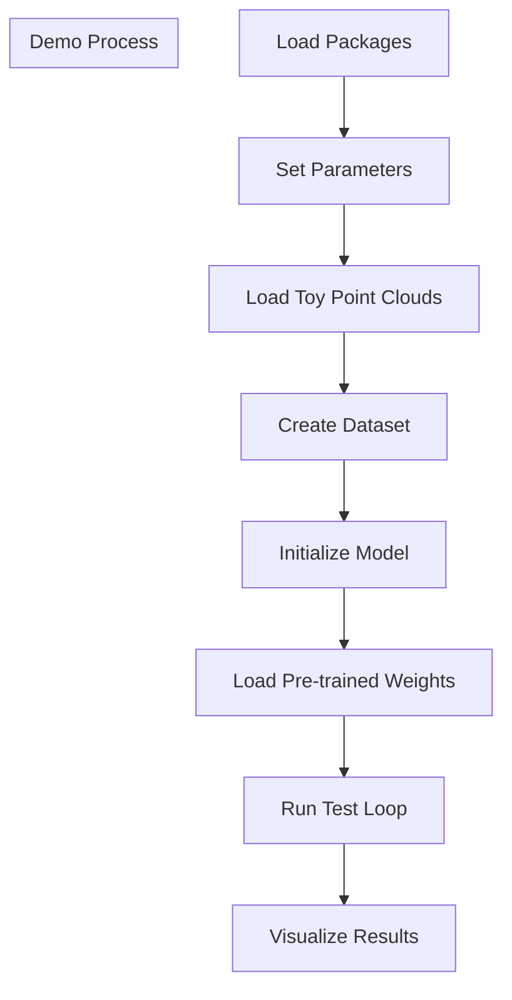
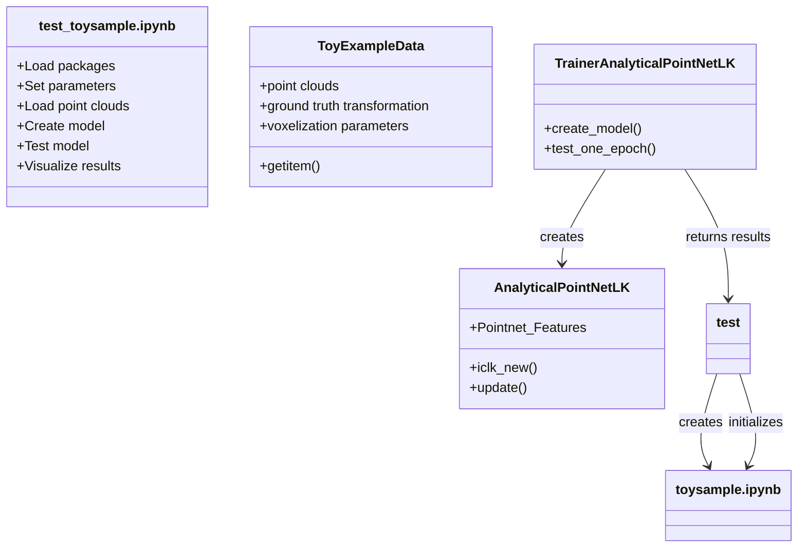
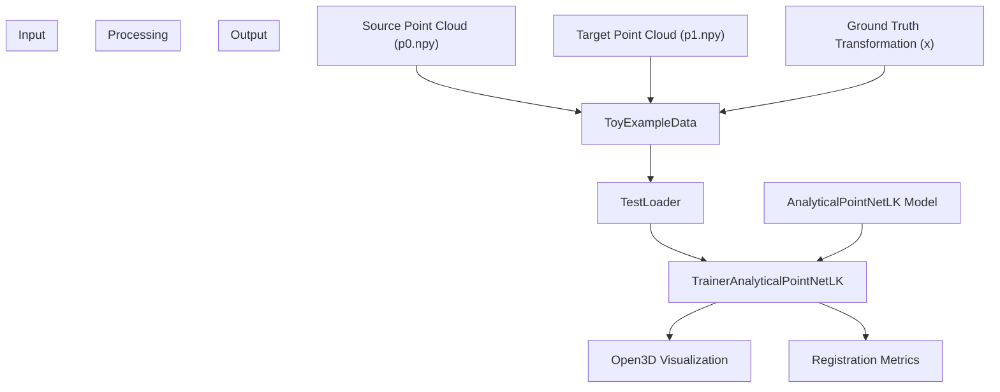
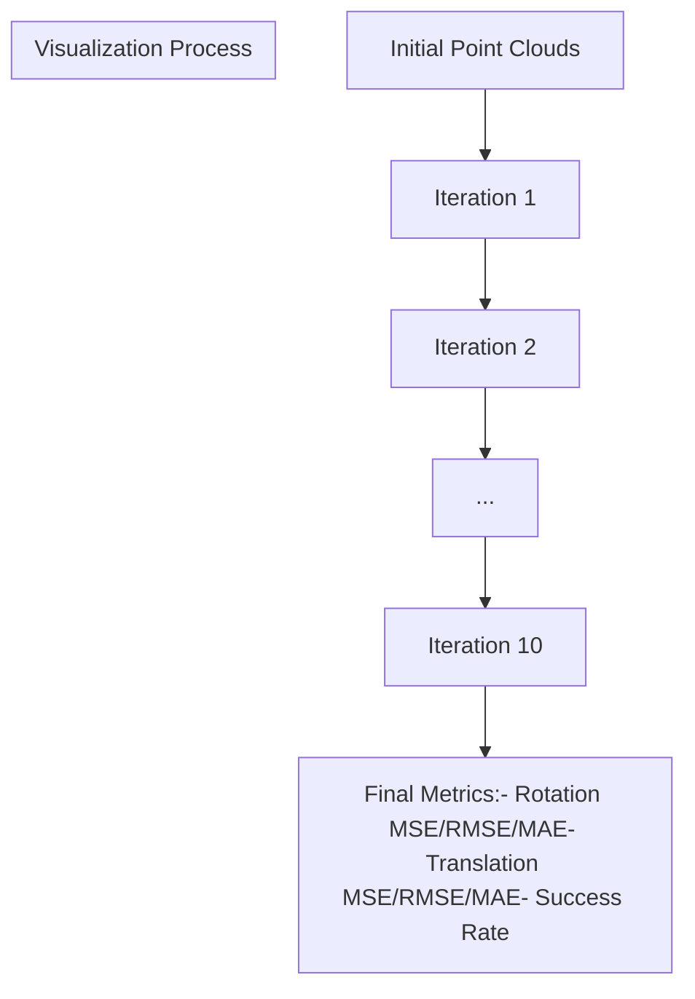
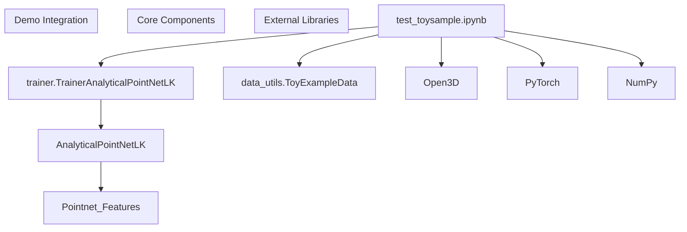

# Demo Example

> **Relevant source files**
> * [demo/p0.npy](https://github.com/Lilac-Lee/PointNetLK_Revisited/blob/4c5fbb1a/demo/p0.npy)
> * [demo/p1.npy](https://github.com/Lilac-Lee/PointNetLK_Revisited/blob/4c5fbb1a/demo/p1.npy)
> * [demo/test_toysample.ipynb](https://github.com/Lilac-Lee/PointNetLK_Revisited/blob/4c5fbb1a/demo/test_toysample.ipynb)

This page provides a detailed walkthrough of the demonstration example included in the PointNetLK_Revisited repository. The demo showcases how to use the pre-trained PointNetLK model on a simple point cloud registration task, allowing users to understand the core functionality of the system without dealing with large datasets. For information about model training and evaluation on standard datasets, see [Training a Model](/Lilac-Lee/PointNetLK_Revisited/5.2-training-a-model) and [Evaluating a Model](/Lilac-Lee/PointNetLK_Revisited/5.3-evaluating-a-model).

## Purpose of the Demo

The demo serves several important purposes:

1. Provides a quick introduction to point cloud registration using PointNetLK
2. Demonstrates the iterative convergence of the algorithm
3. Shows visual results at each iteration
4. Allows easy testing of the system on simple data

## Demo Overview

The demo is implemented as a Jupyter notebook ([demo/test_toysample.ipynb](https://github.com/Lilac-Lee/PointNetLK_Revisited/blob/4c5fbb1a/demo/test_toysample.ipynb)

), which performs point cloud registration on a toy example with visualization of the alignment process. The notebook loads two point clouds and applies the PointNetLK algorithm to find the transformation that aligns them.



Sources: [demo/test_toysample.ipynb L1-L442](https://github.com/Lilac-Lee/PointNetLK_Revisited/blob/4c5fbb1a/demo/test_toysample.ipynb#L1-L442)

## Required Components

The demo utilizes several key components from the PointNetLK_Revisited repository:



Sources: [demo/test_toysample.ipynb L35-L52](https://github.com/Lilac-Lee/PointNetLK_Revisited/blob/4c5fbb1a/demo/test_toysample.ipynb#L35-L52)

 [demo/test_toysample.ipynb L400-L417](https://github.com/Lilac-Lee/PointNetLK_Revisited/blob/4c5fbb1a/demo/test_toysample.ipynb#L400-L417)

## Running the Demo

### Step 1: Setup Parameters

The demo begins by setting up parameters that control the behavior of the PointNetLK algorithm:

```
args = argparse.Namespace()
args.dim_k = 1024         # Dimension for PointNet embedding
args.device = 'cpu'       # Device for computation
args.max_iter = 10        # Maximum iterations for LK
args.embedding = 'pointnet'
args.outfile = 'toyexample_2021_04_17'
args.data_type = 'real'
args.vis = True           # Enable visualization
```

Sources: [demo/test_toysample.ipynb L68-L90](https://github.com/Lilac-Lee/PointNetLK_Revisited/blob/4c5fbb1a/demo/test_toysample.ipynb#L68-L90)

### Step 2: Load Toy Dataset

The demo loads two pre-saved point clouds and sets up voxelization parameters:

```
p0 = np.load('./p0.npy')[np.newaxis,...]
p1 = np.load('./p1.npy')[np.newaxis,...]

# Ground truth transformation parameters
x = np.array([[0.57, -0.29, 0.73, -0.37, 0.48, -0.54]])

# Voxelization parameters
voxel_ratio = 0.05
voxel = 2
max_voxel_points = 1000
num_voxels = 8

testset = data_utils.ToyExampleData(p0, p1, voxel_ratio, voxel, 
                                   max_voxel_points, num_voxels, x, args.vis)
```

Sources: [demo/test_toysample.ipynb L107-L121](https://github.com/Lilac-Lee/PointNetLK_Revisited/blob/4c5fbb1a/demo/test_toysample.ipynb#L107-L121)

### Step 3: Create Model and Load Pre-trained Weights

The demo creates the PointNetLK model and loads pre-trained weights:

```
dptnetlk = trainer.TrainerAnalyticalPointNetLK(args)
model = dptnetlk.create_model()
model.to(args.device)
model.load_state_dict(torch.load('../logs/model_trained_on_ModelNet40_model_best.pth', 
                                 map_location='cpu'))
```

Sources: [demo/test_toysample.ipynb L400-L411](https://github.com/Lilac-Lee/PointNetLK_Revisited/blob/4c5fbb1a/demo/test_toysample.ipynb#L400-L411)

### Step 4: Run Test and Visualization

Finally, the demo runs the test and visualizes the results:

```
testloader = torch.utils.data.DataLoader(testset, batch_size=1, shuffle=False, 
                                        num_workers=0, drop_last=False)
dptnetlk.test_one_epoch(model, testloader, args.device, 'test', 
                       args.data_type, args.vis, toyexample=True)
```

Sources: [demo/test_toysample.ipynb L413-L417](https://github.com/Lilac-Lee/PointNetLK_Revisited/blob/4c5fbb1a/demo/test_toysample.ipynb#L413-L417)

## Data Flow in the Demo

The following diagram illustrates how data flows through the demo:



Sources: [demo/test_toysample.ipynb L107-L121](https://github.com/Lilac-Lee/PointNetLK_Revisited/blob/4c5fbb1a/demo/test_toysample.ipynb#L107-L121)

 [demo/test_toysample.ipynb L400-L417](https://github.com/Lilac-Lee/PointNetLK_Revisited/blob/4c5fbb1a/demo/test_toysample.ipynb#L400-L417)

## Understanding the Visualization

When running the demo with visualization enabled (`args.vis = True`), the notebook provides visual results for each iteration of the PointNetLK algorithm. The visualization shows:

1. Two point clouds (source in blue, target in red)
2. The current alignment between them
3. Progressively better alignment as iterations proceed

The output also includes numerical metrics that measure the quality of registration:



Sources: [demo/test_toysample.ipynb L160-L389](https://github.com/Lilac-Lee/PointNetLK_Revisited/blob/4c5fbb1a/demo/test_toysample.ipynb#L160-L389)

## Interpreting the Results

The demo outputs several metrics to evaluate the quality of registration:

| Metric | Description |
| --- | --- |
| rot_MSE | Mean Squared Error of rotation |
| rot_RMSE | Root Mean Squared Error of rotation |
| rot_MAE | Mean Absolute Error of rotation |
| trans_MSE | Mean Squared Error of translation |
| trans_RMSE | Root Mean Squared Error of translation |
| trans_MAE | Mean Absolute Error of translation |
| success cases | Binary indicators of success (1) or failure (0) for each iteration |

The output also includes mean and median values for these metrics, which help evaluate the overall performance of the algorithm.

Sources: [demo/test_toysample.ipynb L382-L388](https://github.com/Lilac-Lee/PointNetLK_Revisited/blob/4c5fbb1a/demo/test_toysample.ipynb#L382-L388)

## Integration with the Main System

The demo leverages the core components of the PointNetLK_Revisited system, showing how they can be used in a simple context:



Sources: [demo/test_toysample.ipynb L35-L52](https://github.com/Lilac-Lee/PointNetLK_Revisited/blob/4c5fbb1a/demo/test_toysample.ipynb#L35-L52)

 [demo/test_toysample.ipynb L400-L417](https://github.com/Lilac-Lee/PointNetLK_Revisited/blob/4c5fbb1a/demo/test_toysample.ipynb#L400-L417)

## Key Differences from Full Evaluation

The demo differs from full model evaluation ([Evaluating a Model](/Lilac-Lee/PointNetLK_Revisited/5.3-evaluating-a-model)) in several ways:

1. Uses a simple toy dataset rather than standard benchmark datasets
2. Provides visualization of each iteration step
3. Contains a simplified pipeline focused on demonstration
4. Has a fixed ground truth transformation for easy understanding

## Summary

The demo example provides an accessible introduction to the PointNetLK_Revisited system, allowing users to see how the algorithm works on a simple point cloud registration task. It demonstrates the core functionality of the system, including model creation, data loading, and evaluation, while providing visual feedback on the registration process.