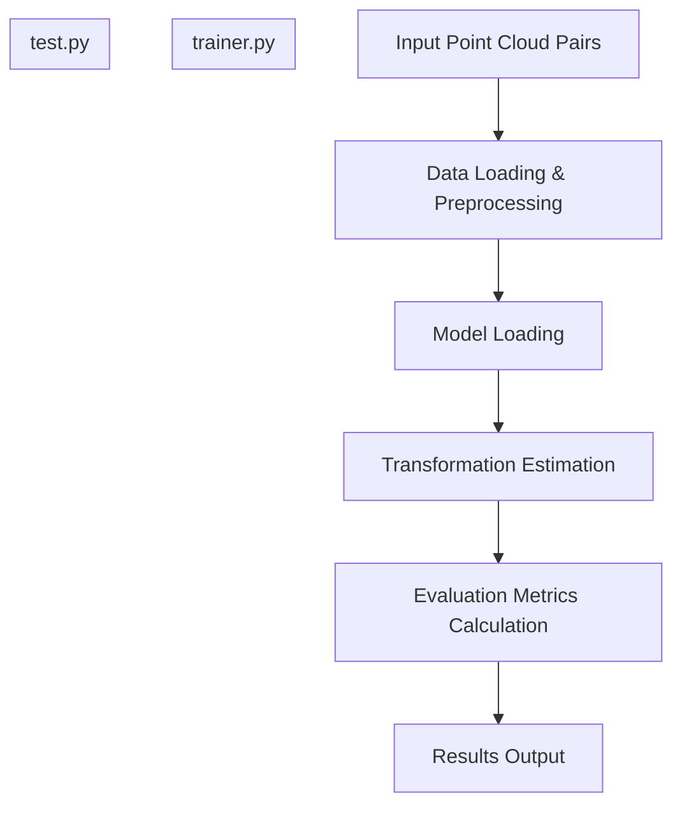
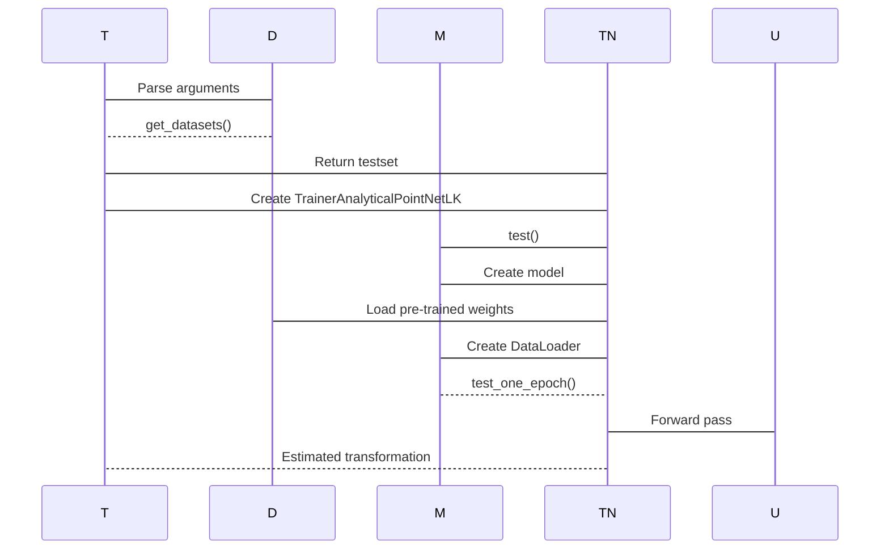
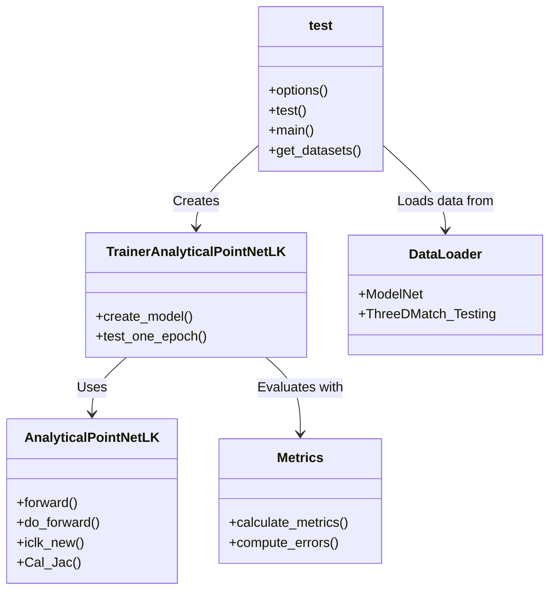

# Evaluating a Model

> **Relevant source files**
> * [README.md](https://github.com/Lilac-Lee/PointNetLK_Revisited/blob/4c5fbb1a/README.md)
> * [logs/model_trained_on_ModelNet40_model_best.pth](https://github.com/Lilac-Lee/PointNetLK_Revisited/blob/4c5fbb1a/logs/model_trained_on_ModelNet40_model_best.pth)
> * [test.py](https://github.com/Lilac-Lee/PointNetLK_Revisited/blob/4c5fbb1a/test.py)

This document provides a comprehensive guide on how to evaluate pre-trained models in the PointNetLK_Revisited repository. It covers the testing configuration, execution process, and interpretation of results. For information about training new models, see [Training a Model](/Lilac-Lee/PointNetLK_Revisited/5.2-training-a-model).

## Overview of the Evaluation Process

The PointNetLK_Revisited repository provides a structured approach to evaluating trained models on various datasets, including ModelNet40 and 3DMatch. The evaluation process measures how accurately the model can estimate transformations between point cloud pairs.



Sources: [test.py L86-L107](https://github.com/Lilac-Lee/PointNetLK_Revisited/blob/4c5fbb1a/test.py#L86-L107)

## Setting up the Testing Environment

Before evaluating a model, ensure you have:

1. Installed all dependencies as specified in the README
2. Downloaded the required test datasets
3. Located your pre-trained model file(s)

The repository comes with a pre-trained model located at `logs/model_trained_on_ModelNet40_model_best.pth` which is trained on the ModelNet40 dataset.

### Dataset Preparation

The codebase supports testing on multiple datasets:

| Dataset | Configuration |
| --- | --- |
| ModelNet40 | Use `--dataset_type modelnet` and specify path with `--dataset_path` |
| 3DMatch | Use `--dataset_type 3dmatch` and specify path with `--dataset_path` |

For 3DMatch dataset, the repository leverages the format prepared by Deep Global Registration. You'll need to create symbolic links to your datasets in the `./dataset/` folder.

Sources: [test.py L113-L144](https://github.com/Lilac-Lee/PointNetLK_Revisited/blob/4c5fbb1a/test.py#L113-L144)

 [README.md L34-L43](https://github.com/Lilac-Lee/PointNetLK_Revisited/blob/4c5fbb1a/README.md#L34-L43)

## Running Model Evaluation

### Basic Command

To evaluate a model, run:

```
python test.py
```

### Test Configuration Parameters

The testing script offers numerous configuration options:

```

```

Sources: [test.py L17-L83](https://github.com/Lilac-Lee/PointNetLK_Revisited/blob/4c5fbb1a/test.py#L17-L83)

### Key Configuration Parameters

| Parameter | Description | Default |
| --- | --- | --- |
| `--outfile` | Path for test output logs | `./test_logs/2021_04_17_test_on_3dmatch_trained_on_modelnet` |
| `--dataset_type` | Dataset to test on (`modelnet` or `3dmatch`) | `3dmatch` |
| `--pretrained` | Path to pre-trained model | `./logs/model_trained_on_ModelNet40_model_best.pth` |
| `--max_iter` | Maximum iterations for LK algorithm | `20` |
| `--voxel_after_transf` | Voxelize after transformation | `False` |
| `--vis` | Visualize results | `False` |

Sources: [test.py L17-L83](https://github.com/Lilac-Lee/PointNetLK_Revisited/blob/4c5fbb1a/test.py#L17-L83)

### Example Commands

#### Testing on ModelNet40:

```
python test.py --dataset_type modelnet --dataset_path ./dataset/ModelNet --categoryfile ./dataset/modelnet40_half2.txt --data_type synthetic
```

#### Testing on 3DMatch:

```
python test.py --dataset_type 3dmatch --dataset_path ./dataset/ThreeDMatch --categoryfile ./dataset/test_3dmatch.txt
```

Sources: [test.py L108-L112](https://github.com/Lilac-Lee/PointNetLK_Revisited/blob/4c5fbb1a/test.py#L108-L112)

 [README.md L56-L59](https://github.com/Lilac-Lee/PointNetLK_Revisited/blob/4c5fbb1a/README.md#L56-L59)

## Evaluation Process Internals

The testing process follows these steps:



Sources: [test.py L86-L107](https://github.com/Lilac-Lee/PointNetLK_Revisited/blob/4c5fbb1a/test.py#L86-L107)

 [test.py L147-L158](https://github.com/Lilac-Lee/PointNetLK_Revisited/blob/4c5fbb1a/test.py#L147-L158)

## Understanding Test Results

The `test_one_epoch` method in `TrainerAnalyticalPointNetLK` evaluates the model and reports several important metrics:

### Key Metrics

| Metric | Description |
| --- | --- |
| Mean Squared Error (MSE) | Average squared difference between estimated and ground truth transformations |
| Mean Angular Error (MAE) | Average angular error in rotation estimation (degrees) |
| Mean Translation Error (MTE) | Average error in translation estimation |
| Success Rate | Percentage of registrations within acceptable error thresholds |
| Convergence Rate | Percentage of cases where the algorithm converged |

The console output will display these metrics, and the results are also saved to the location specified by `--outfile`.

### Visualizing Results

If you pass the `--vis` flag, the evaluation process can visualize the registration results, showing initial misalignment and final alignment after applying the estimated transformation.

For interactive visualization, check out the demo notebook at `./demo/test_toysample.ipynb`, which provides a more intuitive way to examine individual registration results.

Sources: [README.md

14](https://github.com/Lilac-Lee/PointNetLK_Revisited/blob/4c5fbb1a/README.md#L14-L14)

 [README.md L24-L31](https://github.com/Lilac-Lee/PointNetLK_Revisited/blob/4c5fbb1a/README.md#L24-L31)

## Advanced Testing Considerations

### Testing with Noise

The testing framework allows adding controlled noise to point clouds for robustness evaluation:

```
python test.py --sigma 0.01 --clip 0.05
```

This adds Gaussian noise with standard deviation `sigma` and clipped to a range of `clip`.

### Voxelization Options

For real-world data, voxelization is an important pre-processing step:

```
python test.py --voxel 2 --voxel_ratio 0.05 --num_voxels 8 --voxel_after_transf True
```

Setting `--voxel_after_transf` to True applies voxelization after transformation, which is more suitable for scenarios where you already have an initial transformation estimate.

Sources: [test.py L46-L59](https://github.com/Lilac-Lee/PointNetLK_Revisited/blob/4c5fbb1a/test.py#L46-L59)

 [README.md L46-L49](https://github.com/Lilac-Lee/PointNetLK_Revisited/blob/4c5fbb1a/README.md#L46-L49)

## Testing System Architecture

The testing system in PointNetLK_Revisited involves these key components:



Sources: [test.py L86-L112](https://github.com/Lilac-Lee/PointNetLK_Revisited/blob/4c5fbb1a/test.py#L86-L112)

## Conclusion

The evaluation framework in PointNetLK_Revisited provides a comprehensive way to assess model performance on point cloud registration tasks. By following this guide, you can effectively evaluate pre-trained models on different datasets and understand their performance through various metrics.

For visualization of results and a more interactive experience, see [Visualization](/Lilac-Lee/PointNetLK_Revisited/5.5-visualization).