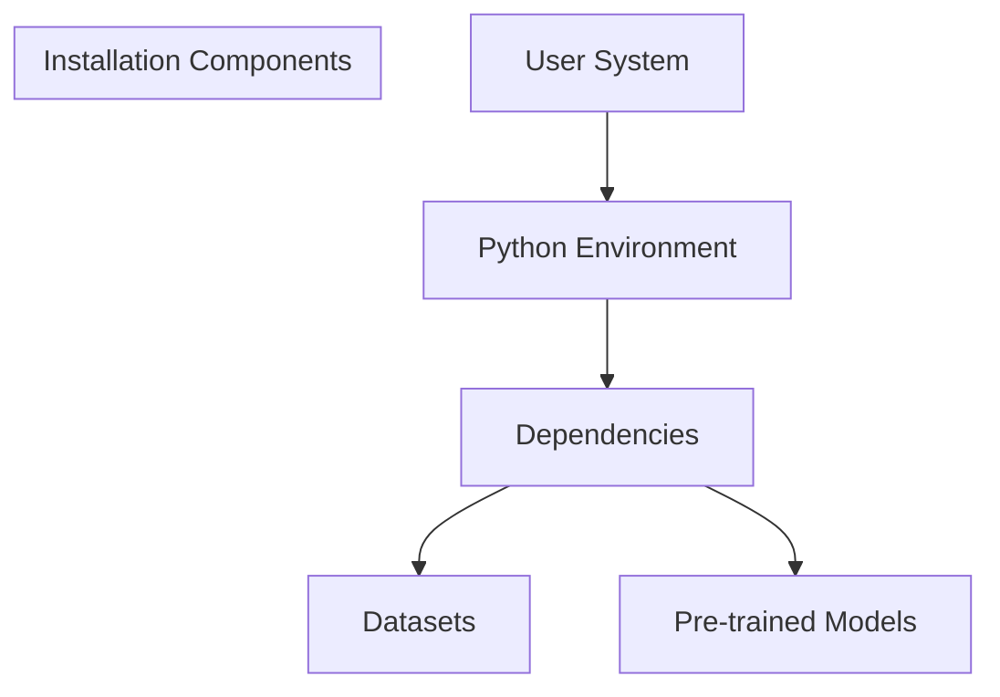
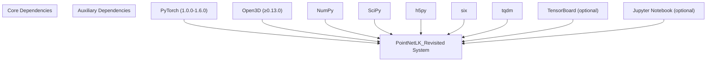
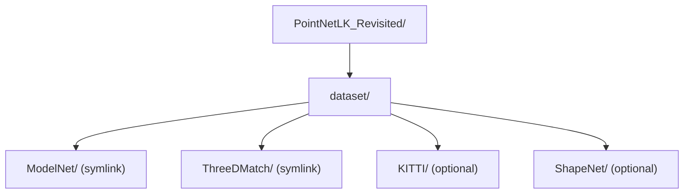
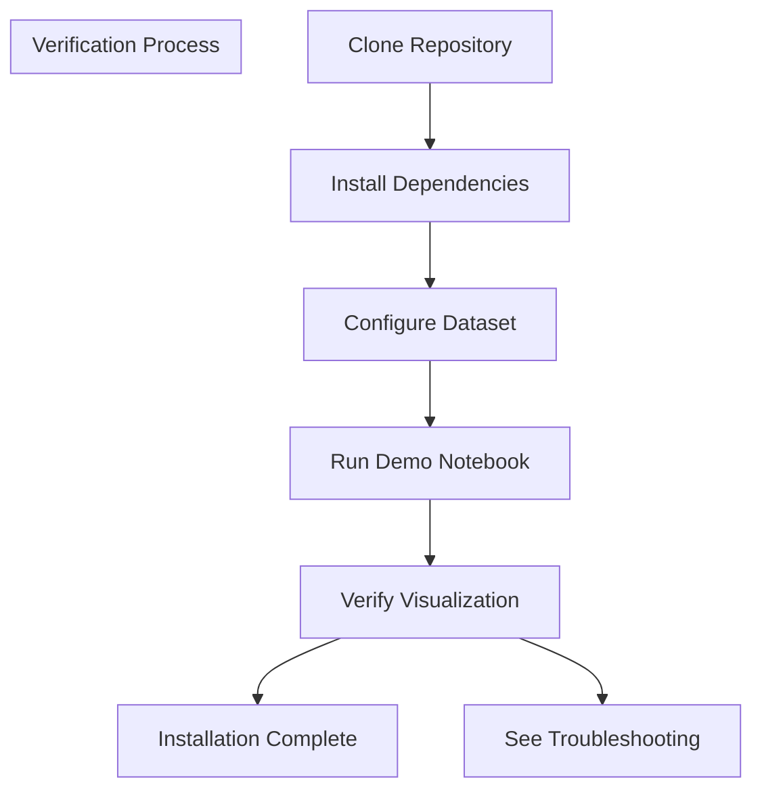

# Installation

> **Relevant source files**
> * [.gitignore](https://github.com/Lilac-Lee/PointNetLK_Revisited/blob/4c5fbb1a/.gitignore)
> * [LICENSE](https://github.com/Lilac-Lee/PointNetLK_Revisited/blob/4c5fbb1a/LICENSE)
> * [README.md](https://github.com/Lilac-Lee/PointNetLK_Revisited/blob/4c5fbb1a/README.md)
> * [requirements.txt](https://github.com/Lilac-Lee/PointNetLK_Revisited/blob/4c5fbb1a/requirements.txt)

This document provides step-by-step instructions for setting up the PointNetLK_Revisited repository on your system. It covers prerequisites, environment setup, dependency installation, and dataset configuration. For information about using the system after installation, see [Training a Model](/Lilac-Lee/PointNetLK_Revisited/5.2-training-a-model) and [Evaluating a Model](/Lilac-Lee/PointNetLK_Revisited/5.3-evaluating-a-model).

## System Requirements

The PointNetLK_Revisited implementation has the following system requirements:

* Python 3.6 or higher
* CUDA-capable GPU (recommended for training)
* Sufficient disk space for datasets and model storage



Sources: [README.md L16-L21](https://github.com/Lilac-Lee/PointNetLK_Revisited/blob/4c5fbb1a/README.md#L16-L21)

## Environment Setup

There are two recommended approaches for setting up your environment:

### Option 1: Direct Installation

1. Clone the repository:

```
git clone https://github.com/Lilac-Lee/PointNetLK_Revisited.git
cd PointNetLK_Revisited
```
2. Install dependencies using pip:

```
pip install -r requirements.txt
```
3. Install PyTorch separately (version compatibility: 1.0.0 ≤ torch ≤ 1.6.0):
Visit the [PyTorch website](https://pytorch.org/) to get the appropriate command for your system.
4. Install TensorBoard for visualization (optional):

```
pip install tensorboard
```

### Option 2: Virtual Environment (Recommended)

1. Clone the repository:

```
git clone https://github.com/Lilac-Lee/PointNetLK_Revisited.git
cd PointNetLK_Revisited
```
2. Create and activate a virtual environment:

```
python -m venv pointnetlk_env
# On Windows
pointnetlk_env\Scripts\activate
# On Linux/Mac
source pointnetlk_env/bin/activate
```
3. Install dependencies:

```
pip install -r requirements.txt
```
4. Install PyTorch separately (version compatibility: 1.0.0 ≤ torch ≤ 1.6.0):
Visit the [PyTorch website](https://pytorch.org/) to get the appropriate command for your system.
5. Install TensorBoard (optional):

```
pip install tensorboard
```

Sources: [README.md L16-L21](https://github.com/Lilac-Lee/PointNetLK_Revisited/blob/4c5fbb1a/README.md#L16-L21)

 [requirements.txt L1-L6](https://github.com/Lilac-Lee/PointNetLK_Revisited/blob/4c5fbb1a/requirements.txt#L1-L6)

## Dependencies Overview

The following diagram illustrates the key dependencies and their roles in the system:



Sources: [README.md L16-L21](https://github.com/Lilac-Lee/PointNetLK_Revisited/blob/4c5fbb1a/README.md#L16-L21)

 [requirements.txt L1-L6](https://github.com/Lilac-Lee/PointNetLK_Revisited/blob/4c5fbb1a/requirements.txt#L1-L6)

### Dependency Details

| Dependency | Version | Purpose |
| --- | --- | --- |
| PyTorch | 1.0.0 - 1.6.0 | Deep learning framework |
| Open3D | ≥ 0.13.0 | Point cloud processing and visualization |
| NumPy | Latest | Numerical operations |
| SciPy | Latest | Scientific computing |
| h5py | Latest | HDF5 file format support for datasets |
| six | Latest | Python 2/3 compatibility utilities |
| tqdm | Latest | Progress bar for training/evaluation |
| TensorBoard | Latest | Optional: Training visualization |
| Jupyter Notebook | Latest | Optional: For running demo notebooks |

Sources: [README.md L16-L21](https://github.com/Lilac-Lee/PointNetLK_Revisited/blob/4c5fbb1a/README.md#L16-L21)

 [requirements.txt L1-L6](https://github.com/Lilac-Lee/PointNetLK_Revisited/blob/4c5fbb1a/requirements.txt#L1-L6)

## Dataset Configuration

The system can work with several datasets for point cloud registration:

1. **ModelNet40**
2. **ShapeNet**
3. **KITTI**
4. **3DMatch**

### Dataset Download Locations

* **ModelNet40**: [https://modelnet.cs.princeton.edu](https://modelnet.cs.princeton.edu)
* **ShapeNet**: [https://shapenet.org](https://shapenet.org)
* **KITTI**: [http://www.cvlibs.net/datasets/kitti/eval_odometry.php](http://www.cvlibs.net/datasets/kitti/eval_odometry.php)
* **3DMatch**: Use the download script from [DeepGlobalRegistration](https://github.com/Lilac-Lee/PointNetLK_Revisited/blob/4c5fbb1a/DeepGlobalRegistration)

### Dataset Directory Setup

After downloading the datasets, set up the directory structure as follows:



Create symbolic links to your dataset locations:

```
# From the repository root
mkdir -p dataset
ln -s /path/to/your/modelnet dataset/ModelNet
ln -s /path/to/your/3dmatch dataset/ThreeDMatch
# Optional other datasets
ln -s /path/to/your/kitti dataset/KITTI
ln -s /path/to/your/shapenet dataset/ShapeNet
```

Sources: [README.md L34-L43](https://github.com/Lilac-Lee/PointNetLK_Revisited/blob/4c5fbb1a/README.md#L34-L43)

## Pre-trained Models

Pre-trained models are provided with the repository. The main pre-trained model used in the paper is located at:

```
logs/model_trained_on_ModelNet40_model_best.pth
```

This model was trained on the ModelNet40 dataset and can be used for inference or as a starting point for fine-tuning.

Sources: [README.md L62-L64](https://github.com/Lilac-Lee/PointNetLK_Revisited/blob/4c5fbb1a/README.md#L62-L64)

## Verification

To verify your installation is working correctly:

1. Run the demonstration notebook:

```
jupyter notebook demo/test_toysample.ipynb
```
2. This notebook provides an interactive example using 3DMatch dataset samples.

Note: The interactive visualization in the demo notebook requires Open3D ≥ 0.13.0 and may take a few seconds to appear.



Sources: [README.md L24-L31](https://github.com/Lilac-Lee/PointNetLK_Revisited/blob/4c5fbb1a/README.md#L24-L31)

## Troubleshooting

### PyTorch Installation Issues

* If you encounter CUDA compatibility issues, ensure your PyTorch version matches your CUDA version
* Visit PyTorch's official site for version-specific installation commands: [https://pytorch.org/](https://pytorch.org/)

### Open3D Visualization Problems

* For visualization issues in the demo notebook, verify your Open3D version: `pip show open3d`
* If the version is below 0.13.0, upgrade with: `pip install --upgrade open3d>=0.13.0`

### Dataset Access Issues

* If symbolic links don't work on your system, you can directly copy the dataset folders to the `dataset/` directory
* Verify that your dataset paths match the expected structure and formats

### Missing Pre-trained Models

* The pre-trained models should be available in the repository
* If missing, check the GitHub repository for updated download instructions

Sources: [README.md L16-L21](https://github.com/Lilac-Lee/PointNetLK_Revisited/blob/4c5fbb1a/README.md#L16-L21)

 [README.md L62-L64](https://github.com/Lilac-Lee/PointNetLK_Revisited/blob/4c5fbb1a/README.md#L62-L64)