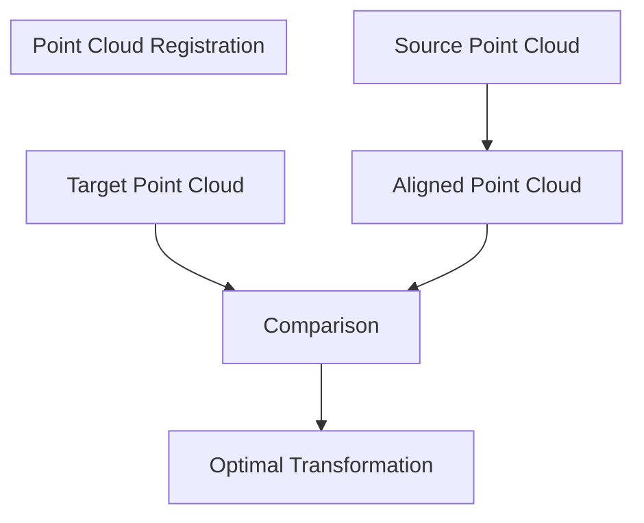
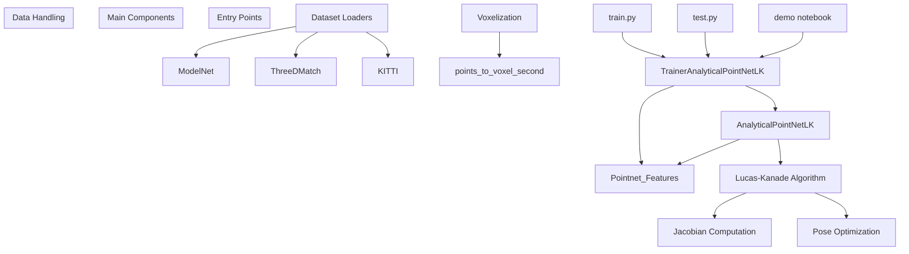
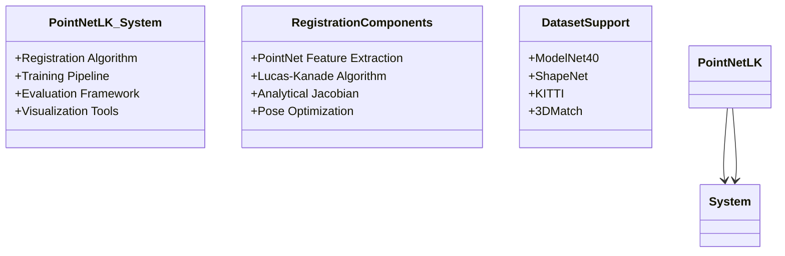
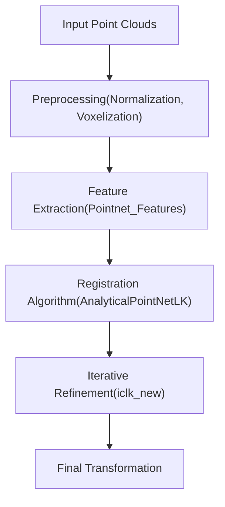
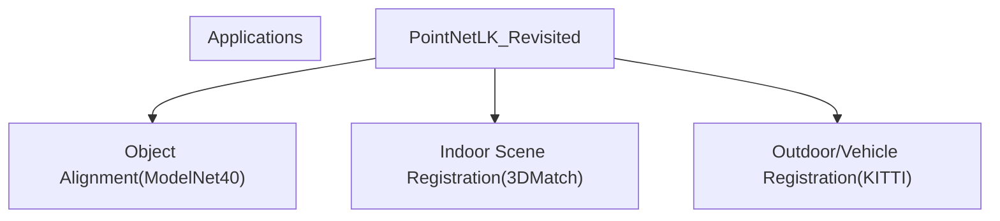

# Overview

> **Relevant source files**
> * [README.md](https://github.com/Lilac-Lee/PointNetLK_Revisited/blob/4c5fbb1a/README.md)

## Purpose and Scope

This document provides a comprehensive overview of the PointNetLK_Revisited repository, which implements an improved version of the PointNetLK algorithm for point cloud registration. The system aligns two point clouds by estimating the rigid transformation (rotation and translation) between them. This page introduces the core concepts, system architecture, and primary components that make up the implementation. For more detailed information about using the system, see [Usage Guide](/Lilac-Lee/PointNetLK_Revisited/5-usage-guide).

Point cloud registration is a fundamental problem in 3D computer vision with applications in robotics, autonomous driving, and 3D reconstruction. The PointNetLK_Revisited implementation focuses particularly on local registration scenarios, where a rough initial alignment is available.

Sources: [README.md L1-L9](https://github.com/Lilac-Lee/PointNetLK_Revisited/blob/4c5fbb1a/README.md#L1-L9)

## What is Point Cloud Registration?

Point cloud registration is the process of finding the optimal alignment between two 3D point clouds. Given a source point cloud and a target point cloud, the goal is to determine the transformation parameters (rotation and translation) that best align the source to the target.

PointNetLK_Revisited combines deep learning-based feature extraction (PointNet) with classical Lucas-Kanade alignment techniques to create a robust, differentiable registration framework.

Sources: [README.md L11-L14](https://github.com/Lilac-Lee/PointNetLK_Revisited/blob/4c5fbb1a/README.md#L11-L14)

## System Components

The repository consists of several core components that work together to implement the point cloud registration algorithm:

The implementation follows a modular design pattern separating model definition, training procedures, and data processing into distinct components.

Sources: [README.md L16-L21](https://github.com/Lilac-Lee/PointNetLK_Revisited/blob/4c5fbb1a/README.md#L16-L21)

 [README.md L47-L49](https://github.com/Lilac-Lee/PointNetLK_Revisited/blob/4c5fbb1a/README.md#L47-L49)

## Key Features

The PointNetLK_Revisited implementation offers several notable features:

1. **Analytical Jacobian Computation**: Improves convergence of the registration algorithm
2. **Voxelization Support**: Efficient handling of dense point clouds
3. **Multiple Dataset Support**: Works with ModelNet40, ShapeNet, KITTI, and 3DMatch datasets
4. **Interactive Visualization**: Demo notebook with Open3D visualization
5. **Pre-trained Models**: Ready-to-use models for immediate testing

Sources: [README.md L34-L44](https://github.com/Lilac-Lee/PointNetLK_Revisited/blob/4c5fbb1a/README.md#L34-L44)

## Code Organization

The codebase is organized into several key files, each responsible for specific aspects of the system:

| File | Primary Responsibility |
| --- | --- |
| `train.py` | Entry point for training models |
| `test.py` | Entry point for evaluating models |
| `trainer.py` | Implements training and evaluation logic |
| `model.py` | Defines the PointNetLK architecture |
| `utils.py` | Transformation and mathematical utilities |
| `data_utils.py` | Dataset loading and preprocessing |

The system follows a logical flow during both training and inference:

Sources: [README.md L52-L59](https://github.com/Lilac-Lee/PointNetLK_Revisited/blob/4c5fbb1a/README.md#L52-L59)

## Relationship to Original PointNetLK

PointNetLK_Revisited is built upon the original PointNetLK algorithm with several improvements:

1. Analytical computation of the Jacobian matrix
2. Advanced voxelization techniques for point cloud processing
3. Enhanced training methodology
4. Support for diverse datasets beyond synthetic data

These improvements make the system more robust for real-world point cloud registration tasks.

Sources: [README.md L67-L74](https://github.com/Lilac-Lee/PointNetLK_Revisited/blob/4c5fbb1a/README.md#L67-L74)

## Practical Applications

The implementation has been demonstrated on several datasets representing different application domains:

The system is particularly well-suited for local registration problems where an initial approximate alignment is available.

Sources: [README.md L11-L14](https://github.com/Lilac-Lee/PointNetLK_Revisited/blob/4c5fbb1a/README.md#L11-L14)

 [README.md L47-L49](https://github.com/Lilac-Lee/PointNetLK_Revisited/blob/4c5fbb1a/README.md#L47-L49)

## Getting Started

To begin using the system, users can:

1. Install dependencies via `pip install -r requirements.txt`
2. Run the demo notebook in `./demo/test_toysample.ipynb`
3. Train a new model with `python train.py`
4. Evaluate model performance with `python test.py`

For more details on installation and usage, see the [Installation](/Lilac-Lee/PointNetLK_Revisited/5.1-installation) and [Training a Model](/Lilac-Lee/PointNetLK_Revisited/5.2-training-a-model) sections.

Sources: [README.md L16-L32](https://github.com/Lilac-Lee/PointNetLK_Revisited/blob/4c5fbb1a/README.md#L16-L32)

 [README.md L52-L59](https://github.com/Lilac-Lee/PointNetLK_Revisited/blob/4c5fbb1a/README.md#L52-L59)