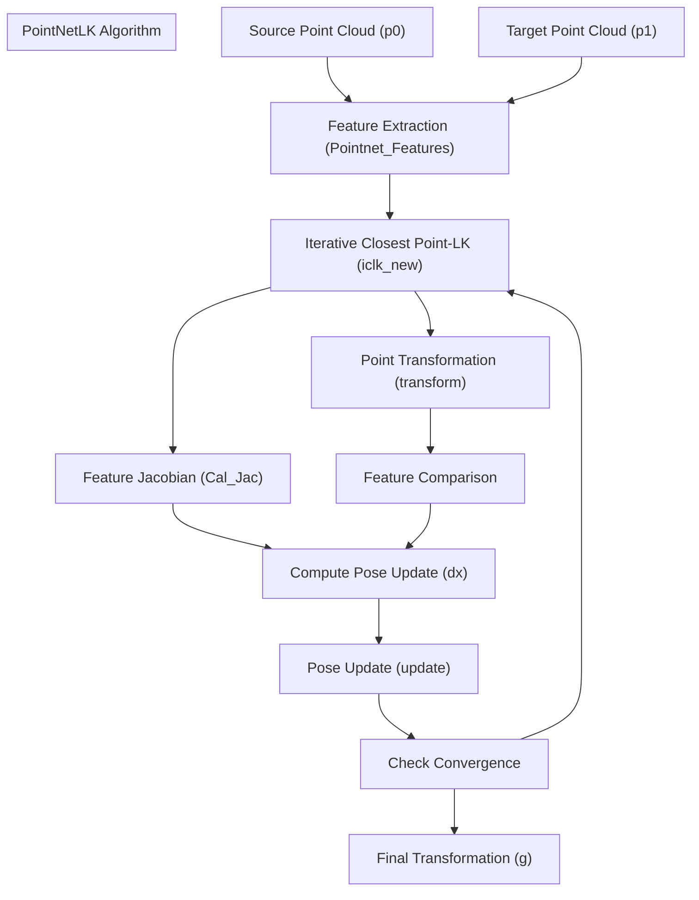
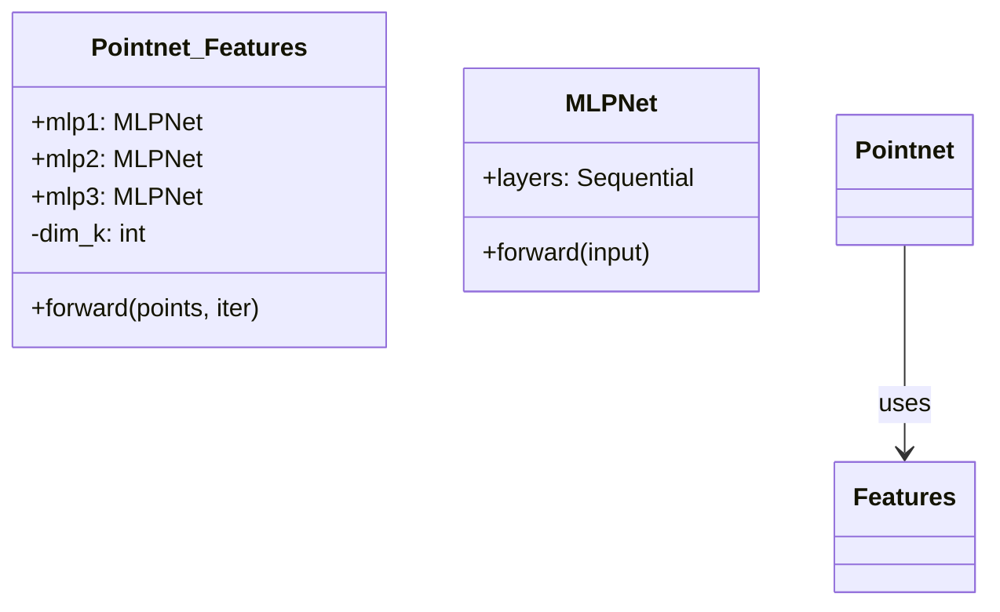
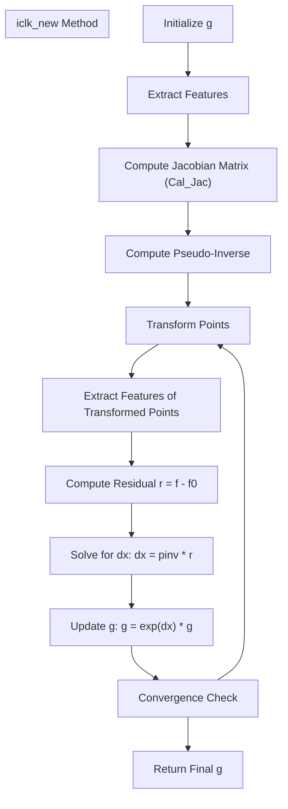
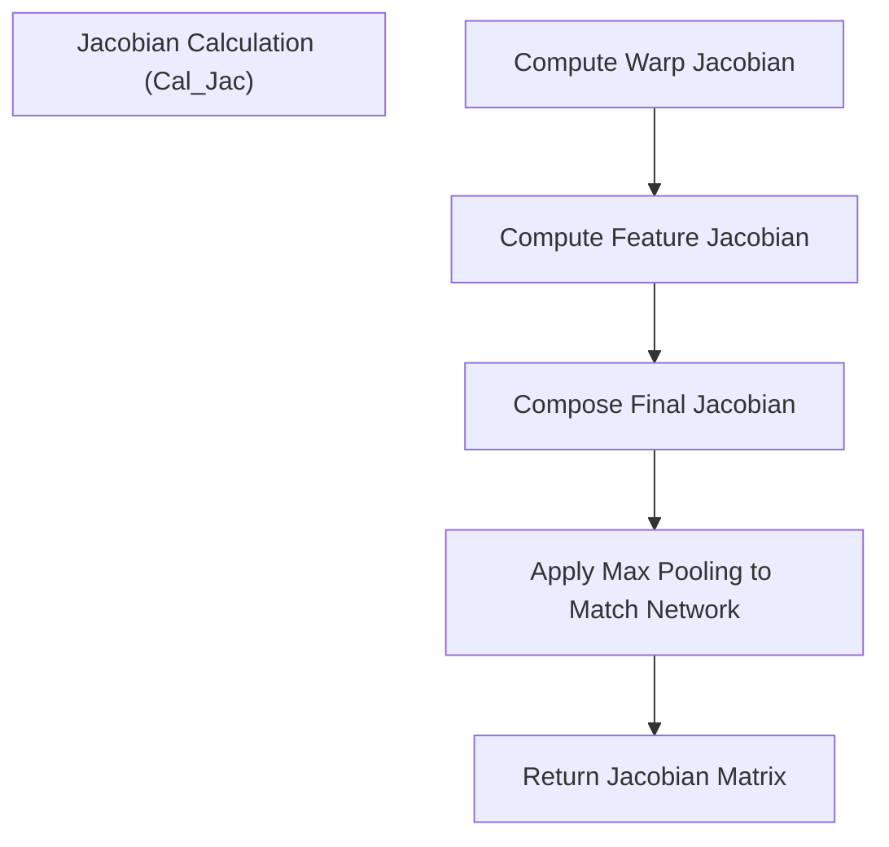
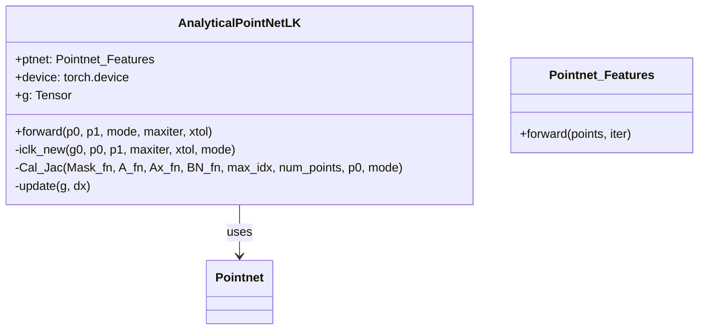

# PointNetLK Algorithm

> **Relevant source files**
> * [README.md](https://github.com/Lilac-Lee/PointNetLK_Revisited/blob/4c5fbb1a/README.md)
> * [model.py](https://github.com/Lilac-Lee/PointNetLK_Revisited/blob/4c5fbb1a/model.py)
> * [utils.py](https://github.com/Lilac-Lee/PointNetLK_Revisited/blob/4c5fbb1a/utils.py)

## Purpose and Scope

This document explains the theoretical foundations and implementation of the PointNetLK algorithm in the PointNetLK_Revisited repository. PointNetLK is a deep learning-based point cloud registration algorithm that combines PointNet for feature extraction with the Lucas-Kanade (LK) algorithm for iterative alignment. This page focuses specifically on the algorithm itself and its implementation, not on how to train or test models based on it (for training details, see [Training System](/Lilac-Lee/PointNetLK_Revisited/3.2-training-system)).

## Overview

PointNetLK is a point cloud registration algorithm that estimates the rigid transformation (rotation and translation) between two point clouds. The algorithm integrates:

1. **PointNet** architecture for extracting features from point clouds
2. **Lucas-Kanade** algorithm adapted for 3D point cloud alignment
3. **Analytical Jacobian computation** for efficient optimization

Sources: [model.py L1-L351](https://github.com/Lilac-Lee/PointNetLK_Revisited/blob/4c5fbb1a/model.py#L1-L351)

 [utils.py L1-L462](https://github.com/Lilac-Lee/PointNetLK_Revisited/blob/4c5fbb1a/utils.py#L1-L462)

## Algorithm Architecture

Sources: [model.py L264-L351](https://github.com/Lilac-Lee/PointNetLK_Revisited/blob/4c5fbb1a/model.py#L264-L351)

 [model.py L204-L216](https://github.com/Lilac-Lee/PointNetLK_Revisited/blob/4c5fbb1a/model.py#L204-L216)

## Core Components

### 1. Feature Extraction with PointNet

The `Pointnet_Features` class implements a simplified PointNet architecture to extract features from point clouds.

The feature extraction process:

1. Takes a point cloud [B, N, 3] as input
2. Processes through three MLP layers with increasing feature dimensions
3. Applies max pooling to create a global feature vector [B, K]
4. When iter=-1, also exports intermediate layer outputs for Jacobian calculation

Sources: [model.py L50-L101](https://github.com/Lilac-Lee/PointNetLK_Revisited/blob/4c5fbb1a/model.py#L50-L101)

 [model.py L9-L41](https://github.com/Lilac-Lee/PointNetLK_Revisited/blob/4c5fbb1a/model.py#L9-L41)

### 2. Lucas-Kanade Algorithm Adaptation

The Lucas-Kanade algorithm has been adapted for 3D point cloud registration in the `iclk_new` method of the `AnalyticalPointNetLK` class.

Sources: [model.py L264-L351](https://github.com/Lilac-Lee/PointNetLK_Revisited/blob/4c5fbb1a/model.py#L264-L351)

### 3. Analytical Jacobian Computation

One of the key innovations in PointNetLK is the analytical computation of the Jacobian matrix, which enables efficient optimization.

The Jacobian computation combines:

1. Warp Jacobian - Relates changes in pose to changes in point coordinates
2. Feature Jacobian - Relates changes in point coordinates to changes in extracted features

Sources: [model.py L222-L262](https://github.com/Lilac-Lee/PointNetLK_Revisited/blob/4c5fbb1a/model.py#L222-L262)

 [utils.py L285-L321](https://github.com/Lilac-Lee/PointNetLK_Revisited/blob/4c5fbb1a/utils.py#L285-L321)

 [utils.py L353-L386](https://github.com/Lilac-Lee/PointNetLK_Revisited/blob/4c5fbb1a/utils.py#L353-L386)

## Implementation Details

### AnalyticalPointNetLK Class

The main implementation class is `AnalyticalPointNetLK`, which integrates all components of the algorithm.

Key methods:

* `forward`: Entry point that initializes and calls the ICP-LK algorithm
* `iclk_new`: Core implementation of the iterative optimization
* `Cal_Jac`: Calculates the analytical Jacobian matrix
* `update`: Updates the transformation using the computed update step

Sources: [model.py L103-L262](https://github.com/Lilac-Lee/PointNetLK_Revisited/blob/4c5fbb1a/model.py#L103-L262)

### Transformation Utilities

The algorithm relies on several mathematical utilities for SE(3) operations:

| Function | Description | Location |
| --- | --- | --- |
| `exp` | Exponential map: converts 6D vector to 4x4 transformation matrix | [utils.py L234-L252](https://github.com/Lilac-Lee/PointNetLK_Revisited/blob/4c5fbb1a/utils.py#L234-L252) |
| `log` | Logarithmic map: converts 4x4 transformation matrix to 6D vector | [utils.py L159-L169](https://github.com/Lilac-Lee/PointNetLK_Revisited/blob/4c5fbb1a/utils.py#L159-L169) |
| `transform` | Applies transformation to points | [utils.py L56-L67](https://github.com/Lilac-Lee/PointNetLK_Revisited/blob/4c5fbb1a/utils.py#L56-L67) |
| `mat_se3` | Converts 6D vector to SE(3) Lie algebra matrix | [utils.py L172-L185](https://github.com/Lilac-Lee/PointNetLK_Revisited/blob/4c5fbb1a/utils.py#L172-L185) |
| `mat_so3` | Converts 3D vector to SO(3) Lie algebra matrix | [utils.py L71-L82](https://github.com/Lilac-Lee/PointNetLK_Revisited/blob/4c5fbb1a/utils.py#L71-L82) |

Sources: [utils.py L56-L252](https://github.com/Lilac-Lee/PointNetLK_Revisited/blob/4c5fbb1a/utils.py#L56-L252)

## Algorithm Workflow

The complete algorithm workflow consists of these steps:

1. **Initialization**:

* Initialize transformation `g0` as identity matrix
* Process source and target point clouds through PointNet to extract features
2. **Feature-based Registration**:

* Calculate the analytical Jacobian matrix
* Compute the pseudo-inverse of the Jacobian
* For each iteration:
* Transform points using current estimate `g`
* Extract features from transformed points
* Calculate residual between features
* Calculate update `dx = pinv * r`
* Update transformation `g = exp(dx) * g`
* Check for convergence
3. **Final Transformation**:

* Return the final transformation `g` and residual `r`

Sources: [model.py L204-L351](https://github.com/Lilac-Lee/PointNetLK_Revisited/blob/4c5fbb1a/model.py#L204-L351)

## Key Parameters

| Parameter | Description | Default |
| --- | --- | --- |
| `maxiter` | Maximum number of iterations | 10 |
| `xtol` | Convergence threshold for pose update magnitude | 1.0e-7 |
| `dim_k` | Dimension of PointNet feature vector | 1024 |
| `num_random_points` | Number of random points used during optimization | 100 |

Sources: [model.py

143](https://github.com/Lilac-Lee/PointNetLK_Revisited/blob/4c5fbb1a/model.py#L143-L143)

 [model.py

264](https://github.com/Lilac-Lee/PointNetLK_Revisited/blob/4c5fbb1a/model.py#L264-L264)

 [model.py

51](https://github.com/Lilac-Lee/PointNetLK_Revisited/blob/4c5fbb1a/model.py#L51-L51)

## Special Considerations

### Voxelization and Coordinate Systems

The algorithm supports both:

* **Synthetic data**: Uses zero-mean centering of point clouds
* **Real data**: Uses voxelization and handles global/local coordinate frames

For real data in test mode, an additional coordinate conditioning is applied to handle the transformation between voxel coordinates and global coordinates.

Sources: [model.py L143-L202](https://github.com/Lilac-Lee/PointNetLK_Revisited/blob/4c5fbb1a/model.py#L143-L202)

 [utils.py L353-L386](https://github.com/Lilac-Lee/PointNetLK_Revisited/blob/4c5fbb1a/utils.py#L353-L386)

### Batch Processing

The implementation supports batch processing of multiple point cloud pairs simultaneously:

* Batch matrices for transformations
* Batch feature extraction and Jacobian computation
* Batch optimization updates

Sources: [model.py L264-L351](https://github.com/Lilac-Lee/PointNetLK_Revisited/blob/4c5fbb1a/model.py#L264-L351)

## Relationship to Original PointNetLK

This implementation revisits the original PointNetLK with improvements:

1. Analytical Jacobian computation instead of numerical approximation
2. Better handling of real-world data through voxelization
3. Coordinate conditioning for improved registration accuracy

Sources: [README.md L1-L88](https://github.com/Lilac-Lee/PointNetLK_Revisited/blob/4c5fbb1a/README.md#L1-L88)