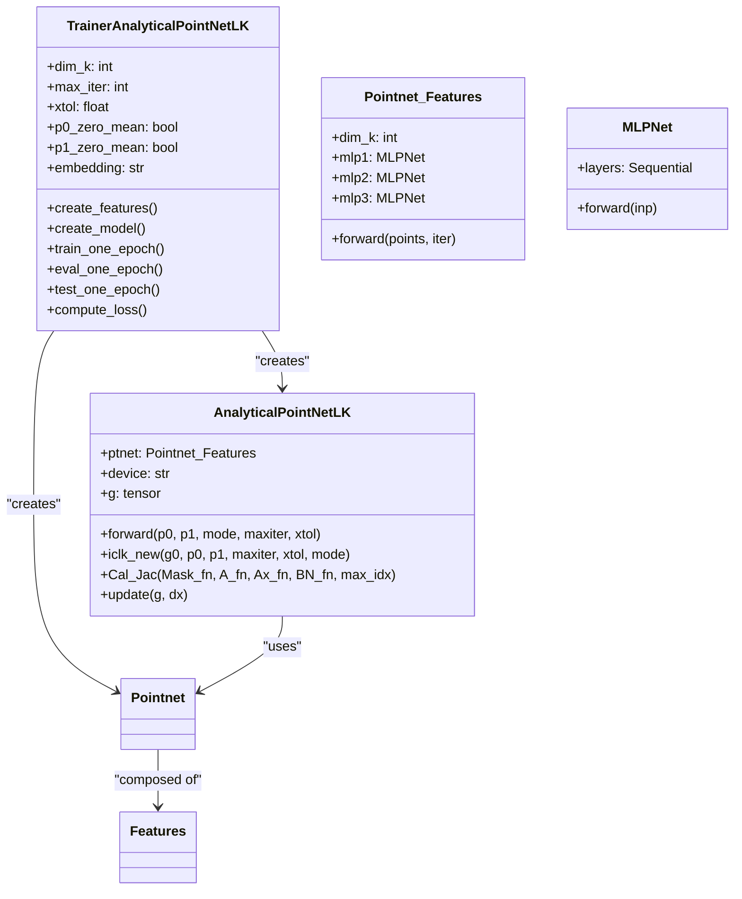
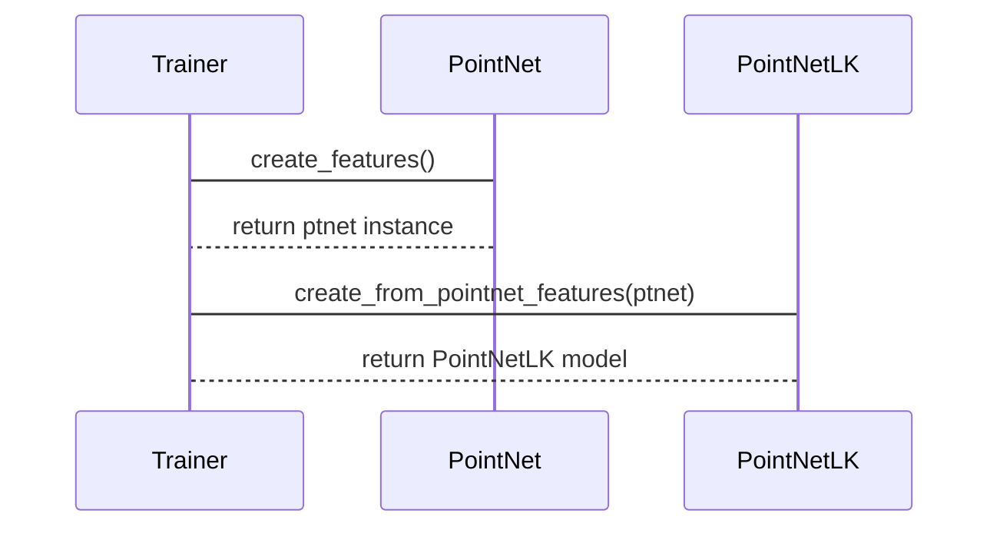
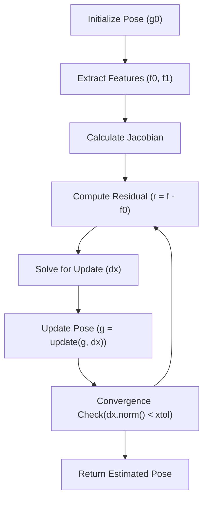
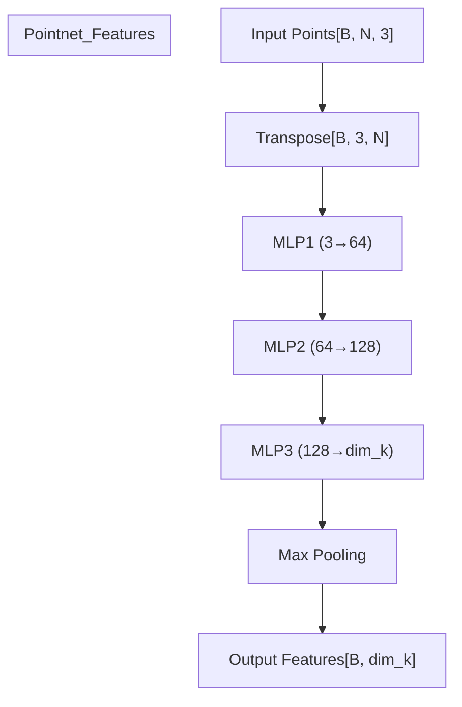
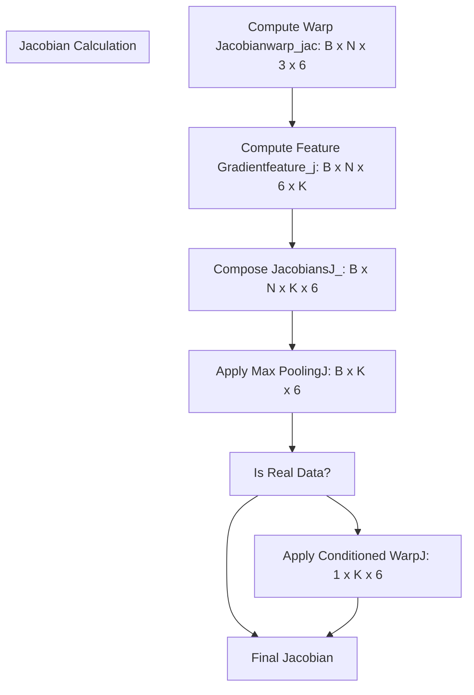
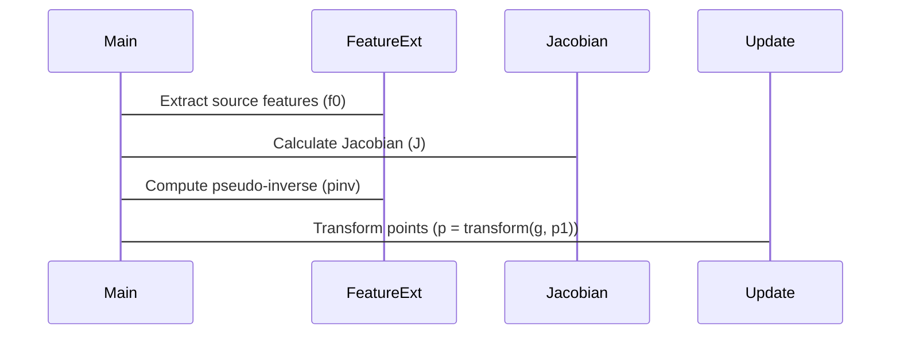
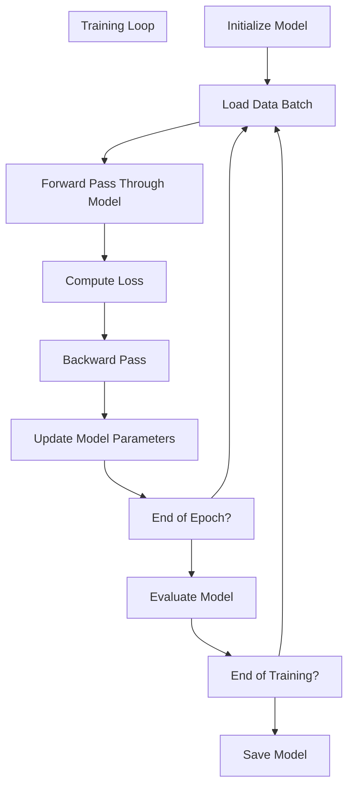

# System Design

> **Relevant source files**
> * [README.md](https://github.com/Lilac-Lee/PointNetLK_Revisited/blob/4c5fbb1a/README.md)
> * [model.py](https://github.com/Lilac-Lee/PointNetLK_Revisited/blob/4c5fbb1a/model.py)
> * [trainer.py](https://github.com/Lilac-Lee/PointNetLK_Revisited/blob/4c5fbb1a/trainer.py)

This document outlines the high-level architecture of PointNetLK_Revisited, a point cloud registration system that combines PointNet feature extraction with the Lucas-Kanade algorithm to align 3D point clouds. For information about specific data flows during training and testing, see [Data Flow](/Lilac-Lee/PointNetLK_Revisited/2.2-data-flow).

## System Architecture Overview

The PointNetLK_Revisited codebase follows a modular architecture that separates concerns between feature extraction, transformation estimation, training logic, and data processing. The system is designed to handle both synthetic and real-world point cloud data for registration tasks.

```

```

Sources: [trainer.py L33-L43](https://github.com/Lilac-Lee/PointNetLK_Revisited/blob/4c5fbb1a/trainer.py#L33-L43)

 [model.py L103-L121](https://github.com/Lilac-Lee/PointNetLK_Revisited/blob/4c5fbb1a/model.py#L103-L121)

 [README.md L34-L41](https://github.com/Lilac-Lee/PointNetLK_Revisited/blob/4c5fbb1a/README.md#L34-L41)

## Key Components and Responsibilities

The system is organized around these primary components, each with specific responsibilities:

| Component | Main Class | Responsibility |
| --- | --- | --- |
| Feature Extraction | `Pointnet_Features` | Extracts deep features from point clouds using a PointNet architecture |
| Registration Algorithm | `AnalyticalPointNetLK` | Implements the iterative closest point algorithm with analytical gradients |
| Training Orchestrator | `TrainerAnalyticalPointNetLK` | Manages the training process, loss computation, and evaluation |
| Transformation Utilities | Utility functions in `utils.py` | Provides mathematical operations for SE(3) transformations |
| Data Processing | Functions in `data_utils.py` | Loads and prepares datasets, performs voxelization |

The feature extraction component transforms raw point clouds into a feature space where alignment can be performed more efficiently. The registration algorithm then uses these features to estimate the rigid transformation between point clouds.



Sources: [trainer.py L19-L42](https://github.com/Lilac-Lee/PointNetLK_Revisited/blob/4c5fbb1a/trainer.py#L19-L42)

 [model.py L49-L100](https://github.com/Lilac-Lee/PointNetLK_Revisited/blob/4c5fbb1a/model.py#L49-L100)

 [model.py L103-L121](https://github.com/Lilac-Lee/PointNetLK_Revisited/blob/4c5fbb1a/model.py#L103-L121)

## Component Interactions

The system components interact in specific ways during different operations:

### Model Creation Process



Sources: [trainer.py L33-L43](https://github.com/Lilac-Lee/PointNetLK_Revisited/blob/4c5fbb1a/trainer.py#L33-L43)

### Registration Process Flow

The core registration algorithm follows these steps:



Sources: [model.py L264-L350](https://github.com/Lilac-Lee/PointNetLK_Revisited/blob/4c5fbb1a/model.py#L264-L350)

## Implementation Details

### Feature Extraction

The feature extraction component uses a series of MLPs followed by max pooling to create a global feature descriptor:



Sources: [model.py L50-L100](https://github.com/Lilac-Lee/PointNetLK_Revisited/blob/4c5fbb1a/model.py#L50-L100)

### Analytical Jacobian Computation

A key innovation in this implementation is the analytical computation of the Jacobian matrix, which makes the optimization more efficient:



Sources: [model.py L222-L262](https://github.com/Lilac-Lee/PointNetLK_Revisited/blob/4c5fbb1a/model.py#L222-L262)

### Iterative Closest Point with Lucas-Kanade

The core registration algorithm is implemented in the `iclk_new` method, which performs iterative closest point with Lucas-Kanade optimization:



Sources: [model.py L264-L350](https://github.com/Lilac-Lee/PointNetLK_Revisited/blob/4c5fbb1a/model.py#L264-L350)

## Integration with Training System

The training system integrates these components and manages the training process:



Sources: [trainer.py L45-L67](https://github.com/Lilac-Lee/PointNetLK_Revisited/blob/4c5fbb1a/trainer.py#L45-L67)

 [trainer.py L210-L241](https://github.com/Lilac-Lee/PointNetLK_Revisited/blob/4c5fbb1a/trainer.py#L210-L241)

## System Design Considerations

The PointNetLK_Revisited system is designed with several key architectural considerations:

1. **Modularity**: Clear separation between feature extraction, pose estimation, and training logic
2. **Flexibility**: Support for different datasets and data types (synthetic vs. real)
3. **Efficiency**: Analytical Jacobian computation for faster optimization
4. **Adaptability**: Configurable parameters for iteration counts, convergence criteria, and feature dimensions

The analytical approach to Jacobian computation is a key innovation that differentiates this implementation from traditional ICP methods, providing more efficient convergence.

Sources: [model.py L222-L262](https://github.com/Lilac-Lee/PointNetLK_Revisited/blob/4c5fbb1a/model.py#L222-L262)

 [trainer.py L19-L29](https://github.com/Lilac-Lee/PointNetLK_Revisited/blob/4c5fbb1a/trainer.py#L19-L29)