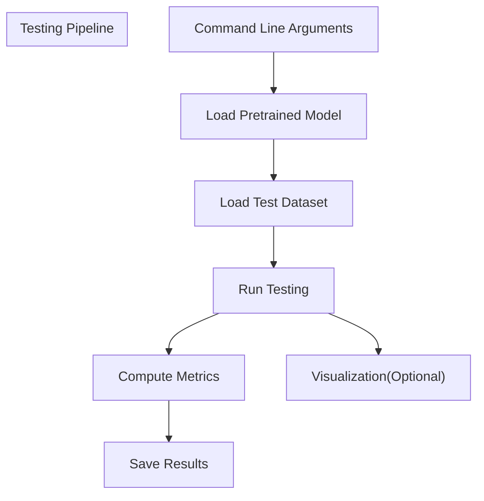
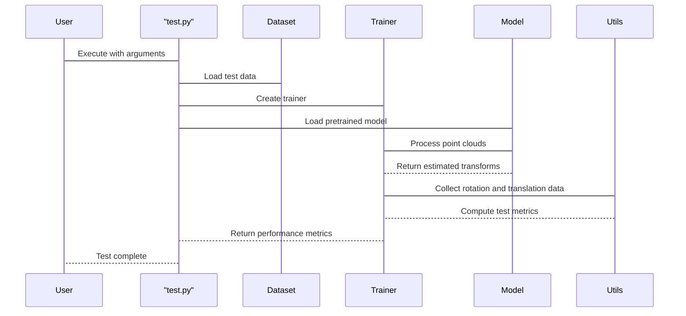
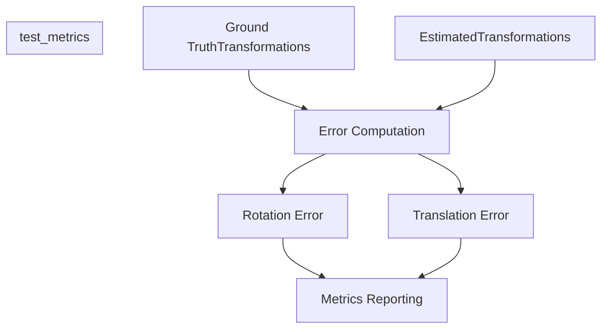
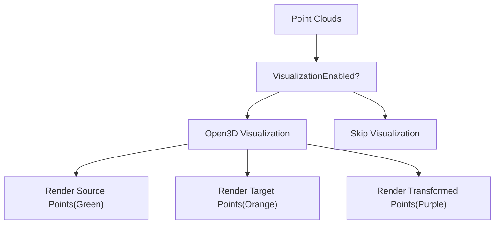

# Testing Framework

> **Relevant source files**
> * [test.py](https://github.com/Lilac-Lee/PointNetLK_Revisited/blob/4c5fbb1a/test.py)
> * [trainer.py](https://github.com/Lilac-Lee/PointNetLK_Revisited/blob/4c5fbb1a/trainer.py)

This document explains the testing framework used in the PointNetLK_Revisited repository for evaluating point cloud registration models. The framework provides tools for assessing model performance, computing metrics, and visualizing results. For information about training models, see [Training System](/Lilac-Lee/PointNetLK_Revisited/3.2-training-system).

## Overview

The testing framework enables users to evaluate pretrained models on various datasets, including synthetic (ModelNet40) and real-world (3DMatch) point clouds. It supports different testing configurations, visualization options, and outputs comprehensive metrics to assess registration accuracy.



Sources: [test.py L147-L158](https://github.com/Lilac-Lee/PointNetLK_Revisited/blob/4c5fbb1a/test.py#L147-L158)

 [trainer.py L87-L208](https://github.com/Lilac-Lee/PointNetLK_Revisited/blob/4c5fbb1a/trainer.py#L87-L208)

## Key Components

The testing framework consists of several interconnected components that handle different aspects of the evaluation process:

```

```

Sources: [test.py L87-L112](https://github.com/Lilac-Lee/PointNetLK_Revisited/blob/4c5fbb1a/test.py#L87-L112)

 [trainer.py L19-L44](https://github.com/Lilac-Lee/PointNetLK_Revisited/blob/4c5fbb1a/trainer.py#L19-L44)

## Test Configuration

The testing framework provides numerous configuration options through command-line arguments in `test.py`:

| Category | Parameters | Description |
| --- | --- | --- |
| Input/Output | `--outfile`, `--dataset_path`, `--categoryfile`, `--pose_file` | Paths for data and results |
| Dataset | `--dataset_type`, `--data_type`, `--num_points` | Dataset selection and configuration |
| Noise | `--sigma`, `--clip` | Control noise added during testing |
| Voxelization | `--overlap_ratio`, `--voxel_ratio`, `--voxel`, `--max_voxel_points`, `--num_voxels` | Point cloud voxelization settings |
| Model | `--embedding`, `--dim_k` | Model architecture parameters |
| Algorithm | `--max_iter` | Maximum LK algorithm iterations |
| Visualization | `--vis` | Enable visualization of results |

Sources: [test.py L17-L84](https://github.com/Lilac-Lee/PointNetLK_Revisited/blob/4c5fbb1a/test.py#L17-L84)

## Testing Process

The testing process follows a well-defined sequence of operations:



Sources: [test.py L87-L112](https://github.com/Lilac-Lee/PointNetLK_Revisited/blob/4c5fbb1a/test.py#L87-L112)

 [trainer.py L87-L208](https://github.com/Lilac-Lee/PointNetLK_Revisited/blob/4c5fbb1a/trainer.py#L87-L208)

## Testing Implementation

The core testing logic is implemented in the `test_one_epoch` method of the `TrainerAnalyticalPointNetLK` class. This method:

1. Sets the model to evaluation mode
2. Processes each batch from the test data loader
3. Handles different data types (real vs. synthetic)
4. Runs the PointNetLK algorithm for the specified number of iterations
5. Collects transformation results
6. Computes error metrics
7. Optionally visualizes results

For each test sample, the method:

* Loads the point clouds and ground truth transformations
* Passes them through the model to estimate transformations
* Computes the error between estimated and ground truth transforms
* Extracts rotation and translation components for metrics

Sources: [trainer.py L87-L208](https://github.com/Lilac-Lee/PointNetLK_Revisited/blob/4c5fbb1a/trainer.py#L87-L208)

## Metrics Computation

After processing all test samples, the framework computes comprehensive metrics to evaluate registration accuracy:



The `test_metrics` function in `utils.py` is called at the end of testing to compute:

* Rotation errors (measured in degrees)
* Translation errors (measured in distance units)
* Success rates at different thresholds
* Overall registration accuracy

Sources: [trainer.py

206](https://github.com/Lilac-Lee/PointNetLK_Revisited/blob/4c5fbb1a/trainer.py#L206-L206)

## Visualization Capabilities

The testing framework offers visualization options for debugging and analysis:



When visualization is enabled:

* Source point cloud is displayed in green
* Target point cloud is displayed in orange
* Transformed point cloud (after registration) is displayed in purple
* Open3D is used for rendering the visualization

Sources: [trainer.py L125-L178](https://github.com/Lilac-Lee/PointNetLK_Revisited/blob/4c5fbb1a/trainer.py#L125-L178)

## Example Usage

To run a test using the pretrained model on the 3DMatch dataset:

```
python test.py --dataset_type 3dmatch \
               --data_type real \
               --pretrained ./logs/model_trained_on_ModelNet40_model_best.pth \
               --outfile ./test_logs/test_on_3dmatch_results \
               --categoryfile ./dataset/test_3dmatch.txt \
               --dataset_path ./dataset/ThreeDMatch
```

To enable visualization during testing:

```
python test.py --dataset_type modelnet \
               --vis \
               --pretrained ./logs/model_trained_on_ModelNet40_model_best.pth
```

Sources: [test.py L147-L158](https://github.com/Lilac-Lee/PointNetLK_Revisited/blob/4c5fbb1a/test.py#L147-L158)

## Integration with Training

The testing framework is designed to work seamlessly with the training system. After training a model with the methods described in [Training System](/Lilac-Lee/PointNetLK_Revisited/3.2-training-system), the resulting model can be evaluated using this testing framework.

While the training system also includes evaluation code (`eval_one_epoch`), the testing framework (`test_one_epoch`) provides more comprehensive metrics and visualization options for final model assessment.

Sources: [trainer.py L69-L85](https://github.com/Lilac-Lee/PointNetLK_Revisited/blob/4c5fbb1a/trainer.py#L69-L85)

 [trainer.py L87-L208](https://github.com/Lilac-Lee/PointNetLK_Revisited/blob/4c5fbb1a/trainer.py#L87-L208)