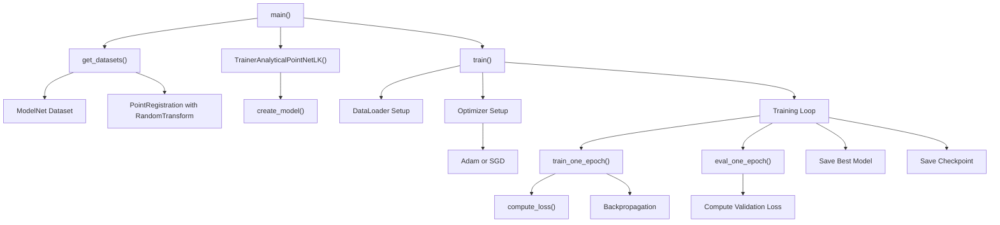
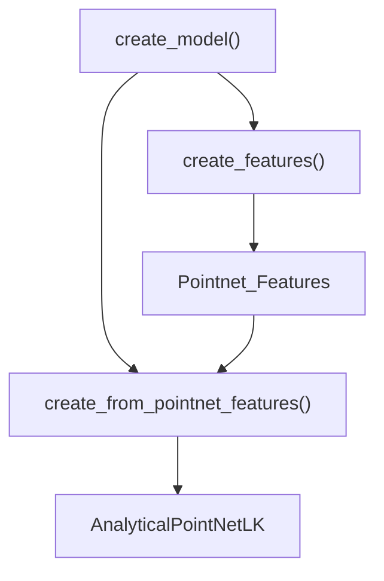
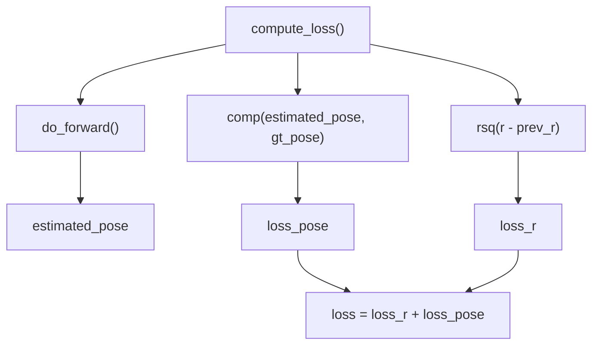

# Training System

> **Relevant source files**
> * [train.py](https://github.com/Lilac-Lee/PointNetLK_Revisited/blob/4c5fbb1a/train.py)
> * [trainer.py](https://github.com/Lilac-Lee/PointNetLK_Revisited/blob/4c5fbb1a/trainer.py)

This document details the training system used in the PointNetLK_Revisited repository. The training system is responsible for training the PointNetLK algorithm to perform point cloud registration by learning efficient feature extraction and transformation estimation. For information about testing models after training, see [Testing Framework](/Lilac-Lee/PointNetLK_Revisited/3.3-testing-framework).

## Training Architecture

The training system follows a modular design that separates concerns between configuration, data management, and the training process itself.

```

```

Sources: [train.py L148-L151](https://github.com/Lilac-Lee/PointNetLK_Revisited/blob/4c5fbb1a/train.py#L148-L151)

 [trainer.py L19-L43](https://github.com/Lilac-Lee/PointNetLK_Revisited/blob/4c5fbb1a/trainer.py#L19-L43)

## Training Configuration Options

The training system is highly configurable through command-line arguments passed to `train.py`. Key configuration parameters include:

| Category | Parameter | Description | Default |
| --- | --- | --- | --- |
| **I/O Settings** | `outfile` | Output filename prefix | ./logs/2021_04_17_train_modelnet |
|  | `dataset_path` | Path to input dataset | ./dataset/ModelNet |
| **Dataset Settings** | `dataset_type` | Dataset type (modelnet, etc.) | modelnet |
|  | `data_type` | Whether data is synthetic or real | synthetic |
|  | `num_points` | Points in point-cloud | 1000 |
|  | `num_random_points` | Random points to compute Jacobian | 100 |
|  | `mag` | Max magnitude of twist-vectors on training | 0.8 |
| **Model Settings** | `embedding` | Feature embedding type | pointnet |
|  | `dim_k` | Dimension of feature vector | 1024 |
|  | `max_iter` | Max iterations for LK algorithm | 10 |
| **Training Settings** | `batch_size` | Mini-batch size | 32 |
|  | `max_epochs` | Number of total epochs to run | 200 |
|  | `optimizer` | Name of optimizer | Adam |
|  | `lr` | Learning rate | 1e-3 |
|  | `decay_rate` | Weight decay rate | 1e-4 |
| **Checkpoint Settings** | `resume` | Path to latest checkpoint |  |
|  | `pretrained` | Path to pretrained model file |  |

Sources: [train.py L17-L81](https://github.com/Lilac-Lee/PointNetLK_Revisited/blob/4c5fbb1a/train.py#L17-L81)

## Training Process Flow

The training process follows a standard epoch-based approach with model initialization, training, evaluation, and checkpointing.



Sources: [train.py L84-L146](https://github.com/Lilac-Lee/PointNetLK_Revisited/blob/4c5fbb1a/train.py#L84-L146)

 [train.py L148-L151](https://github.com/Lilac-Lee/PointNetLK_Revisited/blob/4c5fbb1a/train.py#L148-L151)

## Model Creation Process

The training system creates models in a modular way, first initializing the feature extractor and then building the complete PointNetLK model.



Sources: [trainer.py L33-L43](https://github.com/Lilac-Lee/PointNetLK_Revisited/blob/4c5fbb1a/trainer.py#L33-L43)

## Training and Evaluation Process

### Training Loop

During training, each epoch consists of:

1. **Training Phase** (`train_one_epoch`): Process all batches in the training dataset, computing loss and updating model parameters.
2. **Evaluation Phase** (`eval_one_epoch`): Evaluate model on validation dataset without parameter updates.
3. **Model Saving**: Save best model based on validation loss and the latest checkpoint.

The core training function `train_one_epoch` implements the following algorithm:

1. Set model to training mode
2. For each batch of data:
* Compute loss using `compute_loss`
* Zero gradients
* Backpropagate loss
* Update parameters using optimizer
* Accumulate loss statistics
3. Return average loss values

Sources: [trainer.py L45-L67](https://github.com/Lilac-Lee/PointNetLK_Revisited/blob/4c5fbb1a/trainer.py#L45-L67)

 [train.py L126-L146](https://github.com/Lilac-Lee/PointNetLK_Revisited/blob/4c5fbb1a/train.py#L126-L146)

### Evaluation Loop

The `eval_one_epoch` function follows a similar pattern but without gradient computation or parameter updates:

1. Set model to evaluation mode
2. For each batch of data:
* Compute loss using `compute_loss`
* Accumulate loss statistics
3. Return average loss values

Sources: [trainer.py L69-L85](https://github.com/Lilac-Lee/PointNetLK_Revisited/blob/4c5fbb1a/trainer.py#L69-L85)

## Loss Computation

The loss function used during training combines two components:

1. **Pose Loss**: Measures the difference between estimated transformation and ground truth transformation
2. **Feature Consistency Loss**: Measures the consistency of features during iterations

The loss computation is handled by the `compute_loss` method which:

1. Forwards data through the network using `do_forward`
2. Computes pose loss between estimated and ground truth pose
3. Computes feature consistency loss from current and previous features
4. Combines the losses for total loss



Sources: [trainer.py L210-L241](https://github.com/Lilac-Lee/PointNetLK_Revisited/blob/4c5fbb1a/trainer.py#L210-L241)

## Data Processing for Training

The training system supports both synthetic and real data types, with different processing pipelines for each:

### Synthetic Data

For synthetic data (e.g., ModelNet40), the pipeline includes:

1. Loading point clouds (source and target)
2. Applying random transformations for supervised learning
3. Processing through the model

### Real Data

For real data, an additional voxelization step is performed:

1. Load point clouds
2. Voxelize point clouds
3. Extract features from voxels
4. Process through the model

The data transformation pipeline includes:

* `Mesh2Points` - Converts meshes to point clouds
* `OnUnitCube` - Normalizes points to unit cube
* `Resampler` - Resamples to specified number of points
* `RandomTransformSE3` - Applies random transformations for supervised learning

Sources: [train.py L154-L176](https://github.com/Lilac-Lee/PointNetLK_Revisited/blob/4c5fbb1a/train.py#L154-L176)

 [trainer.py L210-L229](https://github.com/Lilac-Lee/PointNetLK_Revisited/blob/4c5fbb1a/trainer.py#L210-L229)

## Model Training and Checkpointing

### Optimizer Configuration

The training system supports two optimizers:

* **Adam**: Default optimizer with learning rate and weight decay parameters
* **SGD**: Alternative optimizer with just learning rate parameter

```
if args.optimizer == 'Adam':
    optimizer = torch.optim.Adam(learnable_params, lr=args.lr, weight_decay=args.decay_rate)
else:
    optimizer = torch.optim.SGD(learnable_params, lr=args.lr)
```

### Checkpointing

The system saves two types of model checkpoints:

1. **Best Model**: Saved when validation loss improves

```
torch.save(model.state_dict(), '{}_{}.pth'.format(args.outfile, 'model_best'))
```
2. **Last Checkpoint**: Saved at the end of each epoch

```
torch.save(snap, '{}_{}.pth'.format(args.outfile, 'snap_last'))
```

The checkpoint snapshot includes:

* Current epoch
* Model state
* Minimum loss values
* Optimizer state

Sources: [train.py L113-L146](https://github.com/Lilac-Lee/PointNetLK_Revisited/blob/4c5fbb1a/train.py#L113-L146)

## Example Training Command

To train a model using the default parameters on the ModelNet dataset:

```
python train.py --outfile ./logs/my_training_run --dataset_path ./dataset/ModelNet
```

To resume training from a previous checkpoint:

```
python train.py --outfile ./logs/my_training_run --dataset_path ./dataset/ModelNet --resume ./logs/my_training_run_snap_last.pth
```

Sources: [train.py L179-L190](https://github.com/Lilac-Lee/PointNetLK_Revisited/blob/4c5fbb1a/train.py#L179-L190)