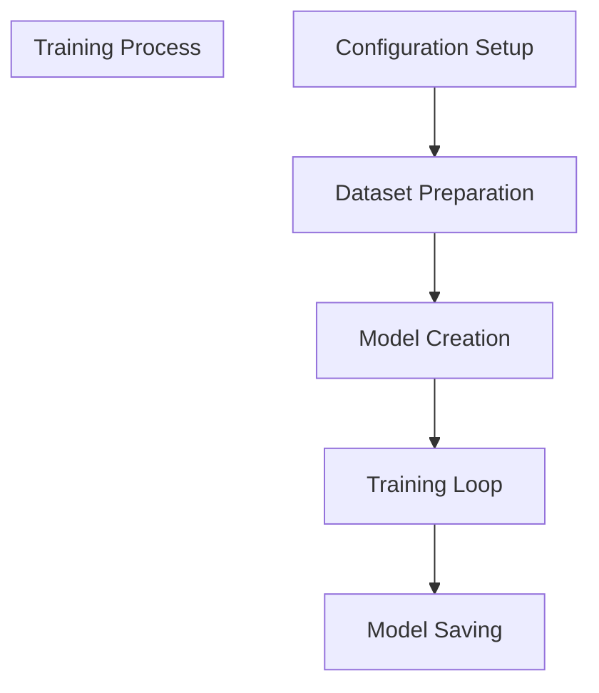
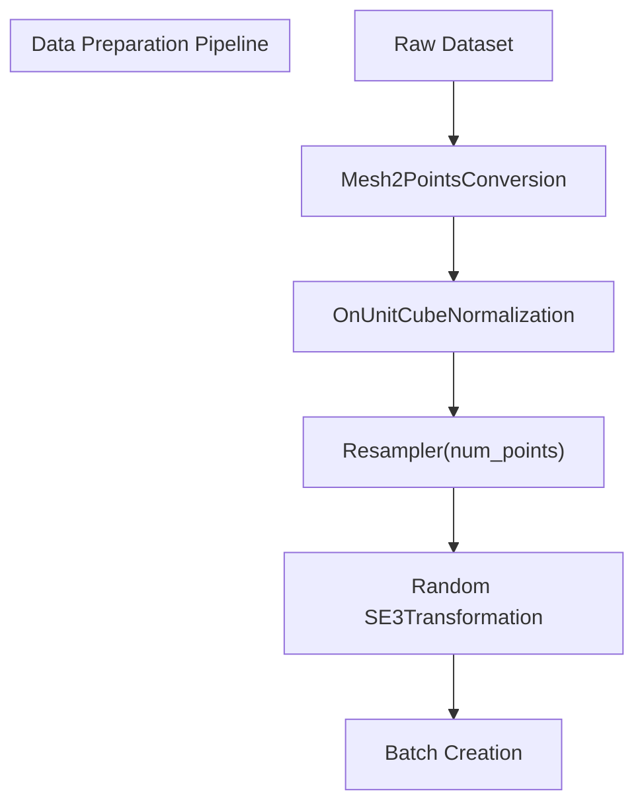
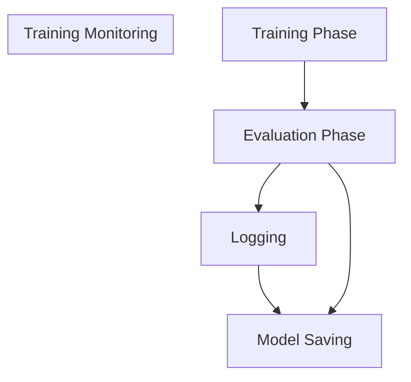

# Training a Model

> **Relevant source files**
> * [README.md](https://github.com/Lilac-Lee/PointNetLK_Revisited/blob/4c5fbb1a/README.md)
> * [train.py](https://github.com/Lilac-Lee/PointNetLK_Revisited/blob/4c5fbb1a/train.py)

This document provides a comprehensive guide on how to train a PointNetLK model using the PointNetLK_Revisited implementation. It covers configuration options, data preparation, the training process, and model saving/loading. For information about evaluating a trained model, see [Evaluating a Model](/Lilac-Lee/PointNetLK_Revisited/5.3-evaluating-a-model).

## 1. Training Configuration Overview

Training a PointNetLK model involves configuring various parameters that affect the training process, dataset processing, and model architecture. The primary entry point for training is the `train.py` script, which accepts numerous command-line arguments.



Sources: [train.py L148-L151](https://github.com/Lilac-Lee/PointNetLK_Revisited/blob/4c5fbb1a/train.py#L148-L151)

 [train.py L84-L146](https://github.com/Lilac-Lee/PointNetLK_Revisited/blob/4c5fbb1a/train.py#L84-L146)

## 2. Configuration Options

The training script offers several configuration categories that can be adjusted via command-line arguments:

### 2.1 I/O Settings

* `--outfile`: Output file path for saving model checkpoints (default: './logs/2021_04_17_train_modelnet')
* `--dataset_path`: Path to the input dataset (default: './dataset/ModelNet')
* `--logfile`: Path to the log file
* `--resume`: Path to a checkpoint for resuming training
* `--pretrained`: Path to a pretrained model for fine-tuning

### 2.2 Dataset Configuration

* `--dataset_type`: Type of dataset to use (default: 'modelnet')
* `--data_type`: Whether data is synthetic or real (default: 'synthetic')
* `--categoryfile`: Path to the file containing categories for training
* `--num_points`: Number of points in each point cloud (default: 1000)
* `--mag`: Maximum magnitude of transformation perturbations during training (default: 0.8)
* `--sigma`: Noise range in the data (default: 0.0)

### 2.3 Model Parameters

* `--embedding`: Type of feature embedding (default: 'pointnet')
* `--dim_k`: Dimension of the feature vector (default: 1024)
* `--max_iter`: Maximum iterations for the Lucas-Kanade algorithm (default: 10)
* `--num_random_points`: Number of random points for Jacobian computation (default: 100)

### 2.4 Training Hyperparameters

* `--batch_size`: Mini-batch size (default: 32)
* `--max_epochs`: Number of total epochs to run (default: 200)
* `--start_epoch`: Starting epoch number (default: 0)
* `--optimizer`: Optimizer to use (default: 'Adam')
* `--lr`: Learning rate (default: 1e-3)
* `--decay_rate`: Weight decay rate (default: 1e-4)
* `--device`: Device to use for training (default: 'cuda:0')

Sources: [train.py L17-L81](https://github.com/Lilac-Lee/PointNetLK_Revisited/blob/4c5fbb1a/train.py#L17-L81)

## 3. Basic Training Command

To train a model with default parameters, simply run:

```
python train.py
```

For customized training, you can specify any of the configuration options:

```
python train.py --dataset_path ./dataset/ModelNet --batch_size 64 --max_epochs 300 --lr 0.0005
```

Sources: [README.md L52-L54](https://github.com/Lilac-Lee/PointNetLK_Revisited/blob/4c5fbb1a/README.md#L52-L54)

 [train.py L179-L190](https://github.com/Lilac-Lee/PointNetLK_Revisited/blob/4c5fbb1a/train.py#L179-L190)

## 4. Data Preparation Process

The training process uses the ModelNet dataset by default, which is prepared through several transformations before being used for training.



### 4.1 Dataset Creation

The system supports the ModelNet dataset by default. The dataset is loaded using the following process:

1. Apply a series of transformations to the dataset:

* `Mesh2Points`: Convert 3D meshes to point clouds
* `OnUnitCube`: Normalize point clouds to fit in a unit cube
* `Resampler`: Resample point clouds to have exactly `num_points` points
2. Create point registration pairs using `PointRegistration` class:

* Each pair consists of a source point cloud and a target point cloud
* The target is created by applying a random SE3 transformation to the source

Sources: [train.py L154-L176](https://github.com/Lilac-Lee/PointNetLK_Revisited/blob/4c5fbb1a/train.py#L154-L176)

## 5. Training Process

The training process is handled by the `TrainerAnalyticalPointNetLK` class. Here's a detailed breakdown of the training flow:

```

```

### 5.1 Training Loop

The training loop consists of the following steps:

1. Create the model using `create_model()`
2. Load pretrained weights or resume from checkpoint if specified
3. Set up data loaders for training and evaluation sets
4. Initialize the optimizer (Adam or SGD)
5. For each epoch:
* Call `train_one_epoch()` to train the model on the training dataset
* Call `eval_one_epoch()` to evaluate the model on the validation dataset
* Track the best model based on validation loss
* Save checkpoints and the best model

Sources: [train.py L84-L146](https://github.com/Lilac-Lee/PointNetLK_Revisited/blob/4c5fbb1a/train.py#L84-L146)

 [train.py L126-L146](https://github.com/Lilac-Lee/PointNetLK_Revisited/blob/4c5fbb1a/train.py#L126-L146)

### 5.2 Model Structure During Training

During training, the model consists of two main components:

1. **Feature Extractor**: Implemented as `Pointnet_Features`, extracts meaningful features from point clouds
2. **Registration Algorithm**: Implemented as `AnalyticalPointNetLK`, uses the extracted features to estimate the transformation between point clouds

The training process optimizes the parameters of the feature extractor to learn features that are useful for point cloud registration.

Sources: [train.py L89-L95](https://github.com/Lilac-Lee/PointNetLK_Revisited/blob/4c5fbb1a/train.py#L89-L95)

## 6. Loss Function and Optimization

The loss function and optimization are handled by the `TrainerAnalyticalPointNetLK` class. The system uses the following optimization approach:

1. **Loss Function**: Computes the error between the estimated transformation and the ground truth transformation
2. **Optimizer**: Either Adam (default) or SGD, configured through command-line arguments
3. **Learning Rate**: Default value is 1e-3, can be customized using the `--lr` parameter
4. **Weight Decay**: Default value is 1e-4, can be customized using the `--decay_rate` parameter

Sources: [train.py L113-L123](https://github.com/Lilac-Lee/PointNetLK_Revisited/blob/4c5fbb1a/train.py#L113-L123)

## 7. Monitoring Training Progress

The training progress is logged using Python's `logging` module. For each epoch, the following information is logged:

* Epoch number
* Training loss
* Validation loss
* Training information metric
* Validation information metric

You can monitor these values to track the model's learning progress and identify potential issues such as overfitting.



Sources: [train.py L126-L146](https://github.com/Lilac-Lee/PointNetLK_Revisited/blob/4c5fbb1a/train.py#L126-L146)

## 8. Saving and Loading Models

### 8.1 Model Saving

The training script automatically saves:

1. **Best Model**: Saved when the validation loss is the lowest seen so far

* File: `{outfile}_model_best.pth`
* Contains only the model state dictionary
2. **Latest Checkpoint**: Saved after each epoch

* File: `{outfile}_snap_last.pth`
* Contains:
* Epoch number
* Model state dictionary
* Minimum loss value
* Minimum information metric value
* Optimizer state dictionary

Sources: [train.py L138-L145](https://github.com/Lilac-Lee/PointNetLK_Revisited/blob/4c5fbb1a/train.py#L138-L145)

### 8.2 Resuming Training

To resume training from a checkpoint, use the `--resume` parameter:

```
python train.py --resume ./logs/2021_04_17_train_modelnet_snap_last.pth
```

This will:

1. Load the model weights
2. Restore the optimizer state
3. Continue training from the saved epoch

Sources: [train.py L97-L103](https://github.com/Lilac-Lee/PointNetLK_Revisited/blob/4c5fbb1a/train.py#L97-L103)

### 8.3 Using a Pretrained Model

To start training from a pretrained model (fine-tuning), use the `--pretrained` parameter:

```
python train.py --pretrained ./logs/model_trained_on_ModelNet40_model_best.pth
```

This will:

1. Load the model weights
2. Start training from epoch 0
3. Use a freshly initialized optimizer

Sources: [train.py L91-L93](https://github.com/Lilac-Lee/PointNetLK_Revisited/blob/4c5fbb1a/train.py#L91-L93)

 [README.md L62-L64](https://github.com/Lilac-Lee/PointNetLK_Revisited/blob/4c5fbb1a/README.md#L62-L64)

## 9. Available Pretrained Models

The repository includes a pretrained model that was trained on the ModelNet40 dataset:

* Location: `logs/model_trained_on_ModelNet40_model_best.pth`
* This model is used to produce most of the results in the paper (except for results on the 3DMatch dataset)

You can use this model as a starting point for fine-tuning on your own dataset or for evaluation purposes.

Sources: [README.md L62-L64](https://github.com/Lilac-Lee/PointNetLK_Revisited/blob/4c5fbb1a/README.md#L62-L64)