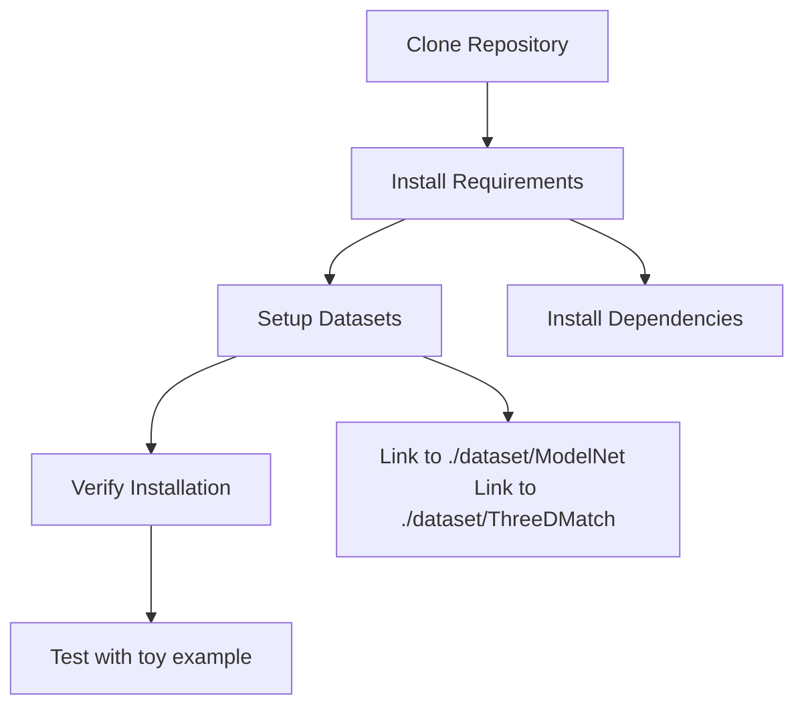
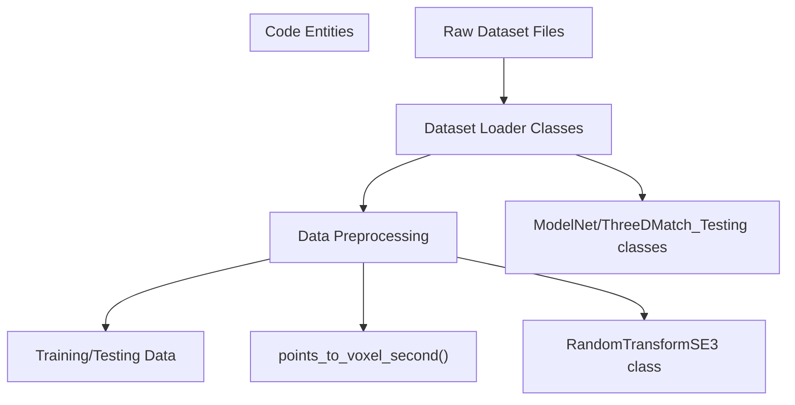
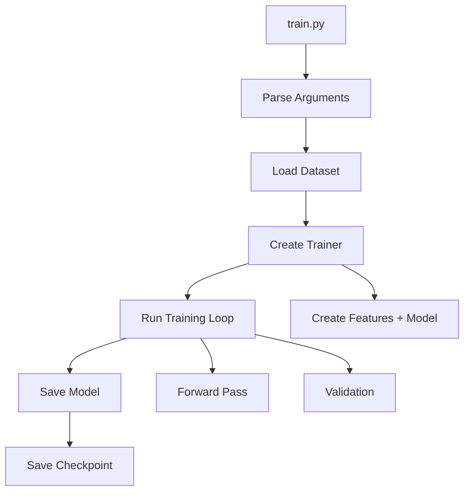
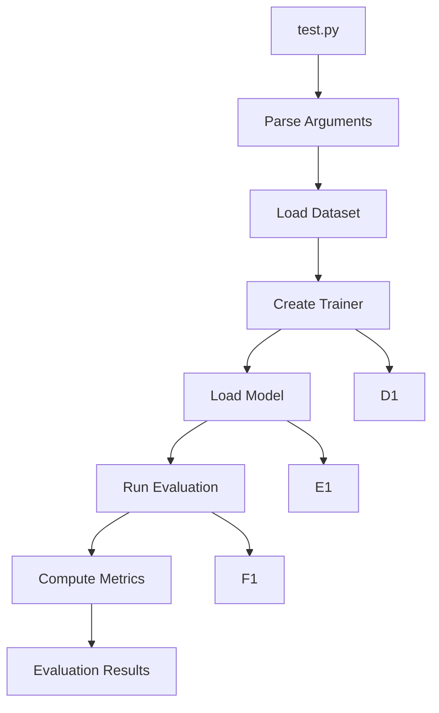
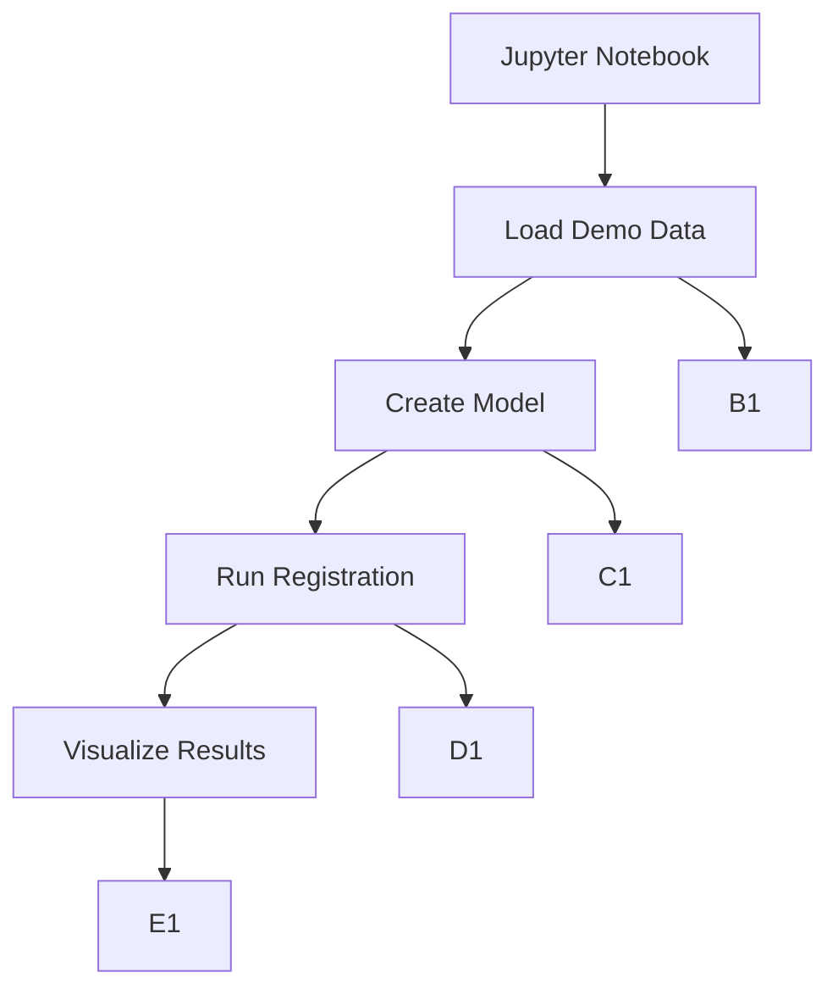

# Usage Guide

> **Relevant source files**
> * [README.md](https://github.com/Lilac-Lee/PointNetLK_Revisited/blob/4c5fbb1a/README.md)
> * [requirements.txt](https://github.com/Lilac-Lee/PointNetLK_Revisited/blob/4c5fbb1a/requirements.txt)

This document provides practical instructions for using the PointNetLK_Revisited system. It covers installation, training new models, evaluating existing models, running demos, and visualizing results. For theoretical information about the PointNetLK algorithm, see [PointNetLK Algorithm](/Lilac-Lee/PointNetLK_Revisited/3.1-pointnetlk-algorithm). For details about the system architecture, see [System Design](/Lilac-Lee/PointNetLK_Revisited/2.1-system-design).

## Installation

Before using the PointNetLK_Revisited system, you need to set up the required environment and dependencies.

### Prerequisites

The codebase requires the following key dependencies:

* Python 3.6+
* PyTorch (tested on versions 1.0.0 to 1.6.0)
* Open3D (>=0.13.0 for interactive visualization)
* TensorBoard (for training visualization)
* Various other Python packages

### Setup Process



1. Clone the repository to your local machine
2. Install dependencies using pip:
```
pip install -r requirements.txt
```
3. Set up datasets by downloading and creating symbolic links in the `./dataset` folder

Sources: [README.md L16-L21](https://github.com/Lilac-Lee/PointNetLK_Revisited/blob/4c5fbb1a/README.md#L16-L21)

 [requirements.txt L1-L6](https://github.com/Lilac-Lee/PointNetLK_Revisited/blob/4c5fbb1a/requirements.txt#L1-L6)

## Dataset Preparation

The system supports multiple datasets for point cloud registration:

| Dataset | Source | Symbolic Link Path |
| --- | --- | --- |
| ModelNet40 | [https://modelnet.cs.princeton.edu](https://modelnet.cs.princeton.edu) | ./dataset/ModelNet |
| ShapeNet | [https://shapenet.org](https://shapenet.org) | - |
| KITTI | [http://www.cvlibs.net/datasets/kitti/eval_odometry.php](http://www.cvlibs.net/datasets/kitti/eval_odometry.php) | - |
| 3DMatch | Use [DGR download script](https://github.com/Lilac-Lee/PointNetLK_Revisited/blob/4c5fbb1a/DGR download script) | ./dataset/ThreeDMatch |

### Data Processing Flow



**Note on Voxelization**: The current implementation relies on having roughly aligned point clouds for voxelization. To apply voxelization after transformation, set the `--voxel_after_transf` argument to `True`.

Sources: [README.md L34-L48](https://github.com/Lilac-Lee/PointNetLK_Revisited/blob/4c5fbb1a/README.md#L34-L48)

## Training a Model

The training system allows you to train new PointNetLK models on your datasets of choice.

### Training Workflow



### Training Commands

Basic training command:

```
python train.py
```

Common training options:

* `--dataset`: Choose dataset (modelnet, shapenet, 3dmatch)
* `--batch_size`: Batch size for training (default: 32)
* `--max_iter`: Maximum LK iterations (default: 10)
* `--epochs`: Number of training epochs (default: 250)
* `--lr`: Learning rate (default: 0.001)

### Training Monitoring

The training progress can be monitored using TensorBoard, which logs metrics like loss, rotation error, and translation error.

Sources: [README.md L52-L54](https://github.com/Lilac-Lee/PointNetLK_Revisited/blob/4c5fbb1a/README.md#L52-L54)

## Evaluating a Model

After training, you can evaluate your model or use the pre-trained models provided with the repository.

### Evaluation Workflow



### Evaluation Commands

Basic evaluation command:

```
python test.py
```

Common evaluation options:

* `--dataset`: Choose dataset (modelnet, shapenet, 3dmatch, kitti)
* `--pretrained`: Path to pretrained model (default: logs/model_trained_on_ModelNet40_model_best.pth)
* `--max_iter`: Maximum LK iterations (default: 10)

### Pre-trained Models

The repository includes a pre-trained model at `logs/model_trained_on_ModelNet40_model_best.pth`, which was trained on the ModelNet40 dataset and used for most results in the paper.

Sources: [README.md L57-L64](https://github.com/Lilac-Lee/PointNetLK_Revisited/blob/4c5fbb1a/README.md#L57-L64)

## Running the Demo Example

A Jupyter notebook demo is provided for quick testing and visualization of the system's capabilities.

### Demo Workflow



To run the demo:

1. Open the Jupyter notebook at `./demo/test_toysample.ipynb`
2. Execute the cells in sequence
3. Interact with the Open3D visualization window (note: interactive visualization requires Open3D ≥0.13.0 and may take a few seconds to appear)

The demo uses a point cloud pair from the 3DMatch dataset as a test example.

Sources: [README.md L24-L31](https://github.com/Lilac-Lee/PointNetLK_Revisited/blob/4c5fbb1a/README.md#L24-L31)

## Visualization

The system offers several visualization capabilities to help understand and analyze the registration results.

### Visualization Options

1. **Interactive 3D Visualization**: The demo notebook provides interactive visualization using Open3D
2. **Registration Progress**: You can visualize the iterative registration process
3. **Error Metrics**: Visualize rotation and translation errors during convergence

### Registration Visualization Example

The repository includes GIF examples of successful registrations on different datasets:

* ModelNet40: Point cloud alignment of synthetic objects
* 3DMatch: Registration of indoor scene fragments
* KITTI: Alignment of outdoor LiDAR scans

### Command-Line Visualization

For custom visualizations from test results, you can use the evaluation results and Open3D to create your own visualizations of point cloud alignments.

Sources: [README.md L11-L14](https://github.com/Lilac-Lee/PointNetLK_Revisited/blob/4c5fbb1a/README.md#L11-L14)

## Advanced Usage

### Using Different Datasets

The system is designed to work with multiple datasets. To use a different dataset:

1. Download the dataset from the appropriate source
2. Create symbolic links in the `./dataset` folder
3. Specify the dataset during training/evaluation with the `--dataset` flag

### Custom Point Cloud Registration

To apply the model to your own point cloud data:

1. Load your point clouds using Open3D or NumPy
2. Preprocess them similarly to the demo (normalization, voxelization)
3. Use the pre-trained model or your custom-trained model for registration
4. Evaluate the results using the provided metric functions

### Debugging and Troubleshooting

Common issues:

* Open3D visualization not showing: Ensure you have Open3D ≥0.13.0
* Dataset loading errors: Check symbolic links and dataset paths
* CUDA out of memory: Reduce batch size or point cloud density

Sources: [README.md L21-L22](https://github.com/Lilac-Lee/PointNetLK_Revisited/blob/4c5fbb1a/README.md#L21-L22)