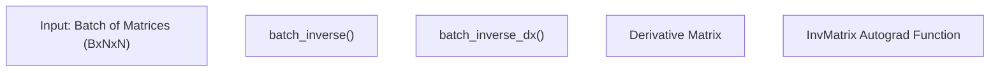
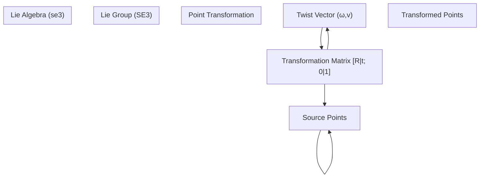
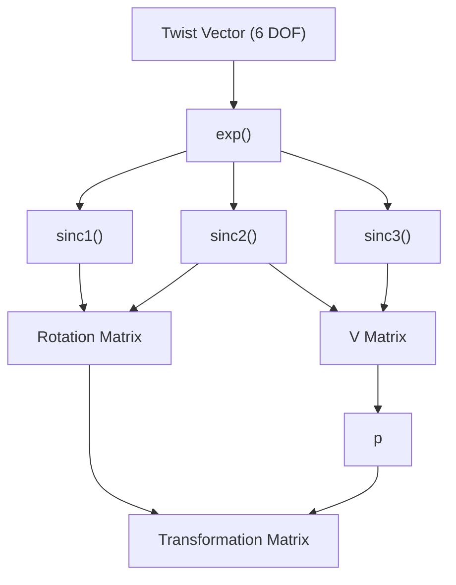
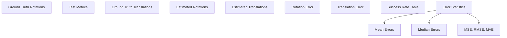

# Utility Functions

> **Relevant source files**
> * [utils.py](https://github.com/Lilac-Lee/PointNetLK_Revisited/blob/4c5fbb1a/utils.py)

## Overview

This document details the mathematical utility functions that form the foundation of the PointNetLK_Revisited registration algorithm implementation. The `utils.py` file contains essential transformations, operations on Lie groups and algebras, Jacobian calculations, and evaluation metrics that enable the core algorithm functionality.

The utilities can be grouped into five main categories:

1. Matrix operations
2. SE(3)/SO(3) operations for rigid transformations
3. Exponential map functions
4. Jacobian computations
5. Testing and evaluation metrics

Sources: [utils.py L1-L6](https://github.com/Lilac-Lee/PointNetLK_Revisited/blob/4c5fbb1a/utils.py#L1-L6)

## Matrix Operations

### Batch Matrix Inversion

The implementation provides differentiable matrix inversion operations for batches of matrices:



The `InvMatrix` autograd function makes matrix inversion differentiable within the PyTorch computational graph, enabling gradient-based optimization through matrix inversions.

Sources: [utils.py L9-L52](https://github.com/Lilac-Lee/PointNetLK_Revisited/blob/4c5fbb1a/utils.py#L9-L52)

## SE(3)/SO(3) Operations

### Core Transformation Functions

These functions operate on elements of the Lie groups SO(3) (rotation) and SE(3) (rigid transformation) and their corresponding Lie algebras so(3) and se(3):

```

```

Key functions include:

* `transform`: Applies a SE(3) transformation to 3D points
* `mat_so3`: Converts a 3D vector to a skew-symmetric matrix
* `log_so3`: Computes the logarithm map for SO(3)
* `log`: Computes the logarithm map for SE(3)

Sources: [utils.py L56-L169](https://github.com/Lilac-Lee/PointNetLK_Revisited/blob/4c5fbb1a/utils.py#L56-L169)

### Transformation Function Flow



Sources: [utils.py L56-L169](https://github.com/Lilac-Lee/PointNetLK_Revisited/blob/4c5fbb1a/utils.py#L56-L169)

 [utils.py L233-L252](https://github.com/Lilac-Lee/PointNetLK_Revisited/blob/4c5fbb1a/utils.py#L233-L252)

## Exponential Map Functions

The exponential map is fundamental for converting elements from Lie algebra se(3) to Lie group SE(3):

* `exp`: Implements the exponential map from se(3) to SE(3)
* `ExpMap`: Autograd function for differentiable exponential map
* `sinc1`, `sinc2`, `sinc3`: Helper functions for calculating terms in the exponential map

The implementation uses stable numerical approximations for small angles through Taylor series expansions.

Sources: [utils.py L188-L282](https://github.com/Lilac-Lee/PointNetLK_Revisited/blob/4c5fbb1a/utils.py#L188-L282)

### Implementation Details



The implementation handles numerical stability for small rotation angles with specialized Taylor series approximations in `sinc1`, `sinc2`, and `sinc3`.

Sources: [utils.py L188-L252](https://github.com/Lilac-Lee/PointNetLK_Revisited/blob/4c5fbb1a/utils.py#L188-L252)

## Jacobian Computations

Three types of Jacobians are implemented for the PointNetLK algorithm:

1. `feature_jac`: Analytical feature Jacobian for PointNet features with respect to inputs
2. `compute_warp_jac`: Warp Jacobian relating point transformations to se(3) parameters
3. `cal_conditioned_warp_jacobian`: Conditioned warp Jacobian for improved numerical stability


The Jacobian computation is at the core of the analytical version of PointNetLK, enabling direct optimization without numerical differentiation.

Sources: [utils.py L285-L386](https://github.com/Lilac-Lee/PointNetLK_Revisited/blob/4c5fbb1a/utils.py#L285-L386)

## Testing Metrics

The `test_metrics` function evaluates the performance of the registration algorithm by comparing the estimated and ground truth transformations:



The evaluation includes:

* Root Mean Square Error (RMSE) for rotation and translation
* Mean Absolute Error (MAE)
* Success rates at different error thresholds (rotation errors from 0° to 5° in 0.5° steps, translation errors from 0 to 0.5 in 0.05 steps)
* Both mean and median error statistics

This comprehensive evaluation provides insights into the registration accuracy and robustness.

Sources: [utils.py L390-L462](https://github.com/Lilac-Lee/PointNetLK_Revisited/blob/4c5fbb1a/utils.py#L390-L462)

## Integration with Core Algorithm

The utility functions serve as building blocks for the PointNetLK algorithm implementation:

```

```

The utility functions provide the mathematical foundation that enables the PointNetLK algorithm to perform efficient point cloud registration through iterative closest point with analytical Jacobians.

Sources: [utils.py L1-L462](https://github.com/Lilac-Lee/PointNetLK_Revisited/blob/4c5fbb1a/utils.py#L1-L462)