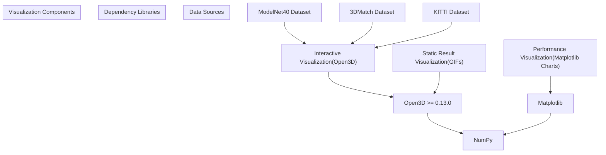
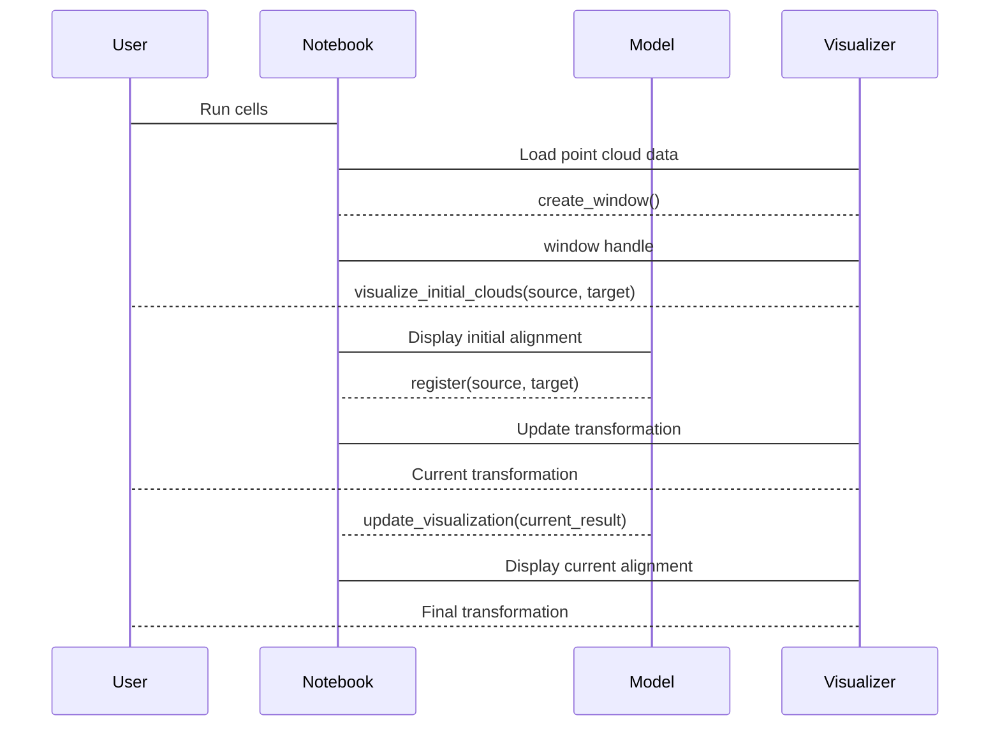
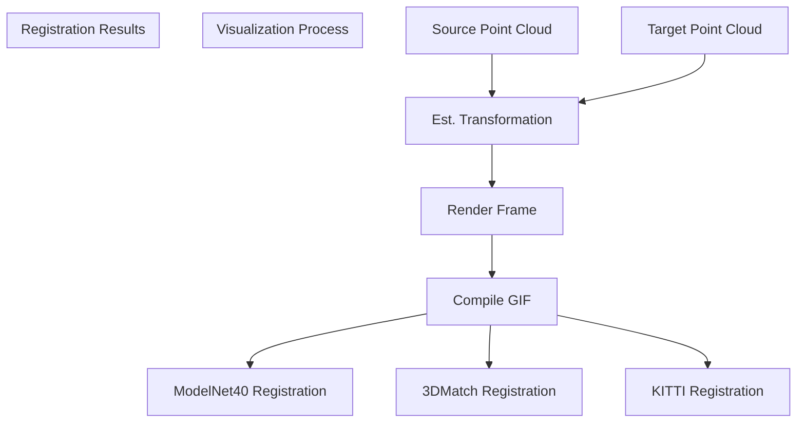
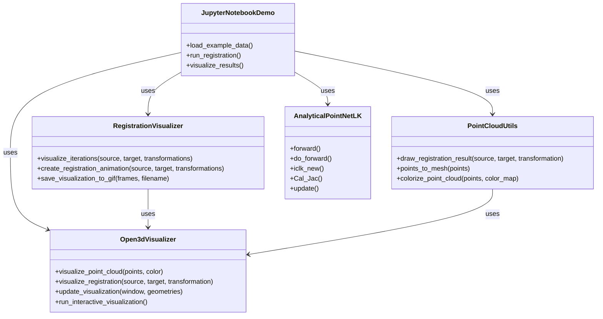
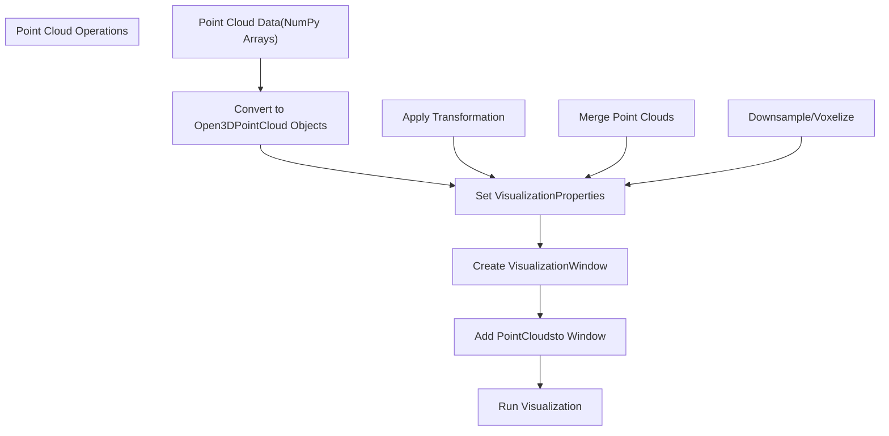
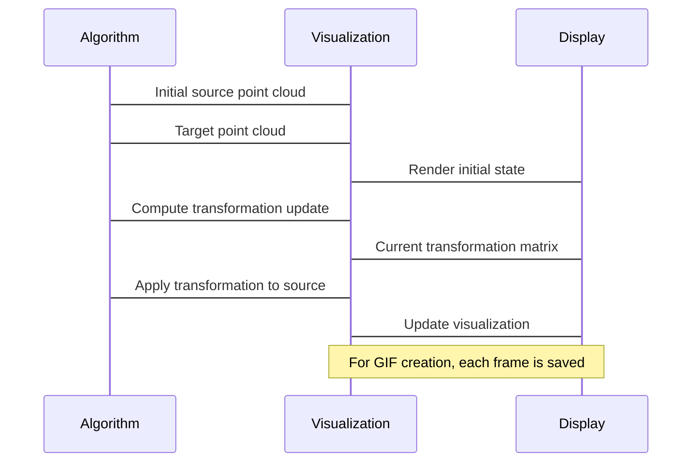
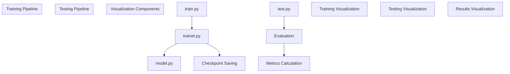

# Visualization

> **Relevant source files**
> * [README.md](https://github.com/Lilac-Lee/PointNetLK_Revisited/blob/4c5fbb1a/README.md)
> * [imgs/3dmatch_registration.gif](https://github.com/Lilac-Lee/PointNetLK_Revisited/blob/4c5fbb1a/imgs/3dmatch_registration.gif)
> * [imgs/code_demo.gif](https://github.com/Lilac-Lee/PointNetLK_Revisited/blob/4c5fbb1a/imgs/code_demo.gif)
> * [imgs/kitti_registration.gif](https://github.com/Lilac-Lee/PointNetLK_Revisited/blob/4c5fbb1a/imgs/kitti_registration.gif)
> * [imgs/modelnet_registration.gif](https://github.com/Lilac-Lee/PointNetLK_Revisited/blob/4c5fbb1a/imgs/modelnet_registration.gif)

This page documents the visualization capabilities in the PointNetLK_Revisited repository. It explains how point cloud data, transformations, and registration results are displayed, both for debugging purposes during development and for presenting final results. For information about running the demo example, see [Demo Example](/Lilac-Lee/PointNetLK_Revisited/5.4-demo-example).

## Overview of Visualization Components

The PointNetLK_Revisited repository primarily uses Open3D for point cloud visualization. Visualization is integrated at multiple levels:

1. **Interactive Visualization**: The repository provides interactive visualization capabilities through the demo notebook
2. **Static Result Visualization**: Pre-rendered GIFs showing the alignment process on various datasets
3. **Performance Visualization**: Methods to visualize the convergence and performance metrics

Sources: README.md:16-21, README.md:24-31

## Visualization Dependencies

The visualization components in the repository rely on the following key dependencies:

| Dependency | Version | Purpose |
| --- | --- | --- |
| Open3D | >= 0.13.0 | Point cloud rendering and interactive visualization |
| Matplotlib | Any | Charts and plots for performance metrics |
| NumPy | Any | Numerical operations for data preparation |

The README specifically notes that Open3D interactive visualization is only available for versions 0.13.0 and above, and users may need to wait for a few seconds for the interactive visualization window to appear.

Sources: README.md:16-21

## Interactive Visualization in the Demo

The repository includes a Jupyter notebook demo (`demo/test_toysample.ipynb`) that provides an interactive visualization environment for experimenting with the PointNetLK algorithm. This demo allows users to:

1. Visualize source and target point clouds
2. View the registration process through iterations
3. Observe the final alignment result

The interactive visualization leverages Open3D's visualization library to render 3D point clouds and transformations in real-time. Users can rotate, zoom, and explore the point cloud data interactively.

Sources: README.md:24-31

## Visualizing Registration Results

The repository includes pre-rendered GIFs demonstrating the registration process on different datasets:

1. **ModelNet40**: Synthetic object models
2. **3DMatch**: Real-world indoor scenes
3. **KITTI**: Autonomous driving point cloud data

These visualizations help demonstrate the algorithm's performance across different types of point cloud data and registration scenarios.

Sources: README.md:12-14

## Visualization Code Structure

The visualization functionality in the codebase is primarily located in the demo notebook, with supporting utilities in the main codebase. Below is a diagram showing the relationship between the visualization code and the core algorithm components:

Sources: README.md:24-31

## Using Open3D for Visualization

The repository uses Open3D's visualization library to display point clouds. The typical workflow for visualizing point clouds involves:

1. Converting NumPy arrays to Open3D point cloud objects
2. Setting properties (colors, point sizes, etc.)
3. Creating a visualization window
4. Adding the point clouds to the window
5. Running the visualization

The following example illustrates the typical pattern for point cloud visualization:

Sources: README.md:16-21, README.md:24-31

## Visualizing Transformation Progress

One key aspect of the registration visualization is showing how the source point cloud progressively aligns with the target point cloud through iterations of the algorithm. This is demonstrated in both the interactive demo and the pre-rendered GIFs.

The visualization process typically involves:

1. Rendering the initial point clouds (source in one color, target in another)
2. For each iteration of the algorithm:
* Applying the current transformation to the source point cloud
* Updating the visualization to show the current alignment
3. Displaying the final registration result

Sources: README.md:12-14, README.md:24-31

## Customizing Visualizations

Users can customize various aspects of the visualization, including:

1. **Point cloud colors**: Modify the color scheme for source and target point clouds
2. **Point sizes**: Adjust the size of points for better visibility
3. **Camera viewpoint**: Change the perspective to better show the alignment
4. **Background color**: Modify the background for better contrast
5. **Visualization style**: Choose between point cloud, mesh, or other representations

These customizations can be applied by modifying the visualization parameters in the demo notebook or by creating custom visualization scripts using the provided utilities.

## Example Visualizations

The repository includes example visualizations for different datasets:

1. **ModelNet40**: Synthetic object models with clean, noise-free point clouds
2. **3DMatch**: Real-world indoor scenes with occlusions and noise
3. **KITTI**: Large-scale outdoor scenes from autonomous driving datasets

These visualizations help demonstrate the robustness of the PointNetLK algorithm across different types of data and registration scenarios.

Sources: README.md:12-14

## Integration with the Training and Testing Pipeline

Visualization components are integrated with the training and testing pipeline to provide visual feedback on the algorithm's performance. This integration allows for:

1. **Training progress visualization**: Monitoring convergence and loss during training
2. **Test result visualization**: Visualizing registration results on test data
3. **Evaluation metrics visualization**: Charts and plots showing quantitative performance metrics

Sources: README.md:52-59

## Conclusion

The visualization capabilities in the PointNetLK_Revisited repository provide powerful tools for understanding, debugging, and presenting the point cloud registration results. By leveraging Open3D's interactive visualization features, users can explore the registration process in detail and gain insights into the algorithm's behavior.

The combination of interactive visualizations in the demo notebook and pre-rendered examples in the README offers a comprehensive view of the algorithm's performance across different datasets and registration scenarios.