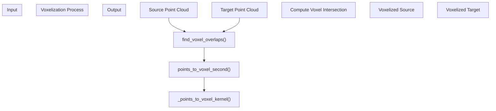
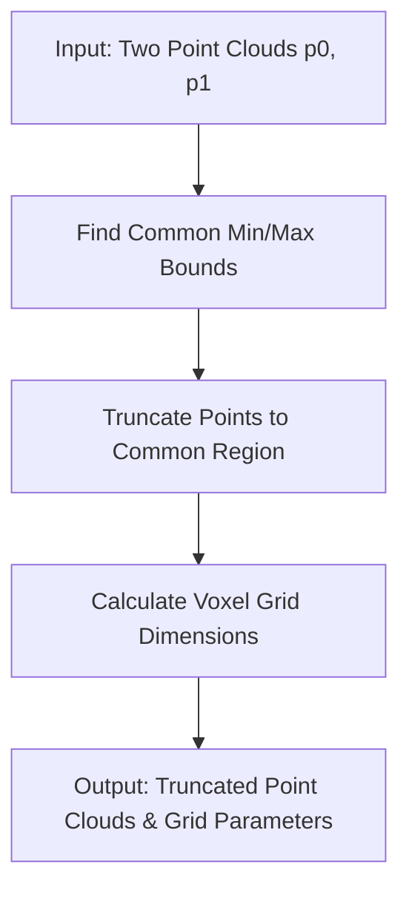
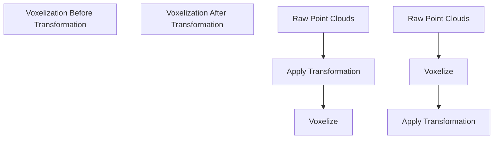
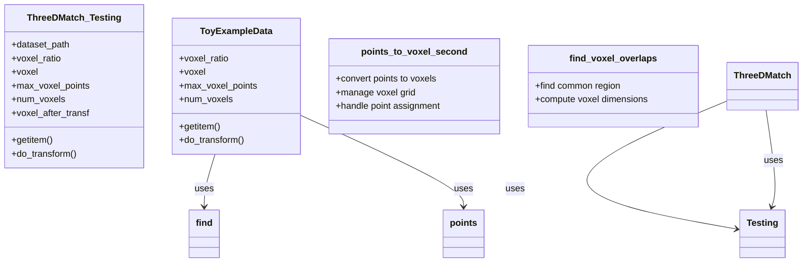
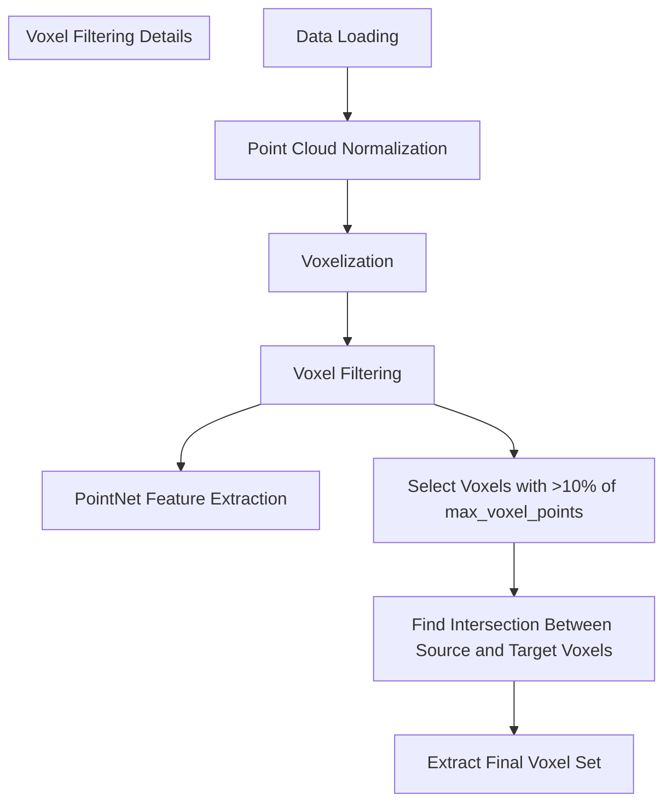

# Voxelization

> **Relevant source files**
> * [README.md](https://github.com/Lilac-Lee/PointNetLK_Revisited/blob/4c5fbb1a/README.md)
> * [data_utils.py](https://github.com/Lilac-Lee/PointNetLK_Revisited/blob/4c5fbb1a/data_utils.py)

## Overview

This document details the voxelization process implemented in the PointNetLK_Revisited repository. Voxelization is a critical preprocessing step that converts continuous 3D point clouds into a discrete volumetric representation by partitioning the 3D space into a grid of cubical cells (voxels). This process helps in standardizing the input data and achieving more efficient and robust point cloud registration.

For information about dataset loading before voxelization, see [Dataset Loaders](/Lilac-Lee/PointNetLK_Revisited/4.1-dataset-loaders).

## Voxelization Process

Voxelization in the PointNetLK_Revisited implementation involves converting irregular point cloud data into a regular grid representation to facilitate feature extraction and registration.



Sources: [data_utils.py L36-L52](https://github.com/Lilac-Lee/PointNetLK_Revisited/blob/4c5fbb1a/data_utils.py#L36-L52)

 [data_utils.py L398-L449](https://github.com/Lilac-Lee/PointNetLK_Revisited/blob/4c5fbb1a/data_utils.py#L398-L449)

 [data_utils.py L348-L394](https://github.com/Lilac-Lee/PointNetLK_Revisited/blob/4c5fbb1a/data_utils.py#L348-L394)

### Finding Voxel Overlaps

The system first identifies overlapping regions between the two point clouds to define a common voxel grid:

1. Computes the common bounding box of both point clouds
2. Truncates points to this common region
3. Calculates the voxel grid dimensions based on the specified voxel size



Sources: [data_utils.py L36-L52](https://github.com/Lilac-Lee/PointNetLK_Revisited/blob/4c5fbb1a/data_utils.py#L36-L52)

### Core Voxelization Algorithm

The `points_to_voxel_second` function converts a point cloud into a voxel representation:

1. Initializes data structures for voxels, coordinates, and point counters
2. Calls the kernel function to perform voxelization
3. Returns voxels, coordinates, and number of points per voxel

Each voxel contains up to a maximum number of points, and the system tracks how many points fall into each voxel.

Sources: [data_utils.py L398-L449](https://github.com/Lilac-Lee/PointNetLK_Revisited/blob/4c5fbb1a/data_utils.py#L398-L449)

 [data_utils.py L348-L394](https://github.com/Lilac-Lee/PointNetLK_Revisited/blob/4c5fbb1a/data_utils.py#L348-L394)

## Voxelization Parameters

The voxelization process is controlled by several key parameters:

| Parameter | Description | Effect |
| --- | --- | --- |
| `voxel_size`/`voxel_ratio` | Size of each voxel | Larger values reduce resolution but improve efficiency |
| `max_voxel_points` | Maximum number of points allowed in each voxel | Controls memory usage and detail preservation |
| `num_voxels` | Maximum number of voxels to create | Limits memory consumption |
| `voxel_after_transf` | Whether to voxelize after applying transformation | Affects how points are grouped in overlapping regions |

Sources: [data_utils.py L56-L77](https://github.com/Lilac-Lee/PointNetLK_Revisited/blob/4c5fbb1a/data_utils.py#L56-L77)

 [README.md L46-L48](https://github.com/Lilac-Lee/PointNetLK_Revisited/blob/4c5fbb1a/README.md#L46-L48)

## Voxelization Implementation

### Voxelization Before vs. After Transformation

The system supports two modes of voxelization relative to the transformation process:



The default setting uses "voxelization before transformation", but "voxelization after transformation" can be enabled by setting the `--voxel_after_transf` flag to `True`. This is particularly important for real-world applications where the system is used for local registration.

Sources: [data_utils.py L93-L173](https://github.com/Lilac-Lee/PointNetLK_Revisited/blob/4c5fbb1a/data_utils.py#L93-L173)

 [README.md L46-L48](https://github.com/Lilac-Lee/PointNetLK_Revisited/blob/4c5fbb1a/README.md#L46-L48)

### Implementation Classes

The voxelization process is implemented within two main dataset classes:

1. **ThreeDMatch_Testing**: Handles voxelization for 3DMatch dataset
2. **ToyExampleData**: Implements voxelization for toy examples used in demonstrations

Both classes follow similar voxelization procedures but with slightly different data handling.



Sources: [data_utils.py L56-L179](https://github.com/Lilac-Lee/PointNetLK_Revisited/blob/4c5fbb1a/data_utils.py#L56-L179)

 [data_utils.py L182-L246](https://github.com/Lilac-Lee/PointNetLK_Revisited/blob/4c5fbb1a/data_utils.py#L182-L246)

## Voxelization in the Processing Pipeline

In the overall data processing pipeline, voxelization sits between data loading and feature extraction:



After voxelization, the system:

1. Filters voxels to keep only those containing a sufficient number of points (>10% of `max_voxel_points`)
2. Identifies voxels that are present in both source and target point clouds
3. Uses this intersection for feature extraction and registration

Sources: [data_utils.py L158-L167](https://github.com/Lilac-Lee/PointNetLK_Revisited/blob/4c5fbb1a/data_utils.py#L158-L167)

## Technical Implementation Details

### Voxel Indexing

The system uses a flattened 3D index to efficiently reference voxels:

```
coords_p0_idx = coords_p0[:,1]*(int(self.voxel**2)) + coords_p0[:,0]*(int(self.voxel)) + coords_p0[:,2]
```

This converts 3D coordinates (x, y, z) into a single flat index for efficient lookups and intersections.

Sources: [data_utils.py L133-L134](https://github.com/Lilac-Lee/PointNetLK_Revisited/blob/4c5fbb1a/data_utils.py#L133-L134)

### Voxel Center Computation

For each voxel, the system computes the coordinates of its center point:

```
xm_x = np.linspace(xmin+vx/2, xmax-vx/2, int(self.voxel))
xm_y = np.linspace(ymin+vy/2, ymax-vy/2, int(self.voxel))
xm_z = np.linspace(zmin+vz/2, zmax-vz/2, int(self.voxel))
mesh3d = np.vstack(np.meshgrid(xm_x,xm_y,xm_z)).reshape(3,-1).T
```

These center coordinates are used when operating on the voxelized representation.

Sources: [data_utils.py L150-L154](https://github.com/Lilac-Lee/PointNetLK_Revisited/blob/4c5fbb1a/data_utils.py#L150-L154)

 [data_utils.py L138-L145](https://github.com/Lilac-Lee/PointNetLK_Revisited/blob/4c5fbb1a/data_utils.py#L138-L145)

## Integration with Open3D for Initial Voxelization

For 3DMatch dataset processing, the system leverages Open3D's voxel downsampling as an initial step:

```
pcd0 = o3d.geometry.PointCloud()
pcd0.points = o3d.utility.Vector3dVector(p0)
p0_downsampled_pcd = pcd0.voxel_down_sample(voxel_size=voxel_ratio)
```

This provides an efficient initial downsampling before the more detailed voxelization process.

Sources: [data_utils.py L23-L31](https://github.com/Lilac-Lee/PointNetLK_Revisited/blob/4c5fbb1a/data_utils.py#L23-L31)

## Best Practices and Limitations

### Best Practices

1. **Voxel Size Selection**: Choose a voxel size that balances detail preservation and computational efficiency
2. **Transformation Timing**: Consider using `voxel_after_transf=True` for real-world registration tasks
3. **Point Cloud Density**: Voxelization works best with point clouds of relatively uniform density

### Limitations

1. The current implementation requires both point clouds to have some overlap region
2. Processing efficiency decreases with very small voxel sizes or very large point clouds
3. Very sparse regions may be underrepresented in the voxelized output

Sources: [README.md L46-L48](https://github.com/Lilac-Lee/PointNetLK_Revisited/blob/4c5fbb1a/README.md#L46-L48)